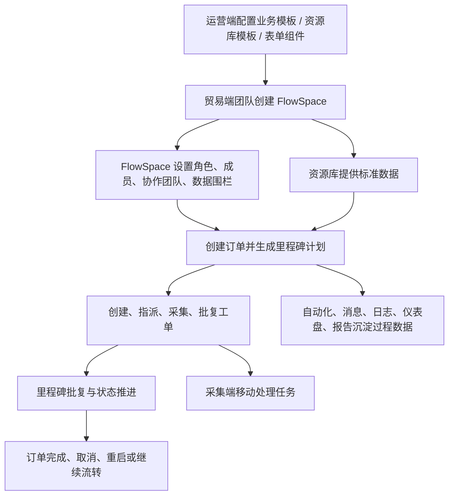
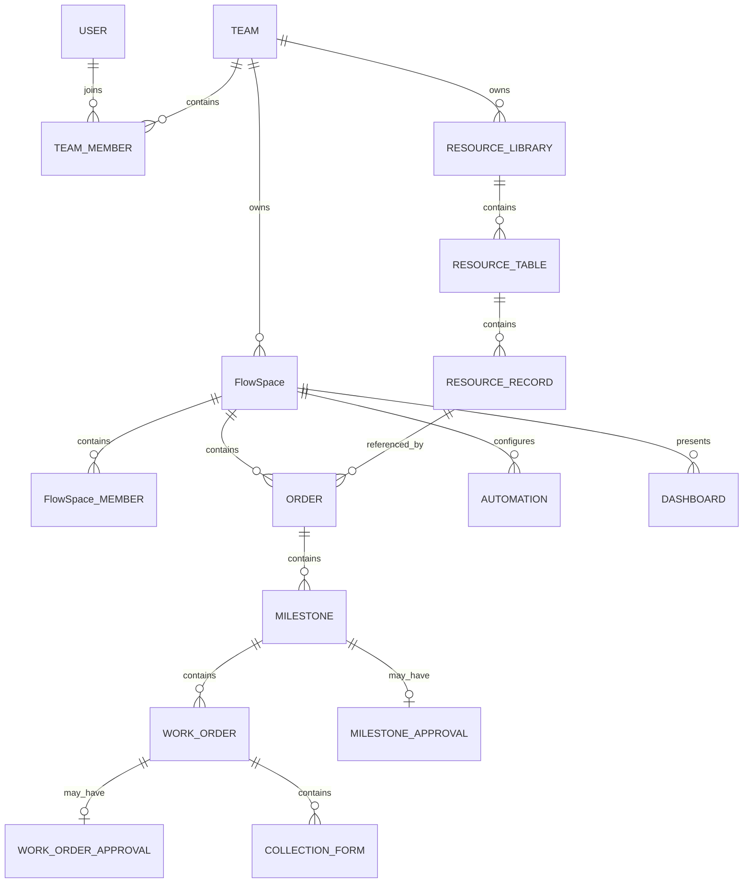

# 产品总览

## 1. 产品定位

Linkincrease 是面向供应链协作场景的业务协同平台。平台以 FlowSpace 为核心业务空间，围绕订单、里程碑、工单、资源库、协作团队、自动化、消息通知和移动采集，连接品牌方、供应商、验货/采集人员、运营人员等多类参与者，支撑从模板配置到业务执行、数据沉淀、追踪审计的完整闭环。

## 2. 产品端组成

| 产品端 | 使用对象 | 核心定位 | 关键关系 |
| --- | --- | --- | --- |
| 运营端 | 平台运营、实施、管理人员 | 配置和监管平台基础能力，包括用户、团队、FlowSpace、业务模板、资源库模板、表单组件、仪表盘、报告、外部 API 和软件记录 | 配置能力下发到贸易端；查看平台级数据 |
| 贸易端 | B 端客户团队和协作团队 | 业务协同主平台，承载团队、FlowSpace、订单、里程碑、工单、资源库、自动化、消息和仪表盘 | 由运营端模板创建 FlowSpace；与采集端实时同步任务和数据 |
| 采集端 | 移动端执行人员、协作成员 | 移动场景下的任务查看、工单采集、工单批复、里程碑批复和消息处理入口 | 与贸易端订单、工单、批复任务双向同步 |

## 3. 核心业务闭环

## 4. 平台能力分层

| 能力层 | 说明 | 代表模块 |
| --- | --- | --- |
| 账号与组织层 | 管理用户身份、团队归属、团队成员、协作团队和个人设置 | 注册登录、个人中心、团队管理、团队设置 |
| 模板与配置层 | 定义业务结构、表单字段、里程碑、批复、资源库和可见范围 | 运营端模板中心、业务模板、资源库模板、表单设计组件 |
| 业务执行层 | 承载供应链协作的核心执行过程 | FlowSpace、订单、里程碑、工单、批复、采集 |
| 主数据层 | 管理可被 FlowSpace 引用的标准化业务数据 | 资源库、资源库分享、资源库视图、资源库历史 |
| 协作与权限层 | 控制不同团队、角色、成员在业务中的可见与可操作范围 | 团队角色、FlowSpace 业务角色、协作方角色、数据围栏、仪表盘权限、报告权限 |
| 自动化与通知层 | 将机械性操作、消息推送和异常通知自动化 | 自动化、定时任务、消息中心、实时消息、邮件协作 |
| 追踪与审计层 | 记录用户操作、系统操作和业务过程变化 | 操作日志、动态、历史记录、跟踪记录、系统自动执行日志 |
| 数据展示层 | 对订单、任务、仪表盘、报告和运营数据进行聚合展示 | 工作台、常用视图、订单日程、仪表盘、报告 |

## 5. 核心业务对象关系

## 6. 当前知识库重点

1. 以 FlowSpace、订单、里程碑、工单为主线梳理业务执行链路。
2. 将团队权限、FlowSpace 权限、协作方权限、资源库权限和数据围栏拆开描述，避免混淆。
3. 将资源库、自动化、消息通知、日志审计作为横向能力，分别沉淀规则。
4. 将运营端模板能力与贸易端实际执行能力对应起来，形成“配置项 -> 运行态行为”的知识结构。
