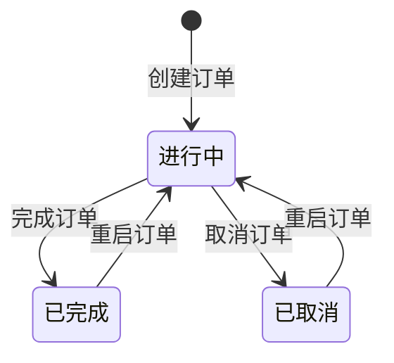
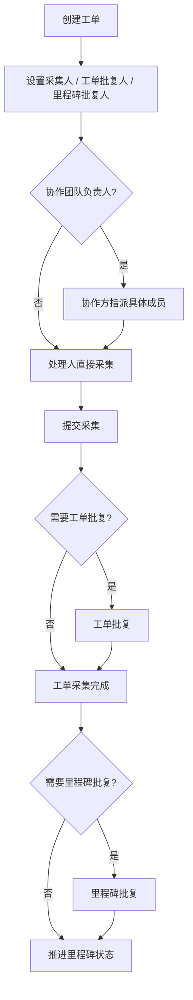
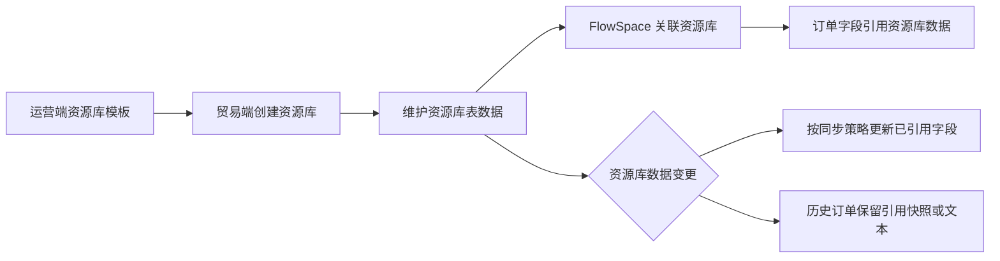

# Linkincrease 完整知识库架构与内容

本文基于 `最新需求源（source:thoughts-v2-current）` 中所有迭代需求重新整理，用于作为 Linkincrease 后续完整知识库的主体框架。它不是原始需求的简单汇总，而是按“产品对象、业务流程、权限边界、状态规则、数据流转、审计追溯”的方式重组。

## 1. 知识库总架构

```text
Linkincrease 知识库
├─ 00 入门与维护
│  ├─ 产品总览
│  ├─ 核心概念词典
│  ├─ 功能地图
│  ├─ 需求来源台账
│  └─ 待办与问题池
├─ 10 产品端说明
│  ├─ 运营端
│  ├─ 贸易端
│  └─ 采集端
├─ 20 核心业务对象
│  ├─ 用户与账号
│  ├─ 团队与协作团队
│  ├─ FlowSpace
│  ├─ 订单
│  ├─ 里程碑
│  ├─ 工单
│  ├─ 批复
│  └─ 资源库
├─ 30 核心业务流程
│  ├─ 从模板到 FlowSpace
│  ├─ 从订单创建到完成
│  ├─ 工单采集与批复
│  ├─ 跨团队协作
│  ├─ 资源库引用与同步
│  ├─ 自动化执行
│  └─ 移动端采集
├─ 40 权限与安全
│  ├─ 团队权限
│  ├─ FlowSpace 业务权限
│  ├─ 协作方权限
│  ├─ 资源库权限
│  ├─ 数据围栏
│  ├─ 仪表盘权限
│  └─ 报告权限
├─ 50 数据、表单与模板
│  ├─ 业务模板
│  ├─ 资源库模板
│  ├─ 表单设计组件
│  ├─ 表单属性与显隐
│  ├─ 公式函数
│  ├─ 验货组件
│  └─ PDF / 第三方数据对接
├─ 60 协作、通知与自动化
│  ├─ 消息中心
│  ├─ 实时消息
│  ├─ 邮件协作
│  ├─ 自动化一期
│  ├─ 定时任务
│  └─ 外部 API 集成
├─ 70 展示与分析
│  ├─ 工作台
│  ├─ 常用视图
│  ├─ 订单日程
│  ├─ 仪表盘
│  └─ 报告
└─ 80 日志、历史与审计
   ├─ 操作日志
   ├─ 动态
   ├─ 历史记录
   ├─ 跟踪记录
   └─ 系统自动执行日志
```

## 2. 产品端知识结构

### 2.1 运营端

运营端是平台配置和监管中心，知识库中应按“配置对象”组织，而不是按页面名称堆叠。

| 知识主题 | 应沉淀内容 | 来源需求 |
| --- | --- | --- |
| 用户数据管理 | 用户列表筛选、用户详情、拥有团队、加入团队、关联 FlowSpace | `【运营端】【用户-用户管理】平台用户数据管理.md` |
| 团队数据管理 | 团队列表、团队详情、成员、角色、协作邀请、参与外部协作 | `【运营端】【用户-团队管理】平台团队数据管理.md` |
| FlowSpace 数据管理 | 平台团队的 FlowSpace 数据、成员、邮件协作、自动化记录、仪表盘、报告、外部 API | `【运营端】【用户-SCCS管理】平台团队的SCCS数据管理.md` 等 |
| 资源库数据管理 | 团队资源库列表、资源库数据明细、权限边界 | `【运营端】【用户-资源库管理】平台团队的资源库数据管理.md` |
| 业务模板 | 模板列表、创建类型、可见范围、设计、发布、复制、同步至 FlowSpace | `【运营端】【模板中心】业务模版管理.md` |
| 资源库模板 | 模板列表、创建、编辑、表单设计、预览、发布 | `【运营端】【模板中心】资源库模版管理.md` |
| 表单设计器 | 布局组件、基础组件、高级组件、属性、显隐、公式、成员/协作方组件 | `【运营端】【业务模板】表单设计组件.md`、`【运营端】【资源库模版】表单设计组件.md` |
| 软件与平台设置 | 软件更新管理、更新记录 | `【运营端】【设置-软件管理】软件相关信息与记录管理.md` |

### 2.2 贸易端

贸易端是 Linkincrease 的核心业务操作平台，知识库中应围绕用户实际完成的业务链路组织。

| 知识主题 | 应沉淀内容 | 来源需求 |
| --- | --- | --- |
| 账号与个人 | 注册、登录、忘记密码、个人资料、语言、退出 | `【贸易端】【账号】注册登录、忘记密码.md`、`【贸易端】【个人中心】...md` |
| 团队与协作 | 创建团队、团队信息、角色、成员、协作团队、邀请流程变更 | `【贸易端】【团队管理】...md`、`【贸易端】【团队设置】...md` |
| 工作台 | FlowSpace 列表、创建 FlowSpace、分组、订单日程、任务中心、常用视图 | `【贸易端】【工作台】...md` |
| FlowSpace 设置 | 基本信息、业务角色、数据围栏、成员、协作团队、里程碑计划、标签、订单标识、取消原因 | `【贸易端】【SCCS设置】.md` |
| 协作 FlowSpace 设置 | 协作团队参与 FlowSpace 后的角色、成员、权限管理 | `【贸易端】【协作SCCS设置】.md` |
| 订单列表 | 订单查看、增删改、导入导出、视图设置、子表模式、工单视图、批量操作 | `【贸易端】【订单列表】*.md` |
| 订单详情 | 订单详情布局、状态操作、里程碑、工单、批复、历史、跟踪、邮件协作 | `【贸易端】【订单详情】*.md` |
| 订单复用 | 翻单、订单关联、里程碑互用、工单互用 | `【贸易端】【订单管理】*.md` |
| 资源库 | 资源库创建、设置、数据管理、视图、分享、FlowSpace 应用、历史 | `【贸易端】【资源库】*.md` |
| 自动化 | 自动化列表、触发条件、执行动作、日志、定时任务 | `【贸易端】【自动化】*.md` |
| 消息与日志 | 消息中心、实时消息、设置类操作日志、系统自动日志 | `【贸易端】【消息中心】...md`、`【贸易端】【操作日志】...md` |

### 2.3 采集端

采集端是移动执行入口，知识库中应按任务处理路径组织。

| 知识主题 | 应沉淀内容 | 来源需求 |
| --- | --- | --- |
| 登录 | 邮箱密码登录、忘记密码 | `【采集端】【登录】邮箱_密码登录、忘记密码.md` |
| 首页 | 我的任务、团队待指派、我关注、FlowSpace 数据展示 | `【采集端】【首页】任务相关数据展示.md` |
| 任务列表 | 进行中、已完成、我发起、团队指派、我关注、操作 | `【采集端】【任务列表】...md` |
| 任务搜索 | 入口、搜索页规则 | `【采集端】【任务搜索页】...md` |
| 任务详情 | 工单详情、工单批复详情、里程碑批复详情、订单信息 | `【采集端】【任务详情页】...md` |
| 消息中心 | 首页入口、消息列表 | `【采集端】【消息中心】消息通知列表.md` |
| 我的 | 个人信息、多语言、修改密码、帮助、联系成功经理、检查更新、退出账号 | `【采集端】【我的】个人中心页.md` |

## 3. 核心业务对象

### 3.1 用户、团队、协作团队

用户是跨团队身份，一个用户可加入多个团队；团队是贸易端业务归属单位，拥有 FlowSpace、资源库、团队角色和协作关系。协作团队不是团队的子组织，而是被主团队邀请参与业务协作的外部团队。

需要沉淀的知识点：

- 账号注册、登录、忘记密码、语言切换、退出账号。
- 首次创建团队与非首次创建团队的差异。
- 团队基础信息、角色、成员、邀请成员、未注册成员标识。
- 团队协作邀请的“我邀请的”和“邀请我的”两类视角。
- 协作团队被邀请到团队层和 FlowSpace 层后的权限差异。
- 团队角色权限与 FlowSpace 业务角色权限的边界。

### 3.2 FlowSpace

FlowSpace 是贸易端核心业务空间，由运营端业务模板创建。一个 FlowSpace 通常包含订单主表单、多个里程碑、里程碑批复、工单采集表单、工单批复表单、成员、业务角色、协作团队、数据围栏、标签、自动化、仪表盘和资源库关联。

需要沉淀的知识点：

- FlowSpace 创建来源：运营端业务模板。
- FlowSpace 工作台展示、分组、搜索、排序和常用视图。
- FlowSpace 基本信息、编辑、删除或状态规则。
- FlowSpace 业务角色、协作方角色、成员、协作团队的配置关系。
- 数据围栏对字段、标签、订单、里程碑和工单可见性的影响。
- 里程碑计划、标签设置、订单标识、订单取消原因等更多设置。
- FlowSpace 与资源库、自动化、仪表盘、报告、外部 API 的关系。

### 3.3 订单

订单是 FlowSpace 中的业务主实体。订单包含订单基本信息、多个里程碑、工单、批复、历史记录、动态和跟踪记录。

订单知识页应包含：

- 订单列表：概览、详情入口、视图设置、子表模式、工单视图。
- 订单新增、编辑、删除、批量编辑、状态修改。
- 订单导入、订单导出、导入记录和失败原因。
- 订单状态：进行中、已完成、已取消。
- 完成订单后的限制：订单不可编辑/取消，里程碑和工单相关操作受限。
- 取消订单后的规则：需要选择取消原因，历史订单保留取消时文本。
- 重启订单后的恢复规则。
- 订单详情结构：标题栏、左侧树、订单基本信息、里程碑信息、工单信息。
- 订单跟踪记录：记录订单和里程碑大节点操作。

### 3.4 里程碑

里程碑是订单流程阶段。每个里程碑可包含里程碑批复和多个工单。

里程碑知识页应包含：

- 状态：未开始、进行中、已完成、已取消。
- 状态变更入口：订单详情、批量操作、自动化等。
- 计划时间、实际开始、实际完成、延迟/提前标签。
- 负责人、标签、数据围栏可见性。
- 创建工单的状态限制：仅未开始或进行中的里程碑可创建工单。
- 完成、取消、重启里程碑对工单、批复、互用的影响。
- 里程碑批复是否存在取决于运营端模板配置。
- 里程碑互用的来源、目标、取消和权限规则。

### 3.5 工单

工单是里程碑下的具体执行任务，由工单采集和工单批复构成。一个里程碑可以有多份工单。

工单知识页应包含：

- 创建工单：最多一次创建 10 条；可复制工单；至少保留一个非隐藏表单。
- 工单名称：默认按创建顺序编号，支持修改，限制 50 字符。
- 表单权限：隐藏表单、非隐藏表单、采集人设置、未设置采集人的必填校验。
- 处理人：采集人、工单批复人、里程碑批复人；可选择成员、协作团队负责人或具体协作成员。
- 指派：协作团队负责人或有指派权限成员可将任务指派给本团队成员。
- 采集：采集人填写可编辑表单；多人并发时需要提示刷新。
- 工单批复：批复人审核采集结果。
- 终止采集：终止后不可继续采集。
- 删除工单：需受权限和状态限制。
- 动态和历史记录：记录创建、采集、批复、编辑、终止、删除等行为。

### 3.6 资源库

资源库是团队级标准化数据池，用于管理基础数据并应用到 FlowSpace。

资源库知识页应包含：

- 资源库创建：从运营端资源库模板选择、预览、使用模板创建。
- 资源库列表：卡片、展开/收起、搜索、排序、空状态。
- 资源库设置：编辑名称、权限角色、成员、表权限。
- 资源库数据：创建、编辑、删除、查看、导入、导出、搜索、排序、批量编辑、批量下载文件。
- 资源库视图管理：不同用户或角色查看数据的视图组织方式。
- 资源库分享：单条或整表分享、密码、只读/可编辑、失效。
- FlowSpace 应用资源库：关联资源库、字段映射、引用数据、历史文本保留。
- 数据编辑历史：记录资源库数据变更，支持追溯。

## 4. 核心流程

### 4.1 从模板到 FlowSpace


知识库中需要明确：模板发布前贸易端不可见；模板启用但未发布仍不可见；模板同步至 FlowSpace 属于独立能力，需要记录同步范围、冲突、已存在数据影响。

### 4.2 从订单创建到完成



订单创建后进入进行中。订单完成或取消后，订单、里程碑、工单、批复的大部分编辑和处理动作被限制。重启订单将订单恢复到进行中，但需要保留历史操作记录和取消原因快照。

### 4.3 工单采集与批复



需要单独沉淀：指派、采集、批复在订单已删除、订单已完成/取消、里程碑已完成/取消、工单已终止、工单已批复、工单已删除等状态下的限制和提示。

### 4.4 跨团队协作

跨团队协作由两层关系组成：

- 团队层协作：主团队邀请协作团队，建立可参与业务的组织关系。
- FlowSpace 层协作：将协作团队加入具体 FlowSpace，并分配协作角色、成员、权限。

协作方在工单和批复中可能被选为“负责人/对接人”，也可能被直接选为具体成员。负责人模式需要协作团队内部再指派成员；具体成员模式则由被选中的成员直接处理。

### 4.5 资源库引用与同步



需要明确：删除资源库或资源库数据后，新订单不可再引用，被历史订单引用的数据仍需保留文本或快照。资源库同步与 FlowSpace/FlowSpace 数据互用写入需要互斥校验，避免同一字段被多来源覆盖。

### 4.6 自动化执行

自动化由一个触发条件和多个执行动作组成。触发条件包括数据新增、数据内容变更、到达记录中的时间；执行动作包括发送通知、新增数据、更新数据。自动化只在同一订单内执行，不跨订单触发。

自动化知识页应沉淀：

- 自动化列表、启用状态、未完善设置提示。
- 触发条件的数据源、条件配置、字段选择范围。
- 执行动作的通知对象、通知渠道、标题内容拼接、附件。
- 新增工单的默认值、处理人、必填字段校验。
- 更新数据的记录范围、筛选条件、字段映射。
- 执行失败通知、执行顺序、后续动作是否继续执行。
- 执行日志列表和详情。
- 定时任务触发时的特殊执行记录。

## 5. 权限与安全结构

权限知识库建议拆成独立章节，避免所有权限散落在页面说明中。

| 权限域 | 控制对象 | 典型权限点 |
| --- | --- | --- |
| 团队权限 | 团队设置、团队成员、团队角色、协作团队、资源库入口 | 创建资源库、删除资源库、资源库管理、邀请成员、设置角色 |
| FlowSpace 业务权限 | 订单、里程碑、工单、批复、仪表盘、自动化 | 查看、创建、编辑、删除、状态修改、指派、采集、批复、互用、导入导出 |
| 协作 FlowSpace 权限 | 协作团队在 FlowSpace 内的业务操作 | 协作方角色、协作成员、指派、处理、查看 |
| 资源库权限 | 资源库设置、表数据、数据范围 | 查看、创建、编辑、删除、导入、导出、批量操作、分享 |
| 数据围栏 | 订单、里程碑、工单、字段、标签 | 控制可见范围，不等于操作权限 |
| 仪表盘权限 | FlowSpace 仪表盘 | 管理、查看、汇总查看 |
| 报告权限 | 报告查看与管理 | 按需求中的报告权限点补充 |

权限判断建议沉淀为统一格式：

```text
功能入口是否展示 = 角色权限 + 对象状态 + 数据围栏/数据范围 + 成员关系
提交是否成功 = 服务端再次校验权限 + 对象状态 + 数据版本 + 必填/格式规则
```

## 6. 状态与限制

| 对象 | 状态 | 关键限制 |
| --- | --- | --- |
| 订单 | 进行中 | 可编辑、可完成、可取消，可推进里程碑和工单 |
| 订单 | 已完成 | 不可编辑、不可取消；里程碑和工单处理动作受限 |
| 订单 | 已取消 | 不可编辑；保留取消原因文本；可按权限重启 |
| 里程碑 | 未开始 | 可创建工单；首次创建工单可变更为进行中 |
| 里程碑 | 进行中 | 可创建工单、采集、批复、完成或取消 |
| 里程碑 | 已完成 | 不可创建工单、不可采集/批复/指派；可按权限重启 |
| 里程碑 | 已取消 | 不可创建工单、不可采集/批复/指派；可按权限重启 |
| 工单 | 正常执行中 | 可采集、批复、指派、邮件协作、终止、删除，取决于权限 |
| 工单 | 已终止采集 | 不可继续采集 |
| 工单 | 已批复 | 采集和部分编辑动作受限 |
| 自动化 | 启用 | 设置完整且满足条件时执行 |
| 自动化 | 未启用 | 不执行 |

## 7. 表单、数据与模板

表单体系是 Linkincrease 的底层配置能力，知识库需要把“运营端配置”和“贸易端/采集端运行态”对应起来。

| 主题 | 内容 |
| --- | --- |
| 布局组件 | 模块分组、分割线、空白占位等 |
| 基础组件 | 单行文本、多行文本、数字、百分比、单选、多选、图片、附件、日期、评级、定位、地址、富文本等 |
| 高级组件 | 关联引用、公式、成员单选/多选、协作方单选/多选、签名、汇率等 |
| 表单属性 | 必填、限制、默认值、移动端布局、Web 布局、国际化 |
| 显隐设置 | 条件展示、隐藏后的校验处理、与数据围栏的关系 |
| 公式函数 | 可用函数、字段类型、系统自动更新日志 |
| 验货组件 | 尺寸检验组件、组合明细、统计表、采集端应用 |

## 8. 消息、通知与邮件协作

消息体系建议按事件源组织：

- 账号与团队事件：注册、邀请、加入、角色变更。
- FlowSpace 事件：成员变更、协作团队变更、权限变更。
- 订单事件：创建、编辑、完成、取消、重启、跟踪记录。
- 里程碑事件：状态变更、批复指派、批复提交。
- 工单事件：创建、采集指派、采集提交、批复指派、批复提交、终止、删除。
- 资源库事件：导入导出、分享、同步、数据变更。
- 自动化事件：执行成功、执行失败、定时任务触发。
- 邮件协作事件：单工单邮件协作、批量发邮件协作。

每类消息都应沉淀：触发条件、接收人、渠道、标题、正文、跳转链接、附件、是否去重、是否受屏蔽设置影响。

## 9. 日志与审计

日志体系需要区分四类记录：

| 类型 | 记录对象 | 主要用途 |
| --- | --- | --- |
| 操作日志 | 团队设置、FlowSpace 设置、协作 FlowSpace 设置、资源库设置等 | 审计配置类操作 |
| 动态 | 工单、里程碑批复、工单批复、采集过程 | 业务过程追踪 |
| 历史记录 | 表单字段和数据编辑历史 | 数据变更追溯 |
| 跟踪记录 | 订单级关键动作 | 串联订单从创建到完成的关键节点 |
| 系统自动执行日志 | 公式自动更新、自动化更新、资源库同步更新 | 区分系统程序与人工操作 |

所有日志类文档建议统一字段：操作时间、操作人、操作对象、操作类型、变更前、变更后、来源模块、是否系统自动执行、关联订单/FlowSpace/资源库。

## 10. 建议落库目录

如果后续要进一步拆分为多页知识库，建议按以下目录落地：

```text
docs/
  00-入门/
  10-产品端/
  20-业务对象/
  30-业务流程/
  40-权限与安全/
  50-模板表单与数据/
  60-协作通知与自动化/
  70-展示分析/
  80-日志审计/
  90-来源与待办/
```

每个功能页建议使用统一模板：

```text
# 功能名称

## 1. 功能定位
## 2. 入口与使用对象
## 3. 核心对象
## 4. 业务流程
## 5. 权限规则
## 6. 状态与限制
## 7. 字段与表单规则
## 8. 通知与日志
## 9. 异常与提示
## 10. 来源需求
## 11. 待确认问题
```

## 11. 优先补全顺序

1. 先补 `20-业务对象`：FlowSpace、订单、里程碑、工单、批复、资源库。
2. 再补 `40-权限与安全`：团队权限、FlowSpace 权限、协作方权限、资源库权限、数据围栏。
3. 再补 `30-业务流程`：订单生命周期、工单采集批复、资源库引用、自动化。
4. 最后补 `60-协作通知与自动化` 和 `80-日志审计`，把所有事件、消息、日志统一表格化。

这样可以先建立稳定的业务骨架，再逐步把每份迭代需求中的页面细节、交互提示和异常校验补进去。
