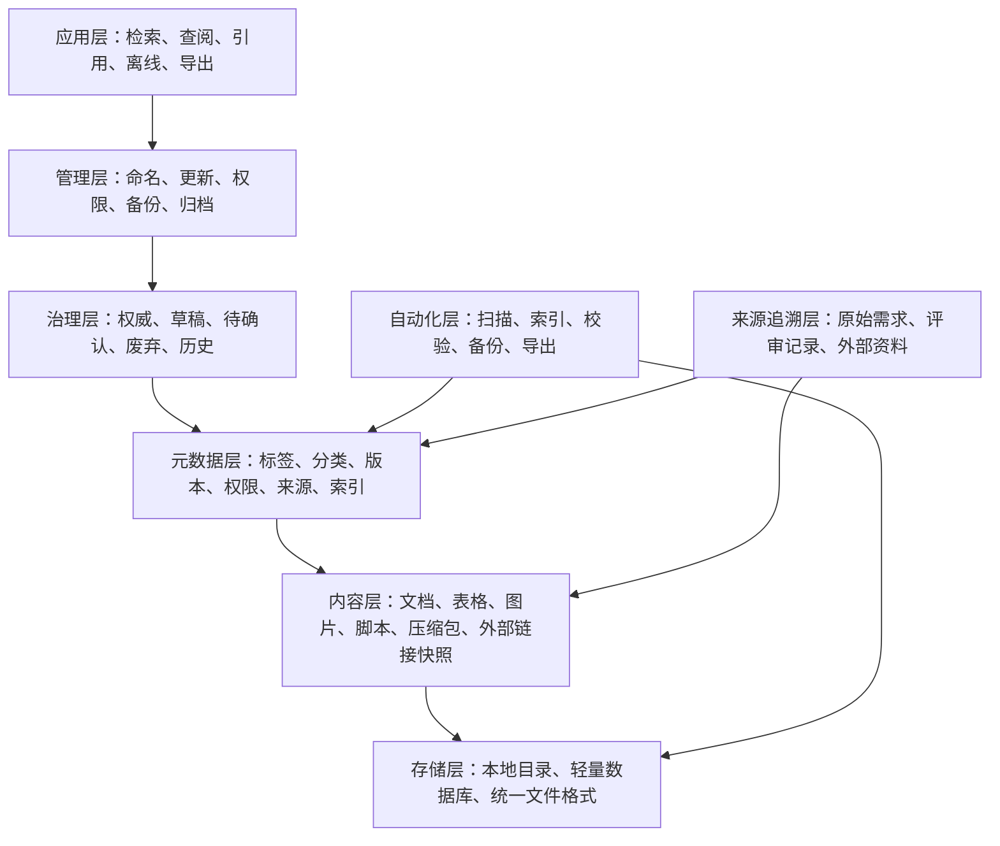

# 知识库工程架构

本文定义 Linkincrease 知识库的底座架构，重点回答：资料放在哪里、用什么格式、如何标注元数据、如何检索、如何更新、如何备份、如何为后续 AI/RAG 或其他知识库系统迁移做准备。

## 1. 总体分层



## 2. 内容层

内容层保存知识库中的实体资料。内容应分为“原始资料”和“知识化资料”，二者不要混放。

| 内容类型 | 说明 | 推荐格式 | 示例 |
| --- | --- | --- | --- |
| 知识页 | 已整理、可阅读、可复用的知识库正文 | `.md` | `04-Linkincrease完整知识库架构与内容.md` |
| 原始需求 | 从所思、Teambition、会议、产品评审导出的原始材料 | `.md`、`.docx`、`.pdf` | `source:thoughts-v2-current/v2.2.x/贸易端/【贸易端】【订单详情】查看&操作.md` |
| 表格资料 | 权限矩阵、字段清单、导入模板、配置表 | `.xlsx`、`.csv` | `metadata/权限矩阵.xlsx` |
| 图片截图 | 原型截图、流程截图、页面截图 | `.png`、`.jpg`、`.webp` | `assets/images/order-detail.png` |
| 脚本工具 | 扫描、索引、导出、检查脚本 | `.ps1`、`.py`、`.js` | `scripts/build-index.ps1` |
| 压缩包 | 一次性导出包、外部资料包、历史快照 | `.zip`、`.7z` | `archive/2026-05-需求文档导出.zip` |
| 外部链接快照 | 对外部文档、钉钉表格、所思链接的本地备份 | `.md`、`.pdf`、`.html` | `sources/external/权限矩阵.md` |

内容层原则：

- 原始资料保留原貌，不直接修改。
- 知识页只沉淀当前共识，不堆完整需求原文。
- 图片和附件不要散落在正文同级目录，统一放入 `assets/`。
- 外部链接必须尽量做本地快照，避免链接失效后无法追溯。

## 3. 元数据层

元数据层用于描述每份资料的分类、状态、版本、权限和索引信息。建议每篇 Markdown 知识页使用 YAML Front Matter。

### 3.1 知识页元数据字段

```yaml
---
title: 订单-生命周期与状态规则
type: knowledge
domain: 贸易端
module: 订单
submodule: 生命周期
status: authoritative
version: v1.0
owner: 产品
maintainer: Daren
updated_at: 2026-05-22
permission: internal
tags:
  - 订单
  - 状态机
  - 权限
source_files:
  - source:thoughts-v2-current/v2.2.x/贸易端/【贸易端】【订单详情】查看&操作.md
  - source:thoughts-v2-current/v2.2.x/贸易端/【贸易端】【订单列表】订单增删改.md
related_docs:
  - 02-核心概念词典.md
  - 03-功能地图.md
search_keywords:
  - 完成订单
  - 取消订单
  - 重启订单
---
```

### 3.2 推荐字段说明

| 字段 | 是否必填 | 说明 |
| --- | --- | --- |
| `title` | 是 | 文档标题 |
| `type` | 是 | `knowledge`、`source`、`metadata`、`template`、`script`、`archive` |
| `domain` | 是 | 运营端、贸易端、采集端、公共能力、知识库管理 |
| `module` | 是 | FlowSpace、订单、工单、资源库、自动化等 |
| `submodule` | 否 | 更细分主题 |
| `status` | 是 | `authoritative`、`draft`、`pending`、`deprecated`、`archived` |
| `version` | 是 | 知识页版本，不等同于产品版本 |
| `owner` | 否 | 业务负责人 |
| `maintainer` | 否 | 文档维护人 |
| `updated_at` | 是 | 最近更新日期 |
| `permission` | 是 | `public`、`internal`、`restricted`、`confidential` |
| `tags` | 否 | 用于检索和聚类 |
| `source_files` | 是 | 原始来源文件 |
| `related_docs` | 否 | 相关知识页 |
| `search_keywords` | 否 | 别名、旧称、常见搜索词 |

### 3.3 元数据台账

除文档内元数据外，建议维护集中台账：

```text
metadata/
  documents.csv          # 所有知识页清单
  sources.csv            # 原始资料来源清单
  tags.csv               # 标签字典
  permissions.csv        # 文档权限清单
  glossary.csv           # 术语索引，可由词典生成
  search-index.json      # 本地检索索引
```

## 4. 存储层

建议把当前根目录逐步演进为以下结构：

```text
Linkincrease知识库/
  README.md
  00-知识库维护规范.md
  01-产品总览.md
  02-核心概念词典.md
  03-功能地图.md
  04-Linkincrease完整知识库架构与内容.md
  05-需求文档来源台账.md
  06-知识库工程架构.md
  99-待办与问题池.md
  docs/
    00-入门/
    10-产品端/
    20-业务对象/
    30-业务流程/
    40-权限与安全/
    50-模板表单与数据/
    60-协作通知与自动化/
    70-展示分析/
    80-日志审计/
    90-来源与待办/
  最新需求源（source:thoughts-v2-current）/
  sources/
    external/
    exported/
    snapshots/
  assets/
    images/
    files/
    diagrams/
  metadata/
  scripts/
  exports/
  archive/
  backups/
  templates/
```

### 4.1 目录职责

| 目录 | 用途 |
| --- | --- |
| 根目录 | 放总览、入口、核心规范和当前主干文档 |
| `docs/` | 后续拆分后的正式知识页 |
| `最新需求源（source:thoughts-v2-current）` | 唯一最新需求源，由所思同步脚本维护 |
| `sources/` | 外部系统导出、外部链接快照、补充来源 |
| `assets/` | 图片、附件、流程图、可复用素材 |
| `metadata/` | 元数据台账、标签字典、索引文件 |
| `scripts/` | 自动化脚本 |
| `exports/` | 对外导出包，如 HTML、PDF、RAG 数据包 |
| `archive/` | 历史归档、废弃资料、旧版本快照 |
| `backups/` | 定期备份包 |
| `templates/` | 文档模板 |

### 4.2 轻量数据库选择

短期可以只使用 Markdown + CSV + JSON。资料量变大后，可增加轻量数据库：

| 方案 | 适用场景 |
| --- | --- |
| CSV | 人工维护简单台账 |
| JSON | 脚本生成检索索引、关系图谱 |
| SQLite | 需要本地快速检索、条件过滤、版本记录 |
| DuckDB | 需要分析大量 CSV、日志和导入导出数据 |

建议先从 `metadata/documents.csv` 和 `metadata/search-index.json` 开始，不急着引入数据库。

## 5. 管理层

管理层负责让知识库长期不乱。

### 5.1 命名规范

| 类型 | 命名建议 | 示例 |
| --- | --- | --- |
| 总览类 | `编号-主题.md` | `01-产品总览.md` |
| 业务对象页 | `对象-主题.md` | `订单-生命周期与状态规则.md` |
| 流程页 | `流程-主题.md` | `流程-工单采集与批复.md` |
| 权限页 | `权限-对象.md` | `权限-FlowSpace业务角色.md` |
| 来源资料 | 保留原文件名 | `【贸易端】【订单详情】查看&操作.md` |
| 图片 | `模块-场景-序号.png` | `order-detail-left-tree-01.png` |
| 导出包 | `YYYY-MM-DD-主题.zip` | `2026-05-22-需求文档导出.zip` |

### 5.2 更新机制


### 5.3 权限划分

| 权限等级 | 说明 | 示例 |
| --- | --- | --- |
| `public` | 可对外或跨团队公开 | 产品介绍、公开 FAQ |
| `internal` | 公司内部可见 | 大多数产品知识页 |
| `restricted` | 限产品、研发、运营等特定团队 | 权限矩阵、未发布规划 |
| `confidential` | 高敏感内容 | 客户资料、商业合同、账号密钥 |

原则：

- 默认 `internal`。
- 原始需求一般为 `internal` 或 `restricted`。
- 客户数据、账号密钥、生产配置不得进入普通知识库正文。
- 如果需要记录敏感信息，只记录索引和位置，不记录明文。

### 5.4 备份策略

| 备份类型 | 频率 | 内容 |
| --- | --- | --- |
| 快速备份 | 每次大改前 | 根目录文档、metadata |
| 日备份 | 每天或每次批量导入后 | 全量知识库 |
| 月归档 | 每月 | 全量压缩包、来源快照 |
| 发布快照 | 每次对外导出或交付前 | docs、metadata、exports |

备份目录建议：

```text
backups/
  2026-05-22-before-restructure.zip
  2026-05-22-after-restructure.zip
```

## 6. 治理层

治理层用于区分内容可信度和生命周期。

| 状态 | 含义 | 处理方式 |
| --- | --- | --- |
| `authoritative` | 当前权威结论 | 可被引用、导出、用于培训 |
| `draft` | 草稿 | 可协作编辑，但不作为最终口径 |
| `pending` | 待确认 | 进入问题池，不写成确定结论 |
| `deprecated` | 已废弃 | 保留历史，不作为当前规则 |
| `archived` | 历史归档 | 只用于追溯 |

知识库首页和索引默认只展示 `authoritative` 与必要的 `draft`；`pending`、`deprecated`、`archived` 需要单独标识。

## 7. 应用层

应用层定义知识库怎么被使用。

| 使用场景 | 实现方式 |
| --- | --- |
| 本地全文检索 | 使用编辑器搜索、`rg`、本地索引 JSON |
| 快速查阅 | README、功能地图、概念词典、目录页 |
| 引用复用 | 每页维护来源、相关文档和稳定标题 |
| 离线查阅 | Markdown 原文 + 图片本地化 + 导出 HTML/PDF |
| 需求追溯 | 来源台账 + `source_files` 元数据 |
| 培训交付 | 从权威页导出产品手册或培训资料 |
| AI/RAG 准备 | 统一 Markdown、元数据、切片、索引 |

### 7.1 检索索引建议

本地索引可以生成 JSON：

```json
{
  "id": "order-lifecycle",
  "title": "订单-生命周期与状态规则",
  "path": "docs/20-业务对象/订单-生命周期与状态规则.md",
  "domain": "贸易端",
  "module": "订单",
  "tags": ["订单", "状态", "权限"],
  "keywords": ["完成订单", "取消订单", "重启订单"],
  "updated_at": "2026-05-22",
  "permission": "internal"
}
```

### 7.2 AI/RAG 切片建议

后续如果用于 RAG，建议按以下规则切片：

- 按二级标题或三级标题切片，不按固定字数硬切。
- 每个切片保留 `title`、`module`、`source_files`、`permission`。
- 权限为 `restricted` 或 `confidential` 的内容单独建索引。
- 原始需求和权威知识页分开索引，回答时优先引用权威页。

## 8. 自动化层

自动化层用于降低维护成本。

| 脚本 | 功能 |
| --- | --- |
| `scan-sources` | 扫描 `最新需求源（source:thoughts-v2-current）` 和 `sources/`，生成来源清单 |
| `build-documents-csv` | 提取 Markdown 元数据，生成 `documents.csv` |
| `build-search-index` | 生成 `search-index.json` |
| `check-links` | 检查本地链接、图片链接、外部链接 |
| `check-metadata` | 检查必填元数据是否缺失 |
| `backup` | 打包备份 |
| `export-html` | 导出可离线浏览的 HTML |
| `export-rag` | 生成 RAG 导入包 |

建议优先实现三个脚本：

1. 扫描来源文档，生成 `metadata/sources.csv`。
2. 扫描知识页，生成 `metadata/documents.csv`。
3. 生成全文检索索引 `metadata/search-index.json`。

## 9. 来源追溯层

来源追溯层解决“这个结论从哪里来”的问题。

每条正式知识结论至少应该能追溯到以下一种来源：

- 原始需求文档。
- 评审纪要。
- 权限矩阵或配置表。
- 原型截图。
- 线上产品行为。
- 产品负责人确认记录。

来源追溯建议：

```text
知识页正文只写当前结论
来源需求列在文末
复杂规则在来源台账中做映射
外部链接必须尽量导出本地快照
待确认内容放入问题池
```

## 10. 当前缺口与下一步

当前已具备：

- 知识库入口。
- 产品总览。
- 核心概念词典。
- 功能地图。
- 完整产品知识架构。
- 需求来源台账。
- 待办与问题池。

下一步建议补齐：

1. `metadata/documents.csv`：登记所有知识页元数据。
2. `metadata/sources.csv`：登记所有原始需求来源。
3. `docs/20-业务对象/`：拆出 FlowSpace、订单、里程碑、工单、资源库。
4. `docs/40-权限与安全/`：拆出完整权限体系。
5. `scripts/`：增加扫描和索引脚本。
