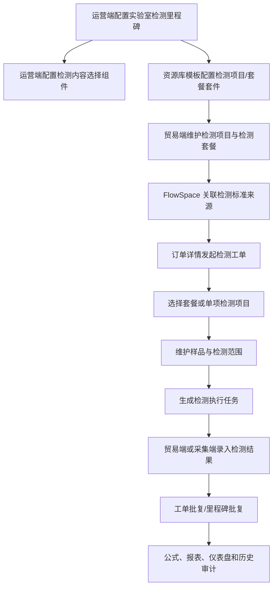

# 实验室检验流程

## 1. 功能定位

实验室检验流程用于在 Linkincrease 内打通“配置 - 预定 - 检测 - 批复 - 统计”的结构化业务闭环。运营端定义业务模板、资源库模板和行业组件规则；贸易端创建 FlowSpace、关联检测标准资源、维护套餐和项目，并组织检测业务；采集端执行实验室检测任务、录入结果并提交。

本能力不建设独立 LIMS，不覆盖实验室内部完整排程、设备、试剂和报告签发系统。首期重点是让检测套餐、项目、样品、执行结果、判定和金额等数据结构化，并可继续参与 Linkincrease 的关联引用、公式计算、报表、仪表盘、权限控制、动态、历史记录和批复流程。

最终结算规则仍需根据后续业务确认独立完善。

## 2. 业务闭环

## 3. 运营端模板配置

### 3.1 实验室检测里程碑

业务模板中可新增一个实验室检测里程碑：

| 配置 | 规则 |
| --- | --- |
| 默认名称 | 实验室检测，可修改 |
| 数量限制 | 同一业务模板最多一个 |
| 添加校验 | 模板已包含实验室检测里程碑时，不允许重复添加 |
| 里程碑属性 | 可编辑、可删除；工单批复不可关闭 |
| 添加表单 | 实验室检测里程碑不展示普通“添加表单”入口 |
| 批复类型 | 仅可选工单批复、里程碑批复 + 工单批复 |

删除实验室检测里程碑时，需同时删除该里程碑下固定表单，并清除模板内相关“检测内容选择”组件、初始内容来源、筛选规则和行业能力设置。

### 3.2 固定表单组

实验室检测里程碑自动生成固定表单：

| 表单 | 表单类型 | 生成方式 | 规则 |
| --- | --- | --- | --- |
| 检测任务信息 | 工单表单 | 自动 | 普通可设计表单，可维护任务、负责人、审核人、实验室等基础信息 |
| 检测标准与项目 | 工单表单 | 自动 | 不允许删除，不允许普通表单设计；通过检测内容选择设置管理 |
| 样品与检测范围 | 工单表单 | 自动 | 维护样品、收样和样品与检测项目范围 |
| 检测执行 | 工单表单 | 自动 | 录入检测结果、判定、特殊情况和临时判定条件 |
| 检测报告 | 工单表单 | 自动 | 普通可设计表单，维护报告编号、日期、结论、备注和附件 |
| 工单批复 | 工单批复表单 | 自动 | 不允许关闭 |
| 里程碑批复 | 里程碑批复表单 | 按配置 | 可按既有表单设计能力配置 |

### 3.3 检测内容选择组件

业务表单设计器新增行业组件：`检测内容选择`。当模板内存在实验室检测里程碑时，对应表单设计页展示该组件。

| 配置项 | 规则 |
| --- | --- |
| 允许选择检测套餐 | 默认开启，开启后贸易端可从已关联检测套餐库选择套餐 |
| 允许添加单项检测项目 | 默认开启，开启后贸易端可从已关联检测项目库添加自选项目 |
| 检测标准来源 | 系统自动关联当前模板唯一实验室检测能力 |
| 筛选规则 | 仅当来源表单可能产生多条工单记录时展示 |
| 条件配置 | 可按表单字段或固定值配置，字段类型和规则参照显隐或自动化 |

检测内容选择组件生成的数据需作为平台可用字段暴露，供公式、报表、仪表盘、批复和历史记录按权限使用。

## 4. 资源库模板与检测标准

资源库模板表单设计器新增“实验室检测”行业组件分组，包含两个套件：`检测项目配置套件` 和 `检测套餐配置套件`。套件整体加入，成员整行展示；点击外框查看结构，点击成员配置属性。套件成员不能单独拖出、复制或删除。

### 4.1 检测项目配置套件

检测项目配置套件用于提供检测项目分类和多方法方案结构。运营端配置分类、方法来源及展示规则；贸易端在项目记录中维护实际方法方案。

| 能力 | 规则 |
| --- | --- |
| 检测项目分类 | 支持通用检测、纺织服装或空白创建初始化；分类名称必填，同级不重名，最多三级 |
| 分类编辑 | 支持新增一级、同级、子级，移动排序，删除节点及其子孙节点 |
| 检测方法方案 | 必须关联当前资源库模板内一张资源表 |
| 候选项展示字段 | 主展示必填，补充字段 1/2 选填，三个展示字段不得重复 |
| 分组字段 | 选填；配置后按字段值分组，空值进入未分组 |

### 4.2 检测套餐配置套件

检测套餐配置套件用于提供套餐项目组成和套餐整体价格能力。运营端只配置项目套件关联；贸易端维护套餐价格及明细。

| 能力 | 规则 |
| --- | --- |
| 套件组成 | 固定包含项目明细及内置套餐价格能力 |
| 关联检测项目配置套件 | 必填、单选，候选项按资源表名称分组 |
| 内置能力 | 自动取得项目分类、项目、方法方案、结果结构、判定方案、样品要求等 |

资源库表单列表顶部可展示“检测资源配置”引导。当前模板存在任一检测项目配置套件或检测套餐配置套件时展示；全部删除后隐藏。项目套件可独立完成，不强制添加套餐套件。

## 5. 贸易端资源数据维护

### 5.1 检测项目

贸易端在资源库中维护检测项目及其方法方案。

| 数据 | 规则 |
| --- | --- |
| 检测项目分类 | 必填，单选，当前仅允许选择末级分类 |
| 方法方案列表 | 至少 1 个；支持添加、编辑、移除 |
| 检测方法 | 必填，从项目套件配置的方法资源表选择已有记录 |
| 结果项 | 至少 1 项；支持文本、数字、等级、枚举等结果类型 |
| 数字结果范围 | 可配置最小值、最大值，仅用于录入校验 |
| 等级值 | 至少 2 个不重复值，支持添加、改名、排序、删除、批量添加 |
| 判定方案 | 至少 1 套；按结果项条件自动联动 |

新增结果项时，每套判定方案需同步生成该结果的条件项；允许删除的结果项被删除后，同步清理其判定条件。

### 5.2 检测套餐

贸易端在资源库中维护检测套餐、套餐项目关系和套餐价格。

| 数据 | 规则 |
| --- | --- |
| 套餐项目 | 由检测项目、方法方案、判定方案组成 |
| 适用样品 | 添加单项检测项目时默认全选全部样品，可调整 |
| 重复校验 | 同一套餐内项目 + 方法方案 + 判定方案唯一 |
| 价格 | 金额按运营端配置决定是否在业务流程中展示 |

## 6. FlowSpace 检测标准关联

当业务模板包含实验室检测里程碑时，当前 FlowSpace 需要配置检测项目、检测套餐等标准数据来源。

只有当前 FlowSpace 包含实验室检测里程碑时，`FlowSpace 管理` 左侧业务模块才展示“实验室检测”。拥有“关联资源库”配置权限的成员进入订单列表时，系统检查实验室检测资源关联状态。

| 配置状态 | 是否可发起检测工单 | 规则 |
| --- | --- | --- |
| 待配置 | 否 | 从未配置、部分配置、字段映射不完整、套件或资源表被删除、来源失效 |
| 已配置 | 是 | 套餐、项目数据源及必填映射全部有效 |

检测标准关联必须满足：

1. 套餐数据和检测项目数据两项固定关联均配置完整。
2. 套餐和项目必须选择同一个团队资源库中的套件实例。
3. 套餐名称、套餐项目明细、项目名称、项目分类、方法方案等必填映射完整。
4. 字段类型兼容。
5. 所选项目套件与套餐项目明细的关联一致。

除实验室检测里程碑固定的检测内容选择组件以外，只要表单内至少仍存在一个检测内容选择组件，就展示共用配置；不需要为每个检测内容组件重复配置套餐或项目来源。

## 7. 订单详情检测流程

实验室检测工单采集包含检测任务信息、检测标准与项目、样品与检测范围、检测执行、检测报告等表单。

### 7.1 检测标准与项目

用户可选择检测套餐，也可添加单项检测项目。无套餐时至少需要有一项自选检测项目。

| 数据组 | 操作规则 | 展示内容 |
| --- | --- | --- |
| 套餐数据 | 套餐下拉只展示关联配置中的套餐显示名称；更换套餐需弹出影响确认并重新生成套餐项目范围 | 套餐显示名称、检测项目数 |
| 检测项目数据 | 添加或编辑单项时，检测项目、方法方案、判定方案、适用样品必填 | 检测项目名称、方法方案、判定方案、自选固定为 1 项 |
| 检测金额 | 仅运营端开启显示价格时展示 | 各币种金额 |

修改项目信息会清空已有项目的录入数据，并需向用户明确提示。移除项目时也需确认影响。

### 7.2 样品与检测范围

样品与检测范围用于维护实验室实际收到的样品，并建立“样品 x 检测项目”的执行范围。检测执行任务由该范围自动生成。

取消已有结果的项目范围时，需二次确认，并清除当前有效结果，历史记录保留。

### 7.3 检测执行

检测执行根据检测标准与项目、样品与检测范围生成样品 x 结果项检测结果及判定。

检测判定状态包括：

| 状态 | 说明 |
| --- | --- |
| 待处理 | 尚未录入有效检测结果 |
| 合格 | 所有需判定结果满足当前判定条件 |
| 不合格 | 存在至少一个不合格结果 |
| 无法判定 | 样品条件不满足、检测过程异常或其他原因导致无法给出正常判定 |
| 未完成 | 没有不合格，但存在未完成结果，或没有一个需录入结果项 |

检测结果录入规则：

- 文本结果正常录入时必填，按方法方案配置人工判定。
- 数字结果需遵循结果项配置的精度、单位和允许录入范围。
- 等级和枚举结果读取项目配置的可选值。
- 超出录入范围时阻止保存并提示允许范围。
- 特殊情况可记录样品条件不满足、检测过程异常/结果无效、其他原因无法检测等，并将检测判定保存为无法判定。

临时判定条件可在检测执行中调整。调整后需展示临时状态标签，并清除当前生效的临时调整时恢复原判定规则。

## 8. 工单批复与采集端

实验室检测工单批复用于对已提交的检测工单进行复核，包括查看检测内容、样品范围、检测结果汇总、逐条检测结果、检测报告信息和附件，并给出整体批复结论。

| 批复范围 | 规则 |
| --- | --- |
| 整体批复 | 批复结论必填，取值通过/不通过；批复意见非必填 |
| 逐条检测结果批复 | 批复人可对每条检测结果选择接受或不接受，并填写独立批复意见 |

采集端与贸易端使用同一份检测工单数据。采集端任务详情页需支持查看任务、维护样品和范围、录入执行条件与检测结果，并在提交任务后同步贸易端。

## 9. 平台联动

实验室检验数据需按 Linkincrease 既有平台能力参与：

- 关联引用：检测项目、套餐、样品和结果需保持结构化引用。
- 公式：检测汇总字段、金额、判定和数量可作为公式来源。
- 报表和仪表盘：检测内容明细、项目明细、样品明细、结果明细和汇总字段需进入分析数据。
- 权限：按 FlowSpace、资源库、表单字段、数据围栏和协作团队权限过滤。
- 动态和历史记录：套餐变更、项目范围变更、结果录入、特殊情况、批复和临时判定条件需可追溯。

## 10. 待确认问题

- 实验室检验最终结算规则、报价口径和多币种金额是否进入首期闭环，仍需业务确认。
- 检测报告签发、实验室内部排程、设备、试剂和第三方 LIMS 对接是否独立成后续需求。
- 检测内容明细、检测项目明细、样品明细和检测结果明细进入 BI、报表和仪表盘时的字段级权限矩阵需要补齐。

## 11. 来源需求

- `source:thoughts-v2-current/v2.8/运营端/【运营端】【表单设计】实验室检验流程.md`