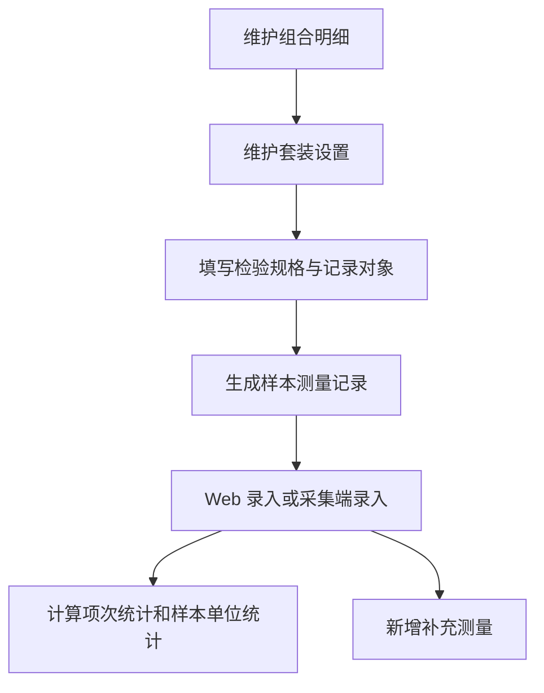

# 验货组件流程

## 1. 功能定位

验货组件流程基于 Linkincrease 低代码平台，在里程碑工单中提供可配置、可生成、可采集、可统计的尺寸检验行业组件。组件兼顾平台灵活性和尺寸检验固定计算逻辑：运营端配置组件结构，贸易端维护组合、套装结构、检验规格并生成样本测量记录，采集端完成现场录入、保存和任务提交。

提交后的明细及统计结果可供贸易端、公式、报表和仪表盘使用。

## 2. 核心术语

| 术语 | 定义 |
| --- | --- |
| 组合 | 由一个或两个业务维度形成的抽样分组，例如红色 / M；名称来自实际配置，不固定为颜色、尺码 |
| 抽样基数 | 某组合的订单或业务数量；单件组合按件，套装组合按套 |
| 样本形态 | 每个组合的抽样单位类型，取值为单件或套装 |
| 套件 | 一套中可独立记录检验项目的对象，例如 Top、Bottom |
| 记录对象 | 检验规格的归属，包括单件规格、按套记录或具体套件 |
| 按套记录 | 每个抽样套只记录一次的检验项目集合，可为空 |
| 检验项目 | 需要测量和判定的一项规格；允许同名，使用稳定 `part_id` 区分 |
| 样本单位 | 组合中的一个抽样编号，对外显示 `#1`、`#2` |
| 测量项次 | 一个样本单位、一个记录对象、一个检验项目形成的一条主测量记录 |
| 补充测量 | 主测量之外的复核数据，默认不参与主统计 |
| 任务草稿 | 采集端点击保存后写入、但尚未通过提交任务同步到服务器正式版本的数据 |

## 3. 运营端配置

### 3.1 尺寸检验组件

尺寸检验属于行业组件，可在运营端业务模板或资源库模板的表单设计器中添加。组件不可拖入子表或布局组件内部，一个表单允许添加多个实例。

组件内置组合明细、记录对象检验规格、样本测量记录及补充测量的数据结构和计算逻辑。运营端只配置结构和属性。

| 配置项 | 规则 |
| --- | --- |
| 组合明细标题 | 必填，默认组合明细 |
| 维度一名称 | 必填，默认颜色；仅为示例，可改为任意业务名称 |
| 维度二名称 | 必填，默认尺码；仅为示例，可改为任意业务名称 |
| 检验规格标题 | 必填，默认检验规格 |
| 检验项目列名 | 必填，默认项目名称 |
| 上偏差、下偏差列名 | 必填 |
| 样本测量记录标题 | 必填，默认样本测量记录 |
| 计划样本量 | 可选择数字或公式数字类型组件；为空时不自动分配 |
| 关联数据 | 可关联独立组合明细或其他尺寸检验组件的组合明细 |
| 国际化 | 可配置组合明细、检验规格、项目名称、偏差列和测量记录标题 |

### 3.2 可用字段

尺寸检验组件需作为平台可用字段暴露，供公式、条件、报表和仪表盘按权限使用。

| 分组 | 字段或子表 |
| --- | --- |
| 组合明细 | 子表 |
| 检验规格 | 子表，需包含记录对象字段 |
| 样本测量记录 | 子表 |
| 补充测量 | 子表 |
| 项次统计 | 应检项次、已检项次、待检项次、合格项次、不合格项次、无法判定项次 |
| 样本单位统计 | 待录入、录入中、已完成、整样合格、整样不合格 |

### 3.3 独立组合明细组件

独立组合明细同属行业组件，只维护组合结构、抽样基数、样本形态、套件清单和样本量，不展示检验规格、生成样本记录、测量统计和补充测量。关联引用时，来源结构只读，本组件是否允许独立维护样本量取运营端配置。

## 4. 贸易端 FlowSpace 应用

### 4.1 组合明细

组合明细表格列名由运营端配置。

| 字段 | 规则 |
| --- | --- |
| 维度一 | 默认取运营端配置值，必填 |
| 维度二 | 2D 时显示并必填；1D 时隐藏 |
| 抽样基数 | 正整数，单件按件、套装按套 |
| 样本形态 | 单选，单件或套装，默认单件 |
| 基数占比 | 当前行抽样基数 / 全部行抽样基数，显示 1 位小数 |
| 样本量 | 非负整数，可由计划样本量自动分配，也可手工修改 |

1D 切换为 2D 时显示维度二列；2D 切换为 1D 时固定保留维度一。1D、2D 均允许维度值相同的组合行重复存在。表格支持从 Excel 直接粘贴多行多列，超出当前行数时自动追加行。

样本量自动分配采用确定性整数算法，使自动分配总量尽可能等于有效计划样本量。计划值为空时不自动分配，各行样本量由用户填写。

### 4.2 关联模式

组合明细关联其他组件时，来源、维度模式和名称、组合行、抽样基数、样本形态、套件设置均只读。当前尺寸组件可独立维护样本量和检验规格。进入可编辑状态时加载来源最新版本。

### 4.3 套装设置

当至少一条组合的样本形态为套装时显示套装设置。

| 操作 | 规则 |
| --- | --- |
| 新增套件 | 套件名称必填且不能重复 |
| 重命名 | 修改显示名称，不修改 `member_id`，已有规格和测量记录仍能关联 |
| 删除套件 | 套件下没有配置检验规则时可删除；已有检验规格时需先复制或删除项目 |
| 适用范围 | 同一组件内全部套装组合使用同一套件清单 |

### 4.4 检验规格与记录对象

系统根据组合结构自动生成记录对象 Tab。

| 组合场景 | 记录对象 |
| --- | --- |
| 仅单件 | 单件规格 |
| 存在套装 | 按套记录和每个具体套件 |
| 单件与套装混合 | 单件规格、按套记录、具体套件 |

检验项目字段包括项目名称、下偏差、上偏差和动态规格值。项目名称必填，允许同名；下偏差、上偏差和标准值均非必填，填写时最多 1 位小数；下偏差需小于等于 0，上偏差需大于等于 0，标准值需大于等于 0。

动态规格列 2D 时按维度二生成，1D 时按维度一生成。检验规格支持表格粘贴、删除项目、选中项目批量复制到其他有效记录对象。

单件与套装混合时，记录对象按组合样本形态决定是否适用。例如 S 为单件、M/L 为套装时，单件规格只对 S 可编辑，按套记录和具体套件只对 M/L 可编辑。不可适用的规格单元格置灰禁用；当组合从适用变为不适用时，系统需清空该单元格已填值且不保留隐藏值；当组合从不适用变为适用时，单元格恢复可编辑，默认空白且允许继续保持空白。

### 4.5 Excel 模板下载与导入

模板包含 `00_填写说明`、`01_组合配置`、`02_检验规格`。用户下载当前组件专属模板后填写，再上传 `.xlsx` 文件。

导入流程：

1. 前端校验扩展名、文件大小、加密、宏和模板标识。
2. 服务端校验 Sheet、表头、必填、数据类型、1 位小数、组合、套件、记录对象、稳定 ID 和动态规格完整性。
3. 一次性返回全部错误，每条包含 Sheet、行号、列名、原值、原因和修改建议。
4. 存在阻断错误时整份文件不落库；仅有警告时允许用户确认继续。
5. 已有数据时，导入后清空已有数据。

关联模式下载模板时，`01_组合配置` 中的来源结构作为只读参考并带出来源版本，不允许通过导入修改维度、组合、抽样基数、样本形态和套件清单，只允许导入当前组件可维护的样本量与检验规格。

`00_填写说明` 需说明填写顺序、术语、阻断规则和警告规则。阻断错误包括：上偏差填写后不满足大于等于 0 且最多 1 位小数、下偏差填写后不满足小于等于 0 且最多 1 位小数、适用规格值填写后不满足大于等于 0 且最多 1 位小数、在不适用规格列填写值、填写 `N/A` 或其他非数字文本。标准值、上偏差或下偏差为空不阻断导入，仅作为警告；警告需预估受影响测量记录数，并提示这些记录录入实测值后将显示为 `无法判定`。

## 5. 样本测量记录

生成样本测量记录前需完成组合明细、套件和检验规格校验。阻止条件包括没有组合行、样本量合计为 0、维度值未填写、抽样基数或样本量非法、存在单件但无单件检验项目、存在套装但所有套装记录对象均无项目、偏差或标准值格式错误、在不适用规格列存在值、套件名称为空或重复等。上偏差、下偏差或标准值为空不阻断生成，仅提示参考数据不完整。

生成公式：

| 场景 | 记录数 |
| --- | --- |
| 单件组合 | 该组合样本量 × 单件规格项目数 |
| 套装组合 | 该组合样本量 × 按套记录项目数和各具体套件项目数之和 |

生成确认弹窗需展示本次抽样单位总数、按组合的样本量和记录对象项目数、本次主测量记录总数。当参考数据不完整时，弹窗额外展示警告：`参考数据未完整：预计有{无法自动判定记录数}条测量记录无法自动判定。仍可生成和录入；录入后显示“无法判定”，不计入合格或不合格。`

确认生成后，新生成且未填写实测值的主测量记录保持 `待录入`，不得因参考数据缺失预先标记为 `无法判定`。生成成功提示 `已生成{测量记录数}条测量记录`。

生成后贸易端仍可逐条录入和修改测量值。样本测量记录包含样本号、组合、记录对象、检验项目、标准值、允许范围、实测值、偏差值和判定。标准值存在时，偏差值为 `实测值 - 标准值`；标准值为空时偏差值显示 `--`。支持按组合、记录对象、样本号、项目、录入状态筛选。

## 6. 统计规则

### 6.1 判定规则

| 指标 | 公式 |
| --- | --- |
| 合格下限 | 标准值 + 下偏差 |
| 合格上限 | 标准值 + 上偏差 |
| 偏差值 | 标准值存在时为实测值 - 标准值；标准值为空时显示 `--` |

判定取值包括 `待录入`、`合格`、`不合格`、`无法判定`。未填写实测值时为待录入，不得将空值按 0 判定。填写实测值且标准值、上偏差、下偏差均完整时，实测值在闭区间 `[合格下限, 合格上限]` 内为合格，否则为不合格；填写实测值但参考数据不完整时为无法判定。标准值或偏差更新后，对保留的实测值重新计算偏差和判定。

### 6.2 测量项次统计

| 指标 | 计算口径 |
| --- | --- |
| 应检项次 | 当前有效主测量记录总数，不包含补充测量 |
| 已检项次 | 已填写有效实测值的主测量记录数 |
| 待检项次 | 应检项次 - 已检项次 |
| 合格项次 | 已检记录中判定合格的数量 |
| 不合格项次 | 已检记录中判定不合格的数量 |
| 无法判定项次 | 已填写实测值但标准值、上偏差或下偏差不完整的主测量记录数 |
| 项次完成率 | 已检项次 / 应检项次 |
| 项次合格率 | 合格项次 / 已检项次；已检为 0 时显示 `--` |

关系校验：`应检项次 = 已检项次 + 待检项次`，`已检项次 = 合格项次 + 不合格项次 + 无法判定项次`。补充测量不进入主项次统计。

### 6.3 样本单位统计

一个样本单位的应检范围为该组合全部适用记录对象的主测量项目。待录入表示一个应检主项目都未填写；录入中表示已填写至少一个但未填写全部；已完成表示全部应检主项目均已填写；整样合格表示已完成且全部主项目合格；整样不合格表示已完成且至少一个主项目不合格；无法判定抽样单位表示已完成、无不合格项次、且至少一个主项目无法判定。

样本单位统计关系：`完整录入 = 合格抽样单位 + 不合格抽样单位 + 无法判定抽样单位`。未完整录入的样本单位不计为整样合格或整样不合格。

配置更新如果会影响已生成测量记录，需提示用户清空并重生成。确认文案为：`继续后将清空当前{已录入数}项实测值和{补测数量}条补充测量，并根据最新配置重新生成{重新生成记录数}条主测量记录。此操作不可撤销。` 当无补充测量时隐藏补测数量。

## 7. 补充测量

补充测量从具体主测量记录发起，用于复核或异常分析，默认不参与主统计。主测量未录入时不允许补测，提示先录入主测量值。补充测量仅作为报告和异常分析参考，不影响应检、已检、待检、合格、不合格、无法判定、完成率或主合格率。

新增补充测量弹窗固定带入组合、记录对象、来源样本号、检验项目、标准值和允许范围。用户填写补测原因、补测数量、补测值和备注；每个补测值生成一条独立补测记录。

补充测量规则：

| 场景 | 处理 |
| --- | --- |
| 新增、编辑或删除补测 | 不改变应检、已检、待检、合格、不合格、完成率及主合格率 |
| 修改标准值或偏差值并保留实测值 | 保留补测值，按最新标准重新计算偏差和参考结果 |
| 清空并重新生成测量记录 | 主测量记录与补测记录一并清空 |
| 来源主测量值被修改 | 补测记录继续保留，来源样本号不变 |
| 来源主测量记录被删除 | 对应补测记录随重新生成一并清空 |

补充测量列表中的偏差值为 `补测值 - 标准值`；标准值为空时显示 `--`。参考结果在参考数据完整时显示范围内或超出范围，在标准值、上偏差或下偏差不完整时显示 `无法判定`。

## 8. 采集端应用

尺寸检验组件在采集端任务详情页中作为独立组件展示。组件标题、维度名称、记录对象名称等内容读取运营端及贸易端配置，不固定使用颜色、尺码、部位等行业文案。

任务详情展示组件标题、保存状态、整体预览入口、项次统计、测量进度、筛选 Tab 和组合卡片。同一任务存在多个尺寸检验组件时，每个组件独立显示保存状态。项次统计和组合卡片需展示 `无法判定项次`；完整录入口径只判断应检主项目是否已录入，不因参考数据缺失而降级为未完成。

组合卡片按组合明细行聚合。套装中的按套记录和具体套件属于同一张组合卡片，不拆成多张卡片。组合状态分为待录入、录入中、已完成和暂无项目；绿色进度条只表示录入完成，不表示全部合格。

测量录入页包含返回、标题、组合信息、保存状态、记录对象 Tab、工具区、测量矩阵、补充测量和底部操作。保存后写入任务待提交草稿，不立即同步服务端；只有任务详情页提交任务后才同步贸易端。

整体预览需汇总展示应检、待检、合格、不合格、无法判定和待检项次，筛选项包括全部、不合格、无法判定、未完成。测量录入页的即时判定取值为范围内、超出范围、无法判定、未录入：实测值为空时为未录入；实测值已填但参考数据不完整时为无法判定；实测值已填且参考数据完整时，根据是否落在允许范围内显示范围内或超出范围。

返回录入页时需统一执行未保存检查：无未保存修改直接返回，有未保存修改则弹出 `保存本次修改？`，用户可选择保存后返回、不保存并返回或继续录入。

## 9. 待确认问题

- 采集端和贸易端同时编辑同一尺寸检验组件时，冲突检测、覆盖和提示策略需结合离线能力进一步明确。
- 尺寸检验组件字段进入公式、条件、报表和仪表盘时，字段级权限、子表展开方式和统计口径需要形成矩阵。
- 补充测量是否需要在报告导出、仪表盘和异常筛选中作为可选数据源，需要后续确认。