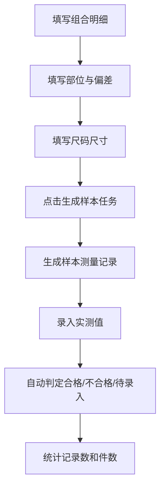

# 验货组件流程

## 1. 功能定位

验货组件流程基于 Linkincrease 低代码平台实现 AQL 抽样检验、尺寸检验和瑕疵检验。它复用资源库、关联 FlowSpace、公式、子表等能力，支持按件判定、多端数据流转与自动判定。

## 2. 依赖资源库

| 资源库 | 用途 | 关键字段 |
| --- | --- | --- |
| 部位库 | 定义检验部位和公差标准 | 部位名称、测量方式、上偏差、下偏差、适用产品类型 |
| 公差库 | 基于标准的尺寸公差参考 | 标准来源、类型、等级、尺寸段、上偏差、下偏差 |
| AQL 字码表 | 按批量范围和检验水平确定抽样字码 | 批量范围、检验水平、字码 |
| AQL 样本量 | 按字码确定样本量 | 字码、样本量 |
| AQL Ac/Re | 按 AQL 等级和字码确定接收/拒收数 | 字码、AQL 等级、Ac、Re |
| 瑕疵库 | 标准化瑕疵类型和等级 | 瑕疵名称、默认严重等级、描述、参考图片 |

## 3. 运营端配置

尺寸检验组件是行业组件，拖入表单后自动生成多表结构。

| 表 | 说明 |
| --- | --- |
| 组合明细 | 灵活 1-2 维组合，例如颜色、尺码，记录数量和分配样本 |
| 部位 | 记录检验部位、上偏差、下偏差 |
| 尺码尺寸 | 按部位和尺码记录基本尺寸 |
| 样本测量记录 | 贸易端生成并录入测量结果 |

运营端可配置各表标题、维度名称、列名、计划样本量、关联数据和国际化内容。尺寸检验组件不可拖入布局，逻辑上相当于多个子表。

## 4. 贸易端应用流程

生成样本任务前，前三张表必须填写完整；未填写完整时，未填输入框标红。生成后，如果前三张表被修改，需要提示配置已修改并重新生成；重新生成会清空已录入数据。

## 5. 组合明细规则

| 字段 | 规则 |
| --- | --- |
| 维度一 | 默认颜色，可自定义 |
| 维度二 | 默认尺码，可自定义；一维模式下隐藏 |
| 数量 | 可填写数字 |
| 占比 | 数量 / 总数量，精确到 1 位小数 |
| 分配样本 | 计划样本量乘以数量占比，四舍五入取整，可手动修改 |

若组合明细关联其他组合明细或尺寸检验组件，则维度、添加行、维度值和数量不可填写，数据来自被关联组件；样本量仍按自身配置计算。

## 6. 样本测量记录

样本测量记录按“分配样本总和 × 部位数量”生成。

| 列 | 来源 |
| --- | --- |
| 组合 | 根据维度自动带出 |
| 件号 | 同一件不同部位使用同一件号 |
| 颜色/尺码 | 根据组合明细自动带出 |
| 部位 | 来自部位表 |
| 实测值 | 用户填写 |
| 合格范围 | 基本尺寸 + 下偏差 到 基本尺寸 + 上偏差 |
| 判定 | 实测值在范围内为合格，不在范围内为不合格，未输入为待录入 |

记录表需要支持模糊搜索和组合筛选。统计包括已录入、合格、不合格，以及合格件数、不合格件数、待录入件数。

## 7. 采集端应用

采集端只展示样本采集部分，并按照组合明细聚合为任务卡片。

任务卡片包括：

- 组合信息，如颜色/尺码。
- 样本数量。
- 已录入进度。

任务详情以矩阵方式录入，每个部位一行，每行显示部位名称、合格范围和每件样本输入框。

## 8. 统计表设计

| 表 | 说明 |
| --- | --- |
| `measure_specs` | 整合组合明细、部位、尺码尺寸，作为规格统计表 |
| `measure_records` | 存储每件样本每个部位的实测值和判定 |

这两类表可支持后续帆软统计或其他外部分析。

## 9. 待确认问题

- AQL Ac/Re 判定与尺寸检验判定之间的最终汇总规则需要继续补充。
- 样本任务生成后，采集端与贸易端同时编辑的冲突处理需要明确。
- 行业组件导入模板、统计报表和移动端离线能力仍需后续拆页。

