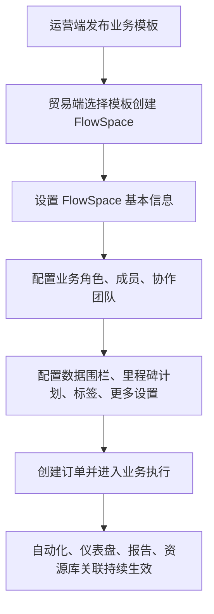

---
title: FlowSpace
type: knowledge
domain: 贸易端
module: FlowSpace
submodule: 核心业务空间
status: authoritative
version: v0.1
owner: 产品
maintainer: Daren
updated_at: 2026-05-26
permission: internal
tags:
  - FlowSpace
  - 业务空间
  - 订单
  - 权限
source_files:
  - source:thoughts-v2-current/v2.1.x/贸易端/【贸易端】【SCCS设置】.md
  - source:thoughts-v2-current/v2.1.x/贸易端/【贸易端】【协作SCCS设置】.md
  - source:thoughts-v2-current/v2.0.x/贸易端/【贸易端】【工作台】工作台、创建SCCS、SCCS分组.md
  - source:thoughts-v2-current/v2.0.x/运营端/【运营端】【模板中心】业务模版管理.md
related_docs:
  - ../../02-核心概念词典.md
  - ../../03-功能地图.md
  - ../40-权限与安全/权限体系总表.md
search_keywords:
  - FlowSpace
  - 业务空间
  - FlowSpace设置
  - 协作FlowSpace
---

# FlowSpace

> 命名说明：FlowSpace（流空间）是 SCCS 的新名称。为了让英文名更容易被直接理解，知识库正文统一使用 FlowSpace；历史来源文档中的 SCCS 仅作为原始文件名和追溯标识保留。

## 1. 功能定位

FlowSpace 是 Linkincrease 贸易端的核心业务空间，用于承载某类供应链协作业务。FlowSpace 通常由运营端业务模板创建，运行态包含订单、里程碑、工单、批复、成员、角色、协作团队、数据围栏、标签、自动化、仪表盘、报告和资源库关联。

## 2. 使用对象与入口

| 使用对象 | 入口 | 说明 |
| --- | --- | --- |
| 团队成员 | 工作台 FlowSpace 列表 | 查看、进入、创建或管理本团队 FlowSpace |
| 团队管理员 | FlowSpace 设置 | 管理基本信息、角色、成员、协作团队、数据围栏 |
| 协作团队成员 | 协作 FlowSpace | 在被授权范围内参与订单、工单和批复 |
| 运营人员 | 运营端 FlowSpace 管理 | 查看平台团队的 FlowSpace 数据、自动化记录、仪表盘、报告等 |

## 3. 核心对象

| 对象 | 说明 |
| --- | --- |
| FlowSpace 基本信息 | 名称、图标、来源模板、描述等基础信息 |
| FlowSpace 成员 | 被加入当前 FlowSpace 的团队成员 |
| FlowSpace 业务角色 | 主团队成员在 FlowSpace 内的业务权限集合 |
| 协作团队 | 被主团队邀请参与当前 FlowSpace 的外部团队 |
| 协作 FlowSpace 角色 | 协作团队在 FlowSpace 内的权限集合 |
| 数据围栏 | 控制成员可见订单、里程碑、工单、字段、标签等数据范围 |
| 里程碑计划 | FlowSpace 内订单流程节点的默认计划配置 |
| 标签设置 | 根据条件展示在订单或里程碑中的业务标签 |
| 更多设置 | 订单标识、订单取消原因等 FlowSpace 级业务设置 |

## 4. 业务流程

## 5. 权限规则

FlowSpace 权限由团队权限、FlowSpace 业务角色、协作 FlowSpace 角色、数据围栏共同决定。

| 权限域 | 作用 |
| --- | --- |
| 团队权限 | 决定是否可创建 FlowSpace、进入团队设置、管理团队级资源 |
| FlowSpace 业务角色 | 决定主团队成员可操作哪些订单、里程碑、工单、仪表盘等 |
| 协作 FlowSpace 角色 | 决定协作团队成员可查看和处理哪些业务数据 |
| 数据围栏 | 决定用户可见的数据范围和字段范围 |

判断入口是否展示时，前端可结合权限、对象状态和成员关系；提交时必须服务端再次校验。

## 6. 状态与限制

当前资料重点描述 FlowSpace 运行态设置，尚未形成完整 FlowSpace 生命周期状态机。已确认限制：

- 创建 FlowSpace 依赖运营端已发布且对当前团队可见的业务模板。
- FlowSpace 内角色、成员、协作团队变更会影响后续订单、里程碑、工单可见性和可操作性。
- 数据围栏变更会影响字段、标签、订单、里程碑、工单等展示范围。
- 订单标识、取消原因等更多设置会影响订单列表、订单详情和状态操作展示。

## 7. 字段、表单与校验

FlowSpace 继承业务模板中的主表单、里程碑、工单表单、批复表单等结构。运行态可调整的配置包括：

- 业务角色和协作方角色。
- 数据围栏。
- FlowSpace 成员和协作团队。
- 里程碑计划。
- 标签设置。
- 订单标识。
- 订单取消原因。

## 8. 通知、日志与审计

FlowSpace 设置类操作需要进入操作日志。涉及成员、协作团队、权限变化时，后续应补充消息通知规则。

已知日志范围：

- FlowSpace 设置操作日志。
- 协作 FlowSpace 设置操作日志。
- 自动化执行日志。
- 系统自动执行日志中与 FlowSpace 相关的自动化、公式、资源库同步动作。

## 9. 异常与提示

需要从原始需求继续抽取的提示包括：

- 无权限操作。
- 成员或协作团队被移除后的业务处理限制。
- 数据围栏变化后的可见性变化。
- 模板或字段变更对运行态 FlowSpace 的影响。

## 10. 来源需求

- `source:thoughts-v2-current/v2.1.x/贸易端/【贸易端】【SCCS设置】.md`
- `source:thoughts-v2-current/v2.1.x/贸易端/【贸易端】【协作SCCS设置】.md`
- `source:thoughts-v2-current/v2.0.x/贸易端/【贸易端】【工作台】工作台、创建SCCS、SCCS分组.md`
- `source:thoughts-v2-current/V2.5.x/贸易端/【贸易端】【仪表盘】权限管理.md`
- `source:thoughts-v2-current/V2.5.x/贸易端/【贸易端】报告权限.md`
- `source:thoughts-v2-current/v2.0.x/运营端/【运营端】【模板中心】业务模版管理.md`

## 11. 待确认问题

- FlowSpace 与 FlowSpace 是否完全同义，还是存在历史命名与产品边界差异。
- FlowSpace 删除、停用、归档等生命周期状态是否已有完整规则。
- 模板同步至已创建 FlowSpace 时的冲突处理和历史数据影响。

