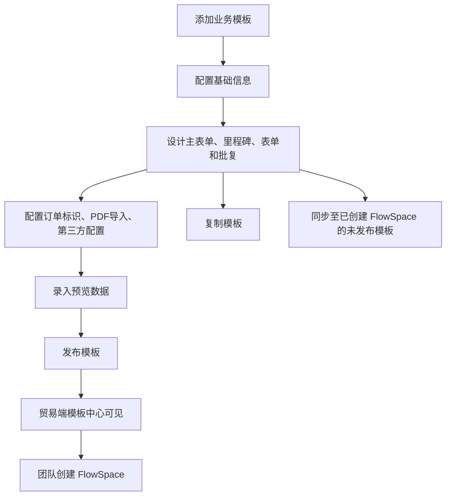

# 业务模板

## 1. 功能定位

业务模板是运营端配置的 FlowSpace 创建模板，用于定义订单主表单、里程碑、工单采集表单、工单批复表单、里程碑批复表单、订单标识、PDF 导入、预览数据、第三方数据对接等配置。

## 2. 使用对象与入口

| 使用对象 | 入口 | 说明 |
| --- | --- | --- |
| 运营人员 | 运营端 > 模板中心 > 业务模板 | 创建、编辑、设计、发布、复制和同步业务模板 |
| 贸易端团队 | 贸易端模板中心 | 基于可见且已发布的业务模板创建 FlowSpace |
| 实施人员 | 模板设计与预览数据 | 模拟业务流程和检查模板配置 |

## 3. 核心对象

| 对象 | 说明 |
| --- | --- |
| 模板基础信息 | 名称、图标、创建类型、所属行业、描述、备注等 |
| 主表单 | 订单级主数据表单，模板默认携带 |
| 里程碑 | 订单流程节点 |
| 里程碑批复表单 | 需要里程碑批复时存在 |
| 工单采集表单 | 里程碑下的执行数据表单 |
| 工单批复表单 | 需要工单批复时存在 |
| 订单标识设置 | 贸易端订单展示标识默认配置 |
| 预览数据 | 用于模板中心模拟模板使用效果 |
| PDF 导入设置 | 定制场景下的 PDF 字段映射 |
| 发布态模板 | 贸易端可见和可创建 FlowSpace 的模板版本 |

## 4. 业务流程

## 5. 权限规则

当前需求主要描述运营端模板管理能力，完整运营端角色权限尚未沉淀。已确认：

- 只有运营端有模板中心权限的人员可管理业务模板。
- 模板可见范围控制贸易端哪些团队可见。
- 模板启用不等于贸易端可见，需启用且已发布。

## 6. 状态与限制

| 状态 | 说明 | 限制 |
| --- | --- | --- |
| 未发布 | 创建后尚未发布 | 即使启用，贸易端仍不可见 |
| 已发布 | 已形成可用版本 | 贸易端可在模板中心使用 |
| 已编辑 | 当前编辑内容与已发布内容不一致 | 需要提示发布 |
| 只读模式 | 默认进入设计时不可编辑 | 需开启编辑开关才能修改 |
| 启用/未启用 | 模板启用状态 | 影响贸易端是否可见，但需结合发布状态 |

## 7. 字段、表单与校验

基础信息：

- 模板名称必填，限制 100 字符。
- 模板图标必填。
- 创建类型必填。
- 所属行业必填。
- 模板描述、备注限制 200 字符。

设计规则：

- 创建模板后默认带主表单。
- 里程碑名称必填，限制 100 字符。
- 表单名称必填，限制 100 字符。
- 里程碑可设置是否需要批复。
- 需要批复后才可设计对应批复表单。
- 可设置默认工单批复人和默认里程碑批复人。
- 可设置部分文案国际化。

## 8. 通知、日志与审计

需要记录：

- 模板新增、编辑、删除。
- 可见范围设置。
- 表单设计变更。
- 发布记录。
- 复制记录。
- 同步至 FlowSpace 记录。

## 9. 异常与提示

已知提示：

- 选择部分可见团队时，至少选择一个团队。
- 模板未发布时，即使启用，贸易端不可见。
- 同步至 FlowSpace 需谨慎处理已有业务数据。

## 10. 来源需求

- `source:thoughts-v2-current/v2.0.x/运营端/【运营端】【模板中心】业务模版管理.md`
- `source:thoughts-v2-current/v2.1.x/运营端/【运营端】【业务模板】表单设计组件.md`
- `source:thoughts-v2-current/v2.1.x/运营端/【运营端】【业务模版】表单属性与显隐设置.md`
- `source:thoughts-v2-current/v2.3.x/运营端/【运营端】【模板设计】里程碑增加第三方数据对接.md`

## 11. 待确认问题

- 运营端模板管理权限模型。
- 模板同步至 FlowSpace 时的字段删除、字段新增和业务数据保留完整规则。
- 定制模板、用户自建模板后续是否纳入当前知识库。
