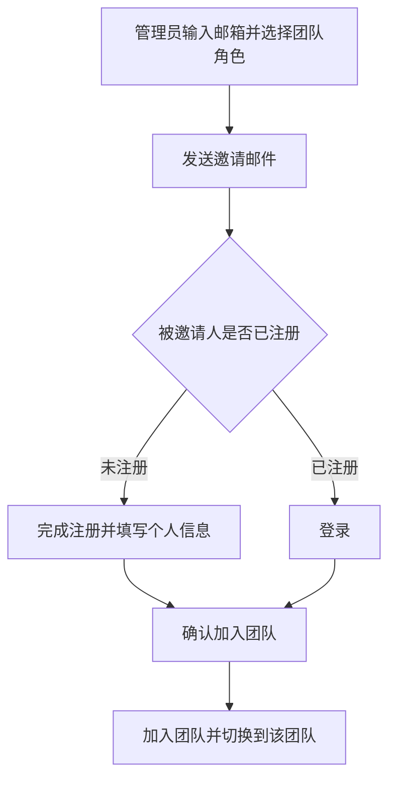
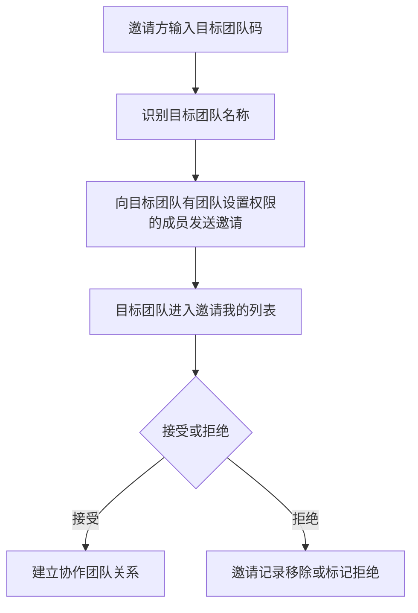

# 团队与协作团队

## 1. 功能定位

团队是 Linkincrease 贸易端的组织归属单位，用于承载团队成员、团队角色、FlowSpace、资源库和协作团队关系。协作团队是与当前团队建立协作关系的外部团队，可进一步加入具体 FlowSpace 参与业务执行。

## 2. 使用对象与入口

| 使用对象 | 入口 | 说明 |
| --- | --- | --- |
| 普通用户 | 创建团队引导、切换团队 | 首次或非首次创建团队、进入已加入团队 |
| 团队管理员 | 团队设置 | 管理团队信息、角色、成员、协作团队 |
| 被邀请成员 | 邮件邀请链接 | 注册或登录后加入团队 |
| 协作团队管理员 | 团队设置 > 协作团队 > 邀请我的 | 接受或拒绝协作邀请 |

## 3. 核心对象

| 对象 | 说明 |
| --- | --- |
| 团队 | 客户在贸易端创建的组织单位 |
| 团队码 | 团队唯一识别码，可用于邀请协作团队 |
| 团队成员 | 加入团队的用户，包括已邀请未加入成员 |
| 拥有者 | 固定角色，有且只有一名成员，默认为团队创建者 |
| 团队管理员 | 固定角色，拥有团队角色内全部权限，权限不可删改但成员可调整 |
| 自定义团队角色 | 团队自定义权限集合 |
| 协作团队 | 被当前团队邀请参与协作的外部团队 |
| 协作邀请 | 团队间建立协作关系的申请记录 |

## 4. 业务流程

### 4.1 团队成员邀请

### 4.2 协作团队邀请

## 5. 权限规则

| 操作 | 权限要求 | 说明 |
| --- | --- | --- |
| 打开团队设置 | 有团队设置权限 | 团队设置入口和邀请成员快捷入口受该权限控制 |
| 创建/编辑/删除团队角色 | 有团队设置权限 | 固定角色不可删除 |
| 邀请成员 | 有团队设置权限 | 可为成员预设团队角色 |
| 删除成员 | 有团队设置权限 | 拥有者不可删除 |
| 设置成员角色 | 有团队设置权限 | 同一成员多个角色权限叠加 |
| 邀请协作团队 | 有团队设置权限 | 需输入对方团队码 |
| 删除协作团队 | 有团队设置权限 | 同步影响其参与的 FlowSpace |

## 6. 状态与限制

| 场景 | 规则 |
| --- | --- |
| 成员已邀请未加入 | 团队成员列表展示未加入标识，可重新邀请 |
| 邮件链接失效 | 成员被删除或协作团队被删除后，点击邀请链接提示链接已失效 |
| 成员已加入团队 | 再次点击邀请链接提示已加入该团队 |
| 删除成员 | 从团队移除，同时从其参与的 FlowSpace 中同步删除 |
| 唯一对接人限制 | 成员作为协作 FlowSpace 唯一对接人时，需先设置其他对接人 |
| 删除协作团队 | 从团队移除，同时从其参与的 FlowSpace 中同步删除 |

## 7. 字段、表单与校验

| 字段 | 规则 |
| --- | --- |
| 团队角色名称 | 必填，限制 100 字符 |
| 成员邮箱 | 需包含且仅包含一个 `@`，并包含至少一个 `.` |
| 团队码 | 邀请协作团队时限制输入 6 位，输入后识别团队名称 |
| 团队成员搜索 | 支持姓名、邮箱、移动电话模糊搜索 |
| 协作团队搜索 | 支持团队名称、简称、团队码模糊搜索 |

## 8. 通知、日志与审计

需要沉淀：

- 邀请成员邮件。
- 邀请协作团队邮件。
- 团队角色创建、编辑、删除日志。
- 团队成员邀请、删除、角色设置日志。
- 协作团队邀请、接受、拒绝、删除日志。
- 成员被移出团队后的系统提示。

## 9. 异常与提示

已知提示：

- 链接已失效。
- 您已加入该团队。
- 您已被移出该团队。如有疑问，请联系团队管理员。
- 唯一对接人场景需先设置其他对接人。

## 10. 来源需求

- `source:thoughts-v2-current/v2.0.x/贸易端/【贸易端】【团队管理】创建团队.md`
- `source:thoughts-v2-current/v2.0.x/贸易端/【贸易端】【团队设置】团队信息、角色、成员、协作团队管理.md`
- `source:thoughts-v2-current/v2.1.x/贸易端/【贸易端】【团队设置】邀请成 员_协作团队流程变更.md`

## 11. 待确认问题

- 删除团队成员后的任务批量移交规则。
- 删除协作团队后的任务批量移交规则。
- 团队拥有者移交的完整入口和校验规则。
