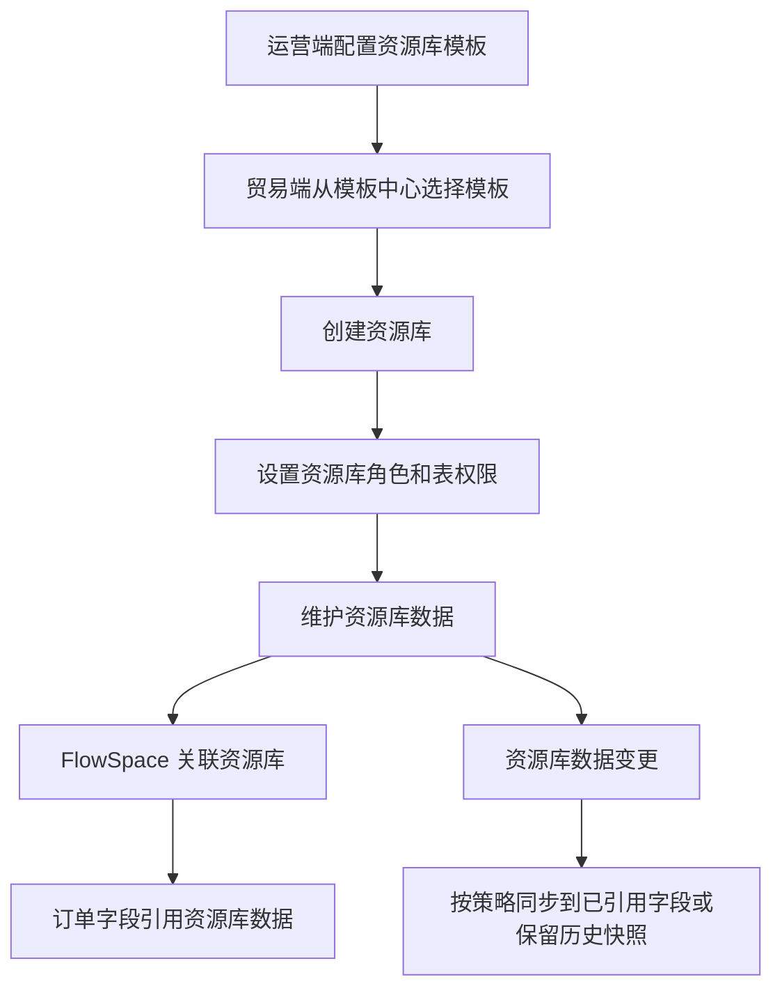

---
title: 资源库
type: knowledge
domain: 贸易端
module: 资源库
submodule: 主数据管理
status: authoritative
version: v0.1
owner: 产品
maintainer: Daren
updated_at: 2026-05-25
permission: internal
tags:
  - 资源库
  - 主数据
  - 资源库模板
  - FlowSpace引用
source_files:
  - source:thoughts-v2-current/V2.4.x/贸易端/【贸易端】【资源库】第一阶段.md
  - source:thoughts-v2-current/V2.5.x/贸易端/【贸易端】【资源库】资源库分享.md
  - source:thoughts-v2-current/V2.5.x/贸易端/【贸易端】【资源库】视图管理.md
  - source:thoughts-v2-current/v2.7/贸易端/【贸易端】【资源库】SCCS应用数据范围、数据编辑历史记录.md
related_docs:
  - ./FlowSpace.md
  - ../40-权限与安全/权限体系总表.md
search_keywords:
  - 团队资源库
  - 资源库引用
  - 资源库同步
  - 资源库分享
---

# 资源库

## 1. 功能定位

资源库是团队级标准化数据池，用于管理物料、供应商、客户等基础数据，并将这些数据应用到 FlowSpace 订单和表单字段中。

## 2. 使用对象与入口

| 使用对象 | 入口 | 说明 |
| --- | --- | --- |
| 团队成员 | 贸易端资源库 | 创建、查看、维护资源库数据 |
| 资源库管理员 | 资源库设置 | 管理资源库基础信息、角色、权限、成员 |
| FlowSpace 成员 | 订单表单中的资源库引用字段 | 引用资源库数据 |
| 运营人员 | 运营端资源库管理、资源库模板 | 配置模板、查看团队资源库数据 |

## 3. 核心对象

| 对象 | 说明 |
| --- | --- |
| 资源库模板 | 运营端配置的资源库结构 |
| 资源库 | 团队基于模板创建的数据池 |
| 资源库表 | 资源库下的数据表 |
| 资源库数据 | 资源库表中的单条记录 |
| 资源库角色 | 控制资源库设置和表数据权限 |
| 资源库视图 | 组织表数据查看方式 |
| 资源库分享 | 对单条或整表数据进行外链或授权分享 |
| FlowSpace 应用资源库 | 将资源库表和字段应用到 FlowSpace 表单 |

## 4. 业务流程

## 5. 权限规则

| 权限域 | 权限点 |
| --- | --- |
| 团队角色 | 创建资源库、删除资源库、资源库管理 |
| 资源库角色 | 资源库设置、查看数据、创建数据、编辑数据、删除数据、导入、导出、批量操作 |
| 表权限 | 按资源库表配置查看、编辑、删除、导入导出等权限 |
| 数据范围 | 控制成员可见或可操作的数据范围 |
| 分享权限 | 控制外链、只读、可编辑、密码、失效等能力 |

## 6. 状态与限制

已确认规则：

- 删除资源库为假删。
- 删除资源库后，各 FlowSpace 下可见表同时被删除。
- 新订单不可再引用已删除资源库或已删除资源库数据。
- 历史订单中已引用的数据需保留文本或快照。
- 资源库名称在当前团队内不可重复。
- 资源库管理员为固定角色，默认包含创建资源库的成员。

## 7. 字段、表单与校验

资源库数据表单由资源库模板决定。字段规则包括：

- 必填校验。
- 字段类型校验。
- 关联引用字段。
- 图片、附件、日期、数字、百分比等组件规则。
- 导入模板字段校验。
- 资源库引用在订单表单中的展示和历史保留。

## 8. 通知、日志与审计

资源库需要沉淀的记录包括：

- 创建、编辑、删除资源库。
- 创建、编辑、删除资源库角色。
- 创建、编辑、删除资源库数据。
- 导入导出记录。
- 批量编辑和批量下载记录。
- 数据编辑历史。
- 资源库同步触发的系统自动执行日志。

## 9. 异常与提示

需要统一沉淀：

- 请输入资源库名称。
- 已存在相同的资源库名称，请修改。
- 暂无权限，请联系管理员。
- 必填项为空时提示请输入对应字段。
- 删除后的数据不可继续引用。
- 导入失败原因和失败记录下载。

## 10. 来源需求

- `source:thoughts-v2-current/V2.4.x/贸易端/【贸易端】【资源库】第一阶段.md`
- `source:thoughts-v2-current/V2.5.x/贸易端/【贸易端】【资源库】资源库分享.md`
- `source:thoughts-v2-current/V2.5.x/贸易端/【贸易端】【资源库】视图管理.md`
- `source:thoughts-v2-current/v2.7/贸易端/【贸易端】【资源库】SCCS应用数据范围、数据编辑历史记录.md`
- `source:thoughts-v2-current/v2.3.x/运营端/【运营端】【模板中心】资源库模版管理.md`
- `missing-current-source/【运营端】【资源库模版】表单设计组件.md`

## 11. 待确认问题

- 资源库同步与自动化更新同一字段时的优先级。
- 资源库分享的外部访问权限、密码和失效策略是否需要独立权限页。
- 资源库数据编辑历史的字段级快照范围。

