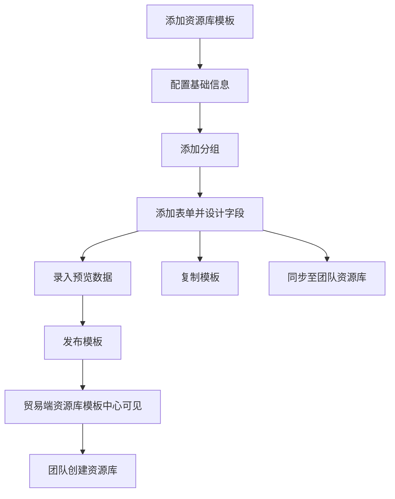

---
title: 资源库模板
type: knowledge
domain: 运营端
module: 资源库模板
submodule: 资源库创建模板
status: authoritative
version: v0.1
owner: 产品
maintainer: Daren
updated_at: 2026-05-25
permission: internal
tags:
  - 资源库模板
  - 资源库
  - 模板中心
  - 表单设计
source_files:
  - source:thoughts-v2-current/v2.3.x/运营端/【运营端】【模板中心】资源库模版管理.md
  - missing-current-source/【运营端】【资源库模版】表单设计组件.md
related_docs:
  - ./资源库.md
search_keywords:
  - 资源库模版
  - 资源库模板
  - 分组
  - 资源库表单
  - 同步至团队资源库
---

# 资源库模板

## 1. 功能定位

资源库模板是运营端配置的资源库创建模板，用于定义团队资源库的分组、表单、字段、预览数据和发布版本。贸易端团队基于可见且已发布的资源库模板创建资源库。

## 2. 使用对象与入口

| 使用对象 | 入口 | 说明 |
| --- | --- | --- |
| 运营人员 | 运营端 > 模板中心 > 资源库模板 | 创建、编辑、设计、发布、复制和同步资源库模板 |
| 贸易端团队 | 贸易端资源库模板中心 | 基于模板创建资源库 |
| 实施人员 | 预览数据 | 模拟资源库数据结构和展示 |

## 3. 核心对象

| 对象 | 说明 |
| --- | --- |
| 模板基础信息 | 名称、图标、创建类型、所属行业、描述、备注 |
| 分组 | 资源库模板中的结构节点 |
| 表单 | 分组下的数据表结构 |
| 表单字段 | 资源库数据字段 |
| 预览数据 | 用于模板中心模拟资源库使用效果 |
| 发布态模板 | 贸易端可见和可用于创建资源库的模板版本 |
| 同步至团队资源库 | 将模板变更同步到已创建的团队资源库 |

## 4. 业务流程

## 5. 权限规则

当前需求主要描述运营端模板管理能力。已确认：

- 只有运营端有模板管理权限的人员可管理资源库模板。
- 系统模板可设置可见团队。
- 模板启用且已发布后，贸易端才可见。

## 6. 状态与限制

| 状态 | 说明 | 限制 |
| --- | --- | --- |
| 未发布 | 创建后尚未发布 | 即使启用，贸易端仍不可见 |
| 已发布 | 形成可用版本 | 贸易端可使用 |
| 只读模式 | 默认查看设计 | 需开启编辑才能修改 |
| 启用/未启用 | 模板启用状态 | 需结合发布状态判断贸易端可见性 |

## 7. 字段、表单与校验

基础信息：

- 模板名称必填，限制 100 字符。
- 模板图标必填。
- 创建类型必填。
- 所属行业必填。
- 模板描述、备注限制 200 字符。

设计规则：

- 创建资源库模板后默认无分组、无表单。
- 分组名称必填，限制 100 字符，需支持国际化。
- 表单名称必填，限制 100 字符，需支持国际化。
- 分组下可创建多个表单。
- 表单设计组件规则引用资源库模板表单设计组件。
- 预览数据按贸易端资源库数据操作逻辑录入。

## 8. 通知、日志与审计

需要记录：

- 资源库模板新增、编辑、删除。
- 可见范围设置。
- 分组和表单设计变更。
- 发布记录。
- 复制记录。
- 同步至团队资源库记录。

## 9. 异常与提示

已知提示：

- 选择部分可见团队时，至少选择一个团队。
- 同步至团队资源库需谨慎，以免影响资源库数据展示。
- 与模板有关联的控件更新后，对应业务数据不可被清空。

## 10. 来源需求

- `source:thoughts-v2-current/v2.3.x/运营端/【运营端】【模板中心】资源库模版管理.md`
- `missing-current-source/【运营端】【资源库模版】表单设计组件.md`
- `source:thoughts-v2-current/V2.4.x/贸易端/【贸易端】【资源库】第一阶段.md`

## 11. 待确认问题

- 模板同步至团队资源库时字段删除、字段新增和历史数据保留规则。
- 资源库模板与业务模板的表单组件差异清单。
- 定制模板、用户自建模板是否纳入近期范围。

