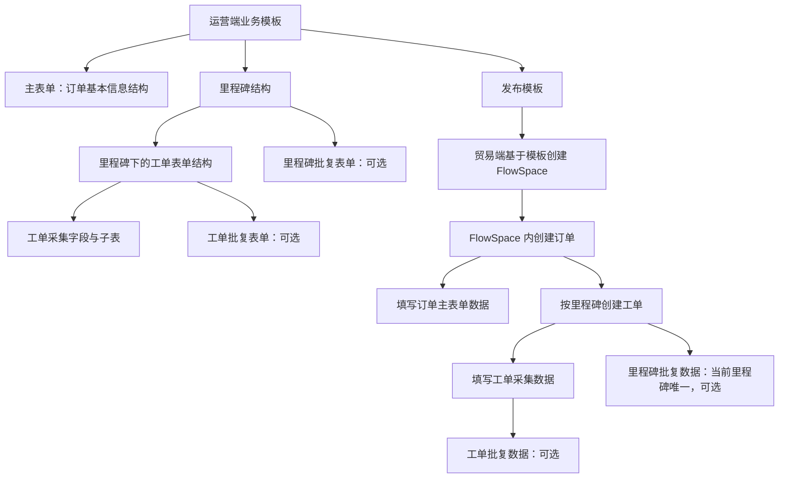
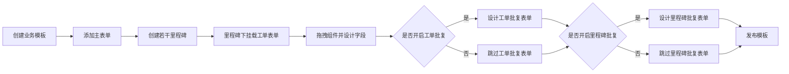
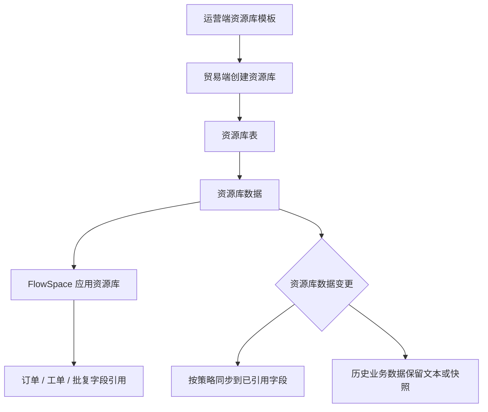

# FlowSpace 数据层级

## 1. 页面定位

本页用于说明 FlowSpace 从“运营端业务模板配置态”到“贸易端业务运行态”的数据层级关系，并明确订单、里程碑、工单、批复、子表、资源库引用、自动化、仪表盘和日志追溯之间的数据边界。

当前知识库已在业务模板、FlowSpace、订单、工单与批复、资源库等页面分别描述相关对象。本页将这些对象统一成权威数据层级，用于后续判断新增功能影响范围、字段归属、数据写入位置、资源库同步边界、仪表盘数据源、自动化更新和日志追溯。

> 重要：任何涉及 FlowSpace 数据新增、字段写入、批量导入、资源库引用、自动化更新、统计分析、权限控制或审计追溯的需求，都必须先判断目标数据处于本页定义的哪一层级。

## 2. 总体层级

FlowSpace 数据可以分为两层：

| 层级 | 说明 | 典型对象 |
| --- | --- | --- |
| 配置态 | 运营端业务模板定义业务结构，决定未来 FlowSpace 中能创建什么数据、有哪些表单、字段和批复规则 | 业务模板、主表单、里程碑、工单表单、工单批复表单、里程碑批复表单、表单组件 |
| 运行态 | 贸易端团队基于已发布模板创建 FlowSpace 后，围绕订单执行产生真实业务数据 | FlowSpace、订单、订单主表单数据、里程碑、工单、工单采集数据、工单批复数据、里程碑批复数据、动态、历史、跟踪记录 |

## 3. 业务模板配置态

业务模板是 FlowSpace 的结构来源。模板创建和设计过程决定运行态的数据容器。

| 配置对象 | 规则 |
| --- | --- |
| 业务模板 | 可创建 FlowSpace 的模板，发布且对团队可见后，贸易端才能使用 |
| 主表单 | 默认存在且有且仅有一个，用于定义订单基本信息 |
| 里程碑 | 一个模板可配置多个里程碑，用于定义订单流程阶段 |
| 工单表单 | 挂载在里程碑下；一个里程碑下可包含多个表单，用于定义工单采集数据 |
| 工单批复表单 | 开启工单批复后存在，是独立批复表单 |
| 里程碑批复表单 | 开启里程碑批复后存在，是独立批复表单 |
| 表单组件 | 构成字段、布局、子表、引用、公式和成员/协作方选择能力 |

### 3.1 模板设计流程

### 3.2 组件与字段类型

| 组件类型 | 组件 |
| --- | --- |
| 布局组件 | 模块分组、分割线、标签页、子表 |
| 基础组件 | 单行文本、多行文本、数字、百分比、单选、多选、日期时间、图片、附件、定位、地址、富文本、评级、空白占位 |
| 高级组件 | 关联引用、公式组件、FlowSpace 成员单选、FlowSpace 成员多选、FlowSpace 协作单选、FlowSpace 协作多选、签名、汇率 |

子表是数据层级中的特殊容器：一个主表单、工单表单、工单批复表单或里程碑批复表单可以包含子表组件；子表内部有自己的列字段和多行数据。

> 重要：设计字段映射、批量导入、自动化更新、仪表盘数据源、报告数据源或历史记录时，必须区分“表单字段”和“子表行字段”。子表字段不能简单等同于父表单字段。

## 4. FlowSpace 运行态

团队使用业务模板创建 FlowSpace 后，模板结构被应用为运行态业务结构。

| 运行态对象 | 来源 | 数据含义 |
| --- | --- | --- |
| FlowSpace | 已发布业务模板 | 某类业务协作空间 |
| 订单 | FlowSpace 内创建 | 业务主实体 |
| 订单主表单数据 | 业务模板主表单 | 订单基本信息 |
| 里程碑 | 业务模板里程碑配置 | 订单流程阶段 |
| 工单 | 订单某个里程碑下创建 | 一次具体执行任务 |
| 工单采集数据 | 当前里程碑下的工单表单 | 处理人填写的执行数据 |
| 工单批复数据 | 工单批复表单 | 对单个工单采集结果的审核或确认 |
| 里程碑批复数据 | 里程碑批复表单 | 对当前里程碑阶段结果的审核或确认 |

### 4.1 订单与主表单

FlowSpace 内新建订单时，用户填写主表单内容，形成订单基本信息。主表单字段受以下规则影响：

- 字段类型、必填、格式和默认值。
- 订单标识设置。
- 数据围栏的字段可见范围。
- 资源库引用字段。
- 公式字段自动更新。
- 自动化或后续同步对字段的更新限制。

### 4.2 里程碑与工单

订单创建后，会按照模板中的里程碑结构进入业务执行。用户可在不同里程碑下按需创建工单。

| 关系 | 说明 |
| --- | --- |
| 一个订单 | 包含多个里程碑 |
| 一个里程碑 | 可创建多个工单 |
| 一个工单 | 对应一次工单采集数据 |
| 一个工单 | 若模板开启工单批复，则对应一个工单批复 |
| 一个里程碑 | 若模板开启里程碑批复，则当前里程碑仅有一个里程碑批复 |

创建工单时，如果模板开启工单批复，需要设置工单批复处理人。若模板开启里程碑批复，通常在创建当前里程碑下第一个工单时设置里程碑批复处理人；当前里程碑下仅存在一份里程碑批复数据。

## 5. 数据基数与身份

设计任何数据写入、同步、导入导出、统计分析或审计能力时，必须明确每类数据的身份粒度。

| 数据对象 | 基数 | 建议身份粒度 |
| --- | --- | --- |
| FlowSpace | 团队内多个 | FlowSpace ID |
| 订单 | FlowSpace 内多个 | 订单 ID |
| 订单主表单字段 | 每个订单一组 | 订单 ID + 字段 ID |
| 订单主表单子表行 | 每个订单可多行 | 订单 ID + 子表 ID + 行 ID |
| 里程碑 | 每个订单多个 | 订单 ID + 里程碑 ID |
| 里程碑批复 | 每个里程碑最多一份 | 订单 ID + 里程碑 ID + 批复 ID |
| 里程碑批复子表行 | 每份批复可多行 | 批复 ID + 子表 ID + 行 ID |
| 工单 | 每个里程碑多个 | 工单 ID |
| 工单采集字段 | 每个工单一组或多表单 | 工单 ID + 表单 ID + 字段 ID |
| 工单子表行 | 每个工单可多行 | 工单 ID + 子表 ID + 行 ID |
| 工单批复 | 每个工单最多一份 | 工单 ID + 批复 ID |
| 工单批复子表行 | 每份批复可多行 | 批复 ID + 子表 ID + 行 ID |

## 6. 资源库数据层级

资源库是团队级标准化数据池，与 FlowSpace 运行态数据不同。

| 层级 | 对象 | 说明 |
| --- | --- | --- |
| 资源库配置态 | 资源库模板 | 运营端定义资源库表结构和字段 |
| 团队主数据态 | 资源库 | 贸易端团队基于资源库模板创建 |
| 表结构 | 资源库表 | 一个资源库可包含多张表 |
| 记录数据 | 资源库数据 | 表中的单条记录 |
| 应用关系 | FlowSpace 应用资源库 | FlowSpace 允许引用哪些资源库表和字段 |
| 业务快照 | 订单/工单/批复字段引用结果 | 引用后在业务数据中展示、保存或同步 |

资源库引用、自动化、公式和人工编辑都可能写入订单、工单、批复或子表字段。后续设计新增功能时，应明确字段来源类型：

| 字段来源 | 说明 | 对新增功能的影响 |
| --- | --- | --- |
| 手动录入 | 用户直接填写 | 可被人工修改冲突规则保护 |
| 资源库引用但不同步 | 引用后保存文本或快照 | 可作为普通业务数据使用，但需提示来源 |
| 资源库同步中 | 资源库变化会持续写入字段 | 不应被其他自动写入机制随意覆盖 |
| 禁止手动修改 | 字段只能通过资源库或系统机制更新 | 不应被人工、导入或自动化绕过写入 |
| 自动化写入 | 自动化更新数据字段 | 需与自动化执行日志和字段冲突规则关联 |
| 公式计算 | 由公式组件根据因子自动计算 | 不应被普通编辑直接覆盖 |
| 系统同步写入 | 由系统同步、批量操作或后续数据类能力写入 | 必须记录来源、目标、操作人或系统程序、写入时间和日志 |
| FlowSpace 互通 | 来源 FlowSpace 数据通过互通方案写入目标 FlowSpace 字段或子表 | 必须记录方案版本、来源数据、目标数据、关联键、字段策略和后续更新结果 |

## 7. 数据层级对产品能力的影响

FlowSpace 数据层级是多个产品能力的前置判断依据。新增能力不能只说“更新字段”或“同步数据”，必须明确写入的是哪一类对象、哪一层表单、哪一个字段或哪一行子表。

### 7.1 常见产品能力与数据层级

| 能力 | 必须识别的数据层级 |
| --- | --- |
| 新建订单 | 订单主表单、订单主表单子表、订单标识字段、资源库引用字段 |
| 创建工单 | 目标订单、目标里程碑、工单表单、工单处理人、工单批复处理人、里程碑批复处理人 |
| 工单采集 | 工单表单字段、工单子表行、处理人、采集状态、动态和历史 |
| 工单批复 | 工单批复表单、工单批复子表、批复人、批复状态、动态和历史 |
| 里程碑批复 | 里程碑批复表单、里程碑批复子表、里程碑状态、批复人 |
| 资源库引用 | 资源库、资源库表、资源库数据、FlowSpace 应用资源库、目标业务字段 |
| 资源库同步 | 已引用字段、同步策略、历史快照、系统执行日志 |
| FlowSpace 数据互通 | 来源 FlowSpace、目标 FlowSpace、互通方案版本、字段映射、子表关联键、来源变化响应方式 |
| 自动化 | 触发数据源、目标数据源、执行动作、字段可写性、执行日志 |
| 导入导出 | 导入模板字段、目标表单字段、子表行、失败原因、导入记录 |
| 仪表盘和报告 | 数据源类型、字段范围、子表展开方式、权限和数据围栏 |
| 日志审计 | 操作对象、字段层级、变更前后值、操作人或系统程序 |

### 7.2 数据写入位置

| 写入位置 | 说明 | 关键限制 |
| --- | --- |
| 订单主表单字段 | 订单级主数据 | 受订单状态、订单权限、数据围栏、资源库引用、公式字段影响 |
| 订单主表单子表行 | 订单级明细数据 | 需区分新增行、更新行、删除行和行级历史 |
| 工单表单字段 | 一次工单采集数据 | 受工单状态、采集人、表单权限和里程碑状态影响 |
| 工单子表行 | 工单采集明细 | 需记录行级变化和来源 |
| 工单批复字段 | 单个工单审核结论 | 受工单批复状态、批复人和批复表单配置影响 |
| 工单批复子表行 | 工单审核明细 | 需记录行级历史和批复状态 |
| 里程碑批复字段 | 当前里程碑阶段结论 | 每个里程碑最多一份，需要结合里程碑状态 |
| 里程碑批复子表行 | 阶段结论明细 | 需记录行级历史和里程碑批复状态 |

### 7.3 FlowSpace 数据互通写入边界

FlowSpace 数据互通同时涉及来源读取、目标写入和关联关系维护。新增或复核互通能力时，必须先明确来源数据和目标数据分别位于哪一层级，再判断字段映射、子表行写入、权限、数据围栏和日志。

| 场景 | 数据层级要求 |
| --- | --- |
| 仅关联 | 建立来源数据与目标数据关系，不写入目标字段；仍需记录来源、目标、方案版本和关系快照 |
| 关联并写入普通字段 | 目标字段必须是目标模块可写字段，不能是公式字段、系统字段或不允许被互通写入的字段 |
| 关联并写入子表 | 必须记录目标子表、目标行、来源行和关联键，不得只记录父对象 ID |
| 来源变化后更新 | 按执行版本和字段级策略判断是否更新，目标状态、字段锁定、资源库持续同步、公式和权限不允许时跳过并记录原因 |
| 多来源聚合 | 多条来源数据写入一个目标字段时，必须按目标字段类型选择聚合规则 |
| 来源失效 | 来源数据删除、归档或不可引用时保留关系快照，目标是否更新或失效标记按方案和异常规则处理 |

> 重要：写入工单、工单批复、里程碑批复时，不得绕过处理人、状态和权限校验；写入子表时，不得只记录父对象 ID，还应记录子表 ID 和行 ID。

## 8. 设计新增功能时的必查清单

凡是新增功能涉及 FlowSpace 数据、字段映射、数据同步、资源库引用、自动化、仪表盘、导入导出或日志追溯，都应检查：

1. 目标字段属于订单主表单、工单表单、工单批复、里程碑批复还是子表行。
2. 目标对象当前状态是否允许写入。
3. 当前用户是否具备来源查看权限和目标写入权限。
4. 数据围栏是否隐藏了来源字段或目标字段。
5. 字段是否来自资源库引用、资源库同步、公式、自动化、系统同步或人工录入。
6. 子表行是否需要记录行级来源、目标关系和关联键。
7. 写入后是否需要历史记录、动态、跟踪记录、系统执行日志或同步日志。
8. 模板字段被删除、类型变化、必填变化时，历史数据如何保留。
9. 是否可能形成多源覆盖、重复写入或系统自动更新冲突。
10. 是否需要异常中心、同步日志、历史记录、动态或人工确认流程。

## 9. 待确认问题

| 问题 | 影响 |
| --- | --- |
| 创建第一个工单时设置里程碑批复处理人的完整规则是否已覆盖所有场景 | 影响里程碑批复生成和指派 |
| 工单批复后是否允许字段被资源库同步、自动化或其他系统同步继续更新 | 影响字段锁定和冲突处理 |
| 资源库同步、自动化、公式和系统同步同时作用于同一字段时的最终优先级 | 影响数据一致性和日志解释 |
| 模板同步至已创建 FlowSpace 后，字段新增、删除、类型变化如何处理 | 影响历史数据、表单展示和自动化配置 |
| 子表行删除、来源数据删除时，目标子表行是否删除、失效标记还是保留快照 | 影响追溯和历史展示 |
| FlowSpace 互通、资源库同步、自动化同时写入同一字段时的优先级是否配置化 | 影响多系统写入一致性 |

## 10. 来源需求

- `source:thoughts-v2-current/v2.0.x/运营端/【运营端】【模板中心】业务模版管理.md`
- `source:thoughts-v2-current/v2.1.x/运营端/【运营端】【业务模板】表单设计组件.md`
- `source:thoughts-v2-current/v2.1.x/运营端/【运营端】【业务模版】表单属性与显隐设置.md`
- `source:thoughts-v2-current/v2.2.x/贸易端/【贸易端】【订单详情】查看&操作.md`
- `source:thoughts-v2-current/v2.2.x/贸易端/【贸易端】【订单详情】工单&里程碑批复操作.md`
- `source:thoughts-v2-current/V2.4.x/贸易端/【贸易端】【资源库】第一阶段.md`
- `source:thoughts-v2-current/v2.9/贸易端/【贸易端】FlowSpace 数据互通.md`