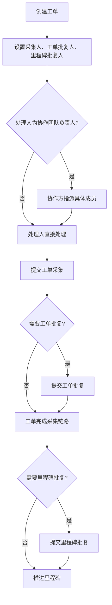

# 工单与批复

## 1. 功能定位

工单是里程碑下的具体执行任务，用于收集、处理和确认业务数据。批复分为工单批复和里程碑批复，是否存在取决于运营端业务模板配置。

## 2. 使用对象与入口

| 使用对象 | 入口 | 说明 |
| --- | --- | --- |
| 主团队 FlowSpace 成员 | 订单详情 | 创建工单、设置处理人、查看动态、执行批复或管理操作 |
| 协作团队成员 | 订单详情、采集端任务 | 指派、采集、批复其权限范围内的任务 |
| 采集端用户 | 任务列表、任务详情 | 移动端处理工单采集、工单批复、里程碑批复 |

## 3. 核心对象

| 对象 | 说明 |
| --- | --- |
| 工单 | 里程碑下的一次具体任务 |
| 工单采集表单 | 处理人填写执行数据的表单 |
| 工单批复 | 对工单采集结果进行确认 |
| 里程碑批复 | 对里程碑阶段结果进行确认 |
| 采集人 | 负责填写工单采集表单的人或协作团队 |
| 工单批复人 | 负责确认工单采集结果的人或协作团队 |
| 里程碑批复人 | 负责确认里程碑结果的人或协作团队 |
| 指派人 | 协作团队中有权限将任务指派给具体成员的人 |

## 4. 业务流程

## 5. 权限规则

| 操作 | 权限要求 | 状态限制 |
| --- | --- | --- |
| 创建工单 | 有当前里程碑创建工单权限 | 订单进行中；里程碑未开始或进行中 |
| 采集指派 | 协作方有对应里程碑工单指派权限；仅可指派本协作团队成员已负责或可负责的表单 | 工单未终止、未批复；里程碑未完成/取消 |
| 工单采集 | 当前工单采集人或协作方未指派前负责人/对接人 | 工单未终止、未批复；里程碑未完成/取消 |
| 工单批复 | 当前工单批复人或对应协作方有权限成员 | 依模板配置和状态限制 |
| 里程碑批复 | 当前里程碑批复人或对应协作方有权限成员 | 依模板配置和状态限制 |
| 修改处理人 | 主团队或协作团队有对应权限成员 | 对象状态允许处理 |
| 终止采集 | 有终止采集权限 | 工单未批复、未终止 |
| 还原采集 | 有当前里程碑还原采集权限，且可查看目标订单和工单 | 工单已终止采集；订单、里程碑进行中；工单未批复、未删除；非跨订单互用只读实例 |
| 删除工单 | 有删除工单权限 | 对象状态允许删除 |

## 6. 状态与限制

工单采集、批复、指派操作在以下场景通常不可执行：

- 订单已删除。
- 订单已完成。
- 订单已取消。
- 里程碑已完成。
- 里程碑已取消。
- 工单已终止采集。
- 工单已批复。
- 工单已删除。
- 当前处理人或可编辑表单权限已变化。
- 多人并发提交后当前页面未刷新。

工单采集人、工单批复人和里程碑批复人可通过 FlowSpace 数据移交转给新的处理人。移交后历史数据状态不变；工单采集任务仅移交原处理人可编辑的表单，不移交整个工单。

协作团队作为采集人时，可进一步按工单采集表单拆分处理人。主团队创建或修改工单时，同一张表单只能选择协作团队负责人或具体成员之一，不能同时选择负责人和成员。协作团队后续指派时，只能在本团队且已加入当前 FlowSpace 的成员范围内调整；非本团队表单和非本团队处理人不可修改。

已终止采集的工单在满足权限和状态条件时可执行还原采集。还原只解除终止锁，不回滚业务数据；字段、子表、图片、附件、处理人、提交标识和历史记录保留，表单显隐、公式、任务归类和可编辑权限按当前配置重新计算。还原后允许再次终止，每轮终止和还原都需要保留独立事件。

## 7. 字段、表单与校验

创建工单时：

- 一次最多创建 10 条工单。
- 工单名称限制 50 字符，默认按创建顺序编号。
- 至少保留一个非隐藏表单。
- 采集人、工单批复人、里程碑批复人按模板配置校验。
- 未设置采集人的表单需校验必填项。
- 表单字段按运营端配置进行类型、必填、格式校验。

采集时：

- 当前采集人可编辑自己负责的表单，其余表单只读。
- 协作团队分表单处理时，成员只能编辑当前指派给自己的表单；同一工单中其他可见表单按只读展示。
- 清空某表单处理人后，该表单回到待指派；若协作团队负责人直接采集，只能采集尚未指派的表单部分。
- 团队任务按工单维度展示：存在未指派表单时为待指派；全部表单已指派后为已指派。
- 个人任务按成员和工单维度展示：负责表单中存在未提交表单时为待处理；全部负责表单提交后为已处理；后续新增未提交表单会回到待处理；无负责表单时移除任务。
- 工单完成度按“已提交有效采集表单数 / 全部有效采集表单数”计算；成员提交只计入当前由自己负责的表单。
- 多人并发时，如其他人已提交，需要提示刷新后再提交。
- 提交后更新头像提交标识、动态、历史记录和完成度。
- 工单采集表单支持“共享表单数据”和“复制数据”。共享组内任一成员工单保存后同步整组，复制只覆盖来源表单当前数据，目标后续按普通表单继续编辑。
- 表单共享/复制仅限同一 FlowSpace 和兼容模板；首期不支持工单批复表单和里程碑批复表单。
- 共享表单禁止导入、批量编辑、API 和自动化直接写入；同步后按目标工单公式和字段显隐重新计算业务有效值。

## 8. 通知、日志与审计

需要记录和通知的事件包括：

- 创建工单。
- 采集指派。
- 协作团队按表单指派、改派、清空处理人和待指派状态变化。
- 工单采集提交。
- 工单批复指派与提交。
- 里程碑批复指派与提交。
- 修改处理人。
- 终止采集。
- 还原采集。
- 删除工单。
- 自动化创建或更新工单。
- 工单采集人、工单批复人、里程碑批复人移交。
- 工单表单共享组创建、成员加入、退出、锁定、解散、同步失败和复制覆盖。

通知渠道包括站内消息、邮件和短信。通知模板、模板 code 和通道边界见 [通知规则与模板](../10-功能模块详情/通知规则与模板.md)。

## 9. 异常与提示

需统一沉淀的提示：

- 暂无权限，请联系管理员。
- 订单已删除，无法操作，请刷新页面。
- 订单已完成/已取消，无法操作，请刷新页面。
- 里程碑已完成/已取消，无法操作，请刷新页面。
- 工单已终止采集/已批复/已删除，无法操作，请刷新页面。
- 工单编辑权限已变更，请刷新页面。
- 某成员已修改数据，请刷新。
- 至少保留一个模块。
- 请设置处理人。
- 请输入指定字段。
- 处理人已变化，请刷新后重试。
- 当前表单已被其他成员指派或提交，请刷新后重试。

## 10. 来源需求

- `source:thoughts-v2-current/v2.2.x/贸易端/【贸易端】【订单详情】工单&里程碑批复操作.md`
- `source:thoughts-v2-current/v2.2.x/贸易端/【贸易端】【订单详情】查看&操作.md`
- `source:thoughts-v2-current/v2.3.x/贸易端/【贸易端】【工单视图】批量操作：批量发邮件协作、批量采集.md`
- `source:thoughts-v2-current/v2.3.x/采集端/【采集端】【任务详情页】工单、工单批复、里程碑批复详情页.md`
- `source:thoughts-v2-current/v2.3.x/采集端/【采集端】【任务列表】工单、工单批复、里程碑批复任务列表.md`
- `source:thoughts-v2-current/v2.8/贸易端/【贸易端】FS 数据移交.md`
- `source:thoughts-v2-current/v2.8/贸易端/【贸易端】【工单】表单互用、表单复制.md`
- `source:thoughts-v2-current/v2.8/贸易端/【贸易端】【工单】协作团队可分表单设置不同处理人.md`
- `source:thoughts-v2-current/v2.8/贸易端/【贸易端】表单数据共享、表单复制.md`
- `source:thoughts-v2-current/v2.8/贸易端/【贸易端】工单终止还原为采集状态.md`

## 11. 待确认问题

- 工单批复后是否允许部分字段继续被自动化或资源库同步更新。
- 跨订单工单表单复制遇到订单内关联引用时，首期阻止整表复制还是复制时跳过关联引用仍需确认。
- 采集端与贸易端在所有状态限制上的提示是否完全一致。
