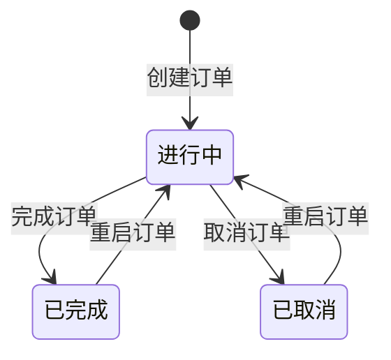
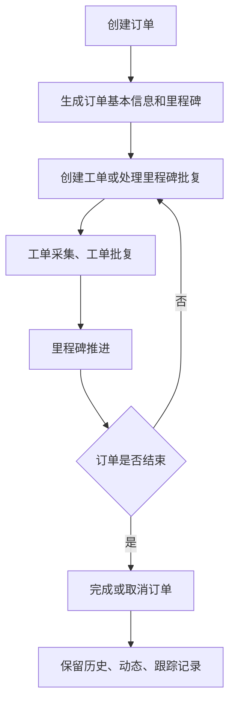

# 订单

## 1. 功能定位

订单是 FlowSpace 中的业务主实体，承载订单基本信息、里程碑、工单、批复、历史记录、动态和跟踪记录。订单由运营端模板定义结构，由贸易端团队在 FlowSpace 中创建和流转。

## 2. 使用对象与入口

| 使用对象 | 入口 | 说明 |
| --- | --- | --- |
| FlowSpace 成员 | 订单列表 | 查看、创建、编辑、删除、导入导出订单 |
| FlowSpace 成员 | 订单详情 | 查看订单基本信息、里程碑、工单、批复和跟踪记录 |
| 协作成员 | 订单详情或任务入口 | 在授权范围内查看和处理相关任务 |
| 采集端用户 | 任务详情 | 查看与任务相关的订单信息 |

## 3. 核心对象

| 对象 | 说明 |
| --- | --- |
| 订单基本信息 | 订单主表单数据 |
| 订单标识 | 用于在列表、详情、面包屑中展示订单身份的字段 |
| 里程碑 | 订单流程阶段 |
| 工单 | 里程碑下的执行任务 |
| 里程碑批复 | 对里程碑阶段结果进行确认 |
| 工单批复 | 对工单采集结果进行确认 |
| 跟踪记录 | 订单级关键节点记录 |
| 历史记录 | 表单数据编辑历史 |
| 订单负责人 | 订单系统字段，默认等于订单创建人；用于数据移交和后续负责人权限判断 |

## 4. 业务流程

订单执行主线：

## 5. 权限规则

订单相关入口和操作受 FlowSpace 业务角色、协作方角色、数据围栏、订单状态共同影响。

| 操作 | 权限要求 | 额外限制 |
| --- | --- | --- |
| 查看订单 | 有订单查看权限且满足数据围栏 | 隐藏不可见字段和标签 |
| 创建订单 | 有创建订单权限 | 需满足表单必填和字段校验 |
| 编辑订单 | 有编辑订单权限 | 已完成、已取消时受限 |
| 删除订单 | 有删除订单权限 | 需处理关联工单和历史记录展示 |
| 完成/取消/重启订单 | 有修改订单状态权限 | 仅特定状态可执行 |
| 查看跟踪记录 | 有查看跟踪记录权限 | 按订单维度展示 |

## 6. 状态与限制

| 状态 | 说明 | 关键限制 |
| --- | --- | --- |
| 进行中 | 订单正常流转 | 可编辑、可取消、可完成，可推进里程碑和工单 |
| 已完成 | 订单结束 | 订单不可编辑和取消；里程碑与工单处理动作受限 |
| 已取消 | 订单取消 | 保存取消时的取消原因文本；业务处理动作受限 |

完成订单后：

- 订单状态变更为已完成。
- 进行中的里程碑变更为已完成，其余里程碑状态按需求规则保持。
- 里程碑不可创建工单、不可修改状态、不可互用。
- 工单不可采集、批复、指派、修改处理人、发邮件协作、终止采集、删除。
- 跟踪记录增加操作记录。

取消订单后：

- 需要选择取消原因。
- 取消原因来自 FlowSpace 设置中的订单取消原因预设。
- 历史订单展示取消时保存的文本，不随后续预设变更而改变。

## 7. 字段、表单与校验

订单基本信息由业务模板主表单决定。展示和编辑时需要同时考虑：

- 字段类型和必填校验。
- 数据围栏对字段可见性的控制。
- 订单标识字段。
- 订单负责人字段；订单/工单列表的字段配置、筛选、排序、模糊搜索和列统计均需支持该字段。
- 子表模式展示。
- 资源库引用字段。
- 公式字段自动更新。

## 8. 通知、日志与审计

订单相关审计包括：

- 创建、编辑、删除订单。
- 完成、取消、重启订单。
- 订单导入导出记录。
- 跟踪记录。
- 历史记录。
- 自动化对订单基本信息的更新记录。
- 订单负责人数据移交成功后，需要写入订单跟踪记录。

## 9. 异常与提示

需要统一沉淀的异常包括：

- 无权限。
- 订单已删除。
- 订单状态已变更。
- 订单已完成或已取消导致无法操作。
- 字段必填或格式错误。
- 数据围栏变化导致字段不可见。

## 10. 来源需求

- `source:thoughts-v2-current/v2.2.x/贸易端/【贸易端】【订单列表】订单列表查看：概览、详情.md`
- `source:thoughts-v2-current/v2.2.x/贸易端/【贸易端】【订单列表】订单增删改.md`
- `source:thoughts-v2-current/v2.3.x/贸易端/【贸易端】【订单列表】订单导入、订单导出.md`
- `source:thoughts-v2-current/v2.2.x/贸易端/【贸易端】【订单详情】查看&操作.md`
- `source:thoughts-v2-current/v2.2.x/贸易端/【贸易端】【订单详情】视图模式：看板、表格.md`
- `source:thoughts-v2-current/v2.8/贸易端/【贸易端】FlowSpace 数据移交.md`

## 11. 待确认问题

- 订单完成、取消、重启后，对邮件协作、互用、自动化是否存在例外场景。
- 删除订单后，采集端已打开任务页面如何实时提示。
- 订单关联和 FlowSpace 关联是否需要进入订单核心页，还是拆为复用关系页。
- 订单负责人是否直接影响订单可见范围，以及数据移交后是否需要立即刷新订单可见授权。
