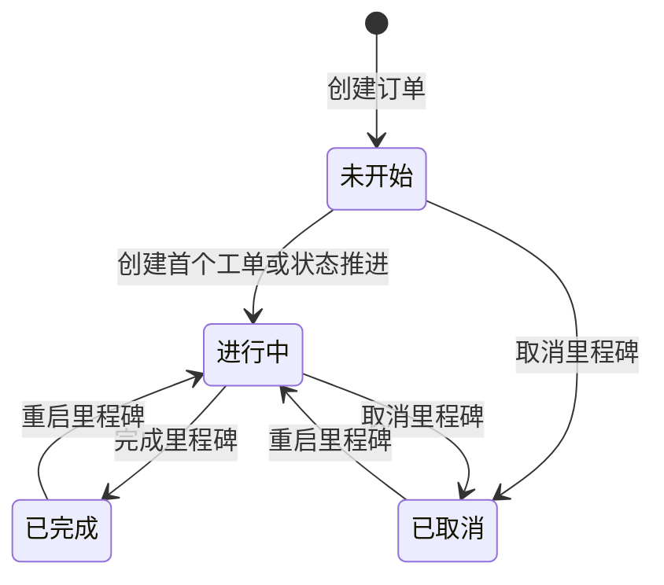

# 里程碑

## 1. 功能定位

里程碑是订单流程中的阶段节点，用于承载阶段计划、负责人、标签、里程碑批复和工单。里程碑结构来自业务模板，运行态计划和状态在 FlowSpace 与订单中生效。

## 2. 使用对象与入口

| 使用对象 | 入口 | 说明 |
| --- | --- | --- |
| 运营人员 | 业务模板设计 | 配置里程碑名称、批复设置、表单、按钮文案等 |
| FlowSpace 管理员 | FlowSpace 设置 > 里程碑计划 | 配置计划起止时间计算规则 |
| FlowSpace 成员 | 订单详情 | 查看里程碑、创建工单、完成/取消/重启里程碑 |
| 协作成员 | 订单详情或采集端任务 | 在授权范围内处理里程碑相关批复或工单 |

## 3. 核心对象

| 对象 | 说明 |
| --- | --- |
| 里程碑模板 | 业务模板中定义的流程节点 |
| 里程碑实例 | 某个订单中的具体里程碑 |
| 里程碑计划 | 计划开始、计划结束、计划耗时及其计算规则 |
| 里程碑负责人 | 负责当前订单下对应里程碑的成员，可选择已加入当前 FlowSpace 的主团队成员或协作团队成员 |
| 里程碑状态 | 未开始、进行中、已完成、已取消 |
| 里程碑批复 | 对阶段结果进行确认的批复数据 |
| 里程碑标签 | 根据条件展示在里程碑上的业务标记 |
| 里程碑互用 | 将里程碑数据复用于其他订单 |

## 4. 业务流程

## 5. 权限规则

| 操作 | 权限要求 | 状态限制 |
| --- | --- | --- |
| 查看里程碑 | 有里程碑下任意工单查看权限或里程碑批复查看权限 | 受数据围栏影响 |
| 创建工单 | 有当前里程碑创建工单权限 | 里程碑未开始或进行中，订单进行中 |
| 修改里程碑状态 | 有当前里程碑修改状态权限 | 按状态机限制 |
| 里程碑批复 | 当前批复人或有对应权限成员 | 依模板配置和状态限制 |
| 修改处理人 | 有修改处理人权限 | 仅进行中相关对象 |
| 里程碑互用 | 有里程碑互用权限 | 已完成/已取消等状态下受限 |

里程碑负责人选择协作成员后，该成员拥有该订单对应里程碑下的所有操作权限。里程碑负责人也可在 FlowSpace 数据移交中作为单一负责人类角色移交，仅可配置一名接收成员。

## 6. 状态与限制

| 状态 | 说明 | 关键限制 |
| --- | --- | --- |
| 未开始 | 订单创建后尚未推进 | 可创建工单，可取消 |
| 进行中 | 已开始执行 | 可创建工单、采集、批复、完成或取消 |
| 已完成 | 阶段结束 | 不可创建工单、采集、批复、指派；可按权限重启 |
| 已取消 | 阶段取消 | 不可创建工单、采集、批复、指派；可按权限重启 |

计划标签：

- 实际开始与计划开始对比可展示延迟或提前。
- 实际完成与计划结束对比可展示延迟或提前。
- 数据围栏会影响里程碑标签和字段展示。

## 7. 字段、表单与校验

里程碑计划设置：

- 计划开始或计划结束可基于主表单日期字段、其他里程碑实际开始/结束时间计算。
- 可设置当天、之前、之后和正整数天数。
- 计划耗时只允许正整数。
- 计划开始和计划结束互推公式：
  - 计划结束时间 = 计划开始时间 + 计划耗时 - 1
  - 计划开始时间 = 计划结束时间 - 计划耗时 + 1
- 任一时间设置不为空时，其余字段需完整，否则提示请完善时间设置。

模板属性：

- 里程碑名称必填，限制 100 字符。
- 可配置是否需要里程碑批复、工单批复。
- 可配置默认批复人。
- 可配置创建工单按钮、工单采集按钮文案。
- 支持部分内容国际化。

## 8. 通知、日志与审计

需要记录：

- 里程碑状态变更。
- 里程碑批复创建、指派、提交、修改处理人。
- 里程碑互用和取消互用。
- 里程碑计划配置变更。
- 自动化更新里程碑相关数据。
- 里程碑负责人数据移交成功后，需要写入订单跟踪记录。

## 9. 异常与提示

已知提示方向：

- 里程碑已完成，不可创建/编辑/处理工单。
- 里程碑已取消，不可创建/编辑/处理工单。
- 里程碑已重启，可继续创建或编辑。
- 请完善时间设置。
- 暂无权限，请联系管理员。

## 10. 来源需求

- `source:thoughts-v2-current/v2.1.x/贸易端/【贸易端】【SCCS设置】.md`
- `source:thoughts-v2-current/v2.2.x/贸易端/【贸易端】【订单详情】查看&操作.md`
- `source:thoughts-v2-current/v2.2.x/贸易端/【贸易端】【订单详情】工单&里程碑批复操作.md`
- `source:thoughts-v2-current/v2.3.x/贸易端/【贸易端】【订单管理】里程碑互用功能.md`
- `source:thoughts-v2-current/v2.0.x/运营端/【运营端】【模板中心】业务模版管理.md`
- `source:thoughts-v2-current/v2.8/贸易端/【贸易端】FlowSpace 数据移交.md`

## 11. 待确认问题

- 重启里程碑后状态应还原为进行中还是完成/取消前状态。
- 订单完成时，未开始和已取消里程碑是否保持原状态的完整规则。
- 里程碑互用状态限制需要从互用需求继续细化。
