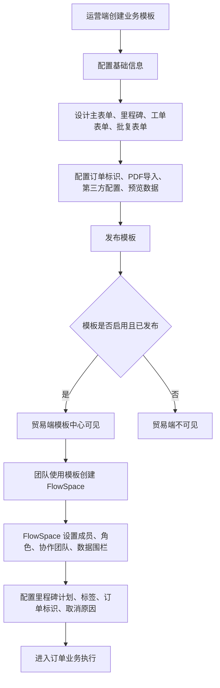

---
title: 从模板到FlowSpace
type: knowledge
domain: 公共能力
module: 业务流程
submodule: 模板创建FlowSpace
status: authoritative
version: v0.1
owner: 产品
maintainer: Daren
updated_at: 2026-05-25
permission: internal
tags:
  - 业务模板
  - FlowSpace
  - 模板发布
  - 模板同步
source_files:
  - source:thoughts-v2-current/v2.0.x/运营端/【运营端】【模板中心】业务模版管理.md
  - source:thoughts-v2-current/v2.0.x/贸易端/【贸易端】【工作台】工作台、创建SCCS、SCCS分组.md
  - source:thoughts-v2-current/v2.1.x/贸易端/【贸易端】【SCCS设置】.md
related_docs:
  - ../20-业务对象/业务模板.md
  - ../20-业务对象/FlowSpace.md
search_keywords:
  - 创建FlowSpace
  - 业务模板
  - 模板发布
  - 同步至FlowSpace
---

# 从模板到 FlowSpace

## 1. 流程定位

本流程描述运营端业务模板如何成为贸易端可使用的 FlowSpace，并在 FlowSpace 运行态中继续配置成员、角色、数据围栏、里程碑计划、标签和更多业务设置。

## 2. 流程图

## 3. 阶段说明

| 阶段 | 关键动作 | 结果 |
| --- | --- | --- |
| 模板创建 | 添加业务模板，配置名称、图标、创建类型、行业、描述、备注 | 生成未发布模板 |
| 模板设计 | 设计主表单、里程碑、工单表单、批复表单 | 确定 FlowSpace 的业务结构 |
| 模板发布 | 发布模板并设置可见范围 | 贸易端可见的前置条件 |
| FlowSpace 创建 | 贸易端团队选择模板创建 FlowSpace | 生成业务空间 |
| FlowSpace 运行态设置 | 设置角色、成员、数据围栏、计划、标签、更多设置 | 形成可执行业务环境 |

## 4. 权限规则

- 运营端模板管理权限决定谁可创建、编辑、发布、复制和同步业务模板。
- 模板可见范围决定哪些团队可在贸易端模板中心看到模板。
- 贸易端团队角色中的“创建 FlowSpace”权限决定谁可创建 FlowSpace。
- FlowSpace 创建后，FlowSpace 内业务权限由 FlowSpace 业务角色和协作方角色控制。

## 5. 状态与限制

| 对象 | 状态 | 规则 |
| --- | --- | --- |
| 业务模板 | 未发布 | 即使启用，贸易端也不可见 |
| 业务模板 | 已发布 | 可按可见范围在贸易端展示 |
| 业务模板 | 已编辑 | 与已发布版本不一致，需要提示发布 |
| FlowSpace | 已创建 | 基于创建时模板生成运行态结构 |
| FlowSpace 模板同步 | 同步至未发布状态的 FlowSpace 模板 | 需谨慎处理字段关联和业务数据 |

## 6. 数据与表单影响

模板定义以下内容：

- 订单主表单。
- 里程碑。
- 工单采集表单。
- 工单批复表单。
- 里程碑批复表单。
- 订单标识默认配置。
- PDF 导入设置。
- 第三方数据对接配置。
- 预览数据。

同步至 FlowSpace 时，需确认新增字段、删除字段、字段关联关系和历史业务数据保留规则。

## 7. 日志与追溯

需要记录：

- 模板创建、编辑、删除。
- 模板发布。
- 模板可见范围设置。
- 模板复制。
- 同步至 FlowSpace。
- FlowSpace 创建。
- FlowSpace 设置变更。

## 8. 待确认问题

- 业务模板同步至已创建 FlowSpace 时，字段删除后的历史业务数据如何保留。
- FlowSpace 内模板是否存在发布态/未发布态的完整状态机。
- 用户自建模板和定制模板是否纳入当前流程。

## 9. 来源需求

- `source:thoughts-v2-current/v2.0.x/运营端/【运营端】【模板中心】业务模版管理.md`
- `source:thoughts-v2-current/v2.0.x/贸易端/【贸易端】【工作台】工作台、创建SCCS、SCCS分组.md`
- `source:thoughts-v2-current/v2.1.x/贸易端/【贸易端】【SCCS设置】.md`

