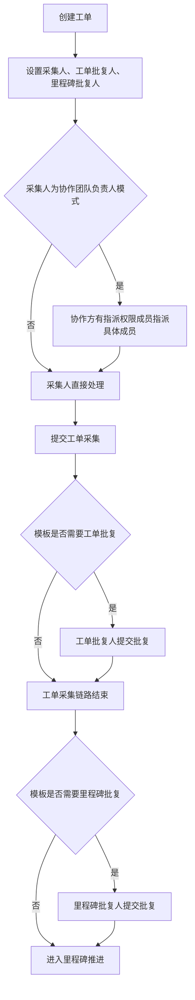

---
title: 工单采集与批复
type: knowledge
domain: 贸易端
module: 业务流程
submodule: 工单处理
status: authoritative
version: v0.1
owner: 产品
maintainer: Daren
updated_at: 2026-05-25
permission: internal
tags:
  - 工单
  - 采集
  - 批复
  - 指派
source_files:
  - source:thoughts-v2-current/v2.2.x/贸易端/【贸易端】【订单详情】工单&里程碑批复操作.md
  - source:thoughts-v2-current/v2.3.x/采集端/【采集端】【任务详情页】工单、工单批复、里程碑批复详情页.md
related_docs:
  - ../20-业务对象/工单与批复.md
  - ../20-业务对象/里程碑.md
  - ../20-业务对象/订单.md
search_keywords:
  - 创建工单
  - 采集指派
  - 工单采集
  - 工单批复
  - 里程碑批复
---

# 工单采集与批复

## 1. 流程定位

本流程描述工单从创建、设置处理人、协作方指派、采集提交、工单批复，到里程碑批复的执行链路。

## 2. 流程图

## 3. 阶段说明

| 阶段 | 关键规则 |
| --- | --- |
| 创建工单 | 里程碑未开始或进行中，且用户有创建工单权限 |
| 设置处理人 | 可选择成员、协作团队负责人或具体协作成员 |
| 采集指派 | 协作方负责人模式下，由有指派权限成员指派具体成员 |
| 工单采集 | 采集人填写可编辑表单并提交 |
| 工单批复 | 模板需要工单批复时执行 |
| 里程碑批复 | 模板需要里程碑批复时执行 |

## 4. 权限与状态限制

不可处理的典型场景：

- 订单已删除。
- 订单已完成或已取消。
- 里程碑已完成或已取消。
- 工单已终止采集。
- 工单已批复。
- 工单已删除。
- 采集人或可编辑表单权限已变化。
- 多人并发提交后当前页面未刷新。

## 5. 表单与校验

创建工单时：

- 一次最多创建 10 条。
- 至少保留一个非隐藏表单。
- 工单名称必填，默认自动编号。
- 采集人、工单批复人、里程碑批复人按模板要求校验。
- 未设置采集人的表单需要校验必填字段。

采集提交时：

- 当前用户只可编辑自己负责的表单。
- 必填项和字段格式按运营端配置校验。
- 其他人提交后，当前页面需刷新才能继续提交。

## 6. 通知与日志

| 事件 | 通知/记录 |
| --- | --- |
| 创建工单 | 通知采集处理成员或协作团队负责人；写入工单动态 |
| 采集指派 | 通知被指派成员；写入工单动态 |
| 采集提交 | 通知发起人或批复人；写入动态和历史记录 |
| 工单批复 | 写入工单批复动态和历史记录 |
| 里程碑批复 | 写入里程碑批复动态和历史记录 |
| 终止采集 | 写入动态 |
| 自动化创建工单 | 操作人为机器人，写入动态和跟踪记录 |

## 7. 待确认问题

- 终止采集是否可恢复。
- 工单批复后，自动化或资源库同步是否仍可更新采集字段。
- 采集端与贸易端的全部提示文案是否一致。

## 8. 来源需求

- `source:thoughts-v2-current/v2.2.x/贸易端/【贸易端】【订单详情】工单&里程碑批复操作.md`
- `source:thoughts-v2-current/v2.3.x/采集端/【采集端】【任务详情页】工单、工单批复、里程碑批复详情页.md`
- `source:thoughts-v2-current/v2.3.x/采集端/【采集端】【任务列表】工单、工单批复、里程碑批复任务列表.md`

