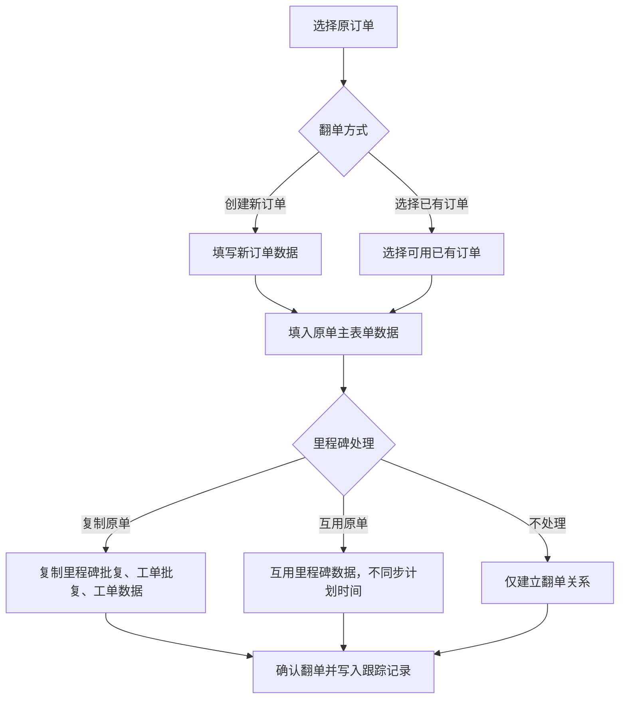

---
title: 订单复用关系
type: knowledge
domain: 贸易端
module: 业务流程
submodule: 订单复用
status: authoritative
version: v0.1
owner: 产品
maintainer: Daren
updated_at: 2026-05-25
permission: internal
tags:
  - 订单
  - 翻单
  - 订单关联
  - 里程碑互用
  - 工单互用
source_files:
  - source:thoughts-v2-current/v2.3.x/贸易端/【贸易端】【订单管理】订单翻单功能.md
  - source:thoughts-v2-current/v2.3.x/贸易端/【贸易端】【订单管理】订单关联功能.md
  - source:thoughts-v2-current/v2.3.x/贸易端/【贸易端】【订单管理】里程碑互用功能.md
  - source:thoughts-v2-current/v2.3.x/贸易端/【贸易端】【订单管理】工单互用功能.md
related_docs:
  - ../20-业务对象/订单.md
  - ../20-业务对象/里程碑.md
  - ../20-业务对象/工单与批复.md
search_keywords:
  - 翻单
  - 订单关联
  - 里程碑互用
  - 工单互用
  - 取消互用
---

# 订单复用关系

## 1. 流程定位

订单复用关系用于在订单之间建立业务关系或复用历史数据，包括订单翻单、订单关联、里程碑互用和工单互用。它们都服务于减少重复录入、提高协作效率和保留跨订单追溯关系，但数据同步范围和影响不同。

## 2. 关系总览

| 关系 | 作用 | 是否复制数据 | 是否建立持续关系 |
| --- | --- | --- | --- |
| 订单翻单 | 基于原订单创建或指定翻单订单 | 可填入原单、复制里程碑、互用里程碑 | 是，原单与翻单互相展示 |
| 订单关联 | 建立订单之间的关系 | 不复制数据 | 是，互相关联展示 |
| 里程碑互用 | 将里程碑数据互用于其他订单 | 展示并复用除计划时间、负责人外的数据 | 是，来源里程碑决定互用数据 |
| 工单互用 | 将工单复用于其他订单里程碑 | 展示工单数据、工单批复、历史和动态 | 是，原工单被复用 |

## 3. 订单翻单

关键规则：

- 翻单权限在 FlowSpace 业务角色中配置。
- 可创建新订单作为翻单，也可选择已有订单作为翻单。
- 创建新订单翻单时，新增订单创建人为翻单操作人。
- 已有订单建立翻单关系时，订单创建人不变。
- 复制原单不复制里程碑计划时间、不复制邮件协作数据。
- 复制或互用里程碑时，主表单公式可能需要重新计算。
- 翻单成功后，原单和翻单都写入跟踪记录。

## 4. 订单关联

订单关联用于建立订单之间的互相关系，不默认复制字段或流程数据。

关键规则：

- 关联权限在 FlowSpace 业务角色中配置。
- 可从订单列表或订单详情发起。
- 可选择一条或多条订单。
- 可选订单排除当前订单和已关联订单。
- 关联后，两边订单都展示关联标识。
- 点击关联订单跳转详情，无权限时提示暂无权限。
- 取消关联后，两边关系解除并写入跟踪记录。
- 关联订单被删除后，另一方不再展示关联信息，并写入跟踪记录。

## 5. 里程碑互用

里程碑互用用于将某订单的里程碑数据复用于其他订单。

关键规则：

- 需要有里程碑互用权限。
- 互用后，同步展示原里程碑数据，但计划时间和负责人不同步。
- 原无权限的订单若添加互用里程碑，原工单参与人可跳转并查看互用工单。
- 可将当前里程碑互用于其他订单，也可从其他订单互用里程碑到当前订单。
- 可选订单需满足订单进行中、里程碑未开始或进行中、具备对应权限等条件。
- 里程碑或工单已有互用关系时，部分互用入口需置灰或后端拦截。
- 互用和取消互用均需写入订单跟踪记录。

## 6. 工单互用

工单互用用于将某个工单复用于其他订单的里程碑。

关键规则：

- 需要有工单互用权限。
- 互用后可查看工单数据、工单批复数据、历史记录、工单动态，但互用工单不可发新动态。
- 可在里程碑操作中添加互用工单，也可在工单操作中将工单互用于其他里程碑。
- 互用自其他工单的工单仅有查看功能，无工单编辑操作。
- 里程碑新增工单命名逻辑不受互用工单影响。
- 源工单动态记录互用和取消互用。
- 任一方数据被删除时，需要取消互用关系并更新展示。

## 7. 权限与状态限制

| 关系 | 权限 | 状态限制 |
| --- | --- | --- |
| 翻单 | 订单翻单权限 | 可选订单需符合来源规则，避免循环翻单或已翻单订单重复作为翻单 |
| 订单关联 | 订单关联权限 | 排除当前订单、已关联订单、不可见订单 |
| 里程碑互用 | 里程碑互用权限 | 订单进行中，里程碑未开始或进行中；排除已有互用冲突 |
| 工单互用 | 工单互用权限 | 订单进行中，目标里程碑未完成；排除互用自工单、已互用工单等 |

## 8. 日志与审计

需要记录：

- 创建翻单关系。
- 取消翻单关系。
- 建立订单关联。
- 取消订单关联。
- 里程碑互用和取消互用。
- 工单互用和取消互用。
- 删除订单、里程碑、工单导致复用关系取消。

## 9. 待确认问题

- 翻单、关联、互用之间是否允许组合使用的完整矩阵。
- 取消里程碑互用时，目标里程碑数据保留或清空的选择规则。
- 工单互用中源工单被删除后，目标工单删除是否需要保留审计快照。

## 10. 来源需求

- `source:thoughts-v2-current/v2.3.x/贸易端/【贸易端】【订单管理】订单翻单功能.md`
- `source:thoughts-v2-current/v2.3.x/贸易端/【贸易端】【订单管理】订单关联功能.md`
- `source:thoughts-v2-current/v2.3.x/贸易端/【贸易端】【订单管理】里程碑互用功能.md`
- `source:thoughts-v2-current/v2.3.x/贸易端/【贸易端】【订单管理】工单互用功能.md`

