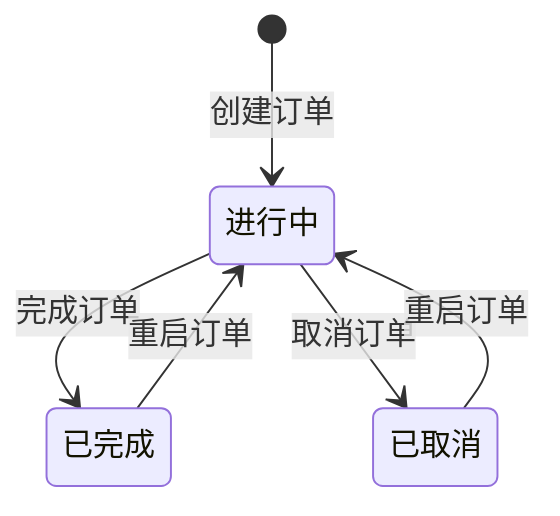
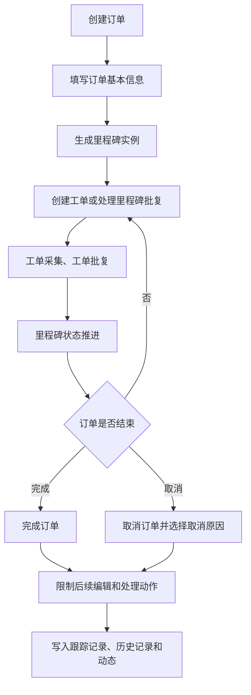

---
title: 订单生命周期
type: knowledge
domain: 贸易端
module: 业务流程
submodule: 订单生命周期
status: authoritative
version: v0.1
owner: 产品
maintainer: Daren
updated_at: 2026-05-25
permission: internal
tags:
  - 订单
  - 生命周期
  - 状态
  - 跟踪记录
source_files:
  - source:thoughts-v2-current/v2.2.x/贸易端/【贸易端】【订单详情】查看&操作.md
  - source:thoughts-v2-current/v2.2.x/贸易端/【贸易端】【订单列表】订单增删改.md
  - source:thoughts-v2-current/v2.3.x/贸易端/【贸易端】【订单列表】批量操作.md
related_docs:
  - ../20-业务对象/订单.md
  - ../20-业务对象/里程碑.md
  - ../20-业务对象/工单与批复.md
search_keywords:
  - 创建订单
  - 完成订单
  - 取消订单
  - 重启订单
  - 跟踪记录
---

# 订单生命周期

## 1. 流程定位

订单生命周期描述订单从创建、执行业务、推进里程碑和工单，到完成、取消或重启的完整状态变化，以及各状态下对里程碑、工单、批复和日志的影响。

## 2. 状态机

## 3. 主流程

## 4. 关键规则

| 动作 | 规则 |
| --- | --- |
| 创建订单 | 按业务模板主表单填写数据，生成对应里程碑 |
| 编辑订单 | 需有编辑订单权限，已完成/已取消状态受限 |
| 完成订单 | 仅进行中订单可完成；完成后订单和相关里程碑、工单处理动作受限 |
| 取消订单 | 仅进行中订单可取消；需选择取消原因 |
| 重启订单 | 已完成或已取消订单可按权限重启为进行中 |
| 删除订单 | 需有删除订单权限；删除后相关链接应提示无权限或不可访问 |

## 5. 完成订单后的影响

- 订单状态变更为已完成。
- 订单不可编辑、不可取消。
- 进行中的里程碑变更为已完成，其余里程碑状态按规则保持。
- 所有里程碑不可创建工单，不可修改状态，不可从其他订单互用里程碑，不可添加互用工单。
- 所有里程碑批复不可编辑、指派、修改处理人。
- 所有工单不可采集、批复、指派、修改处理人、发邮件协作、终止采集、删除工单。
- 跟踪记录增加完成订单记录。

## 6. 取消订单后的影响

- 订单状态变更为已取消。
- 取消时需选择取消原因。
- 取消原因来自 FlowSpace 设置中的订单取消原因预设。
- 历史订单中保存取消时的文本，后续修改预设不影响已取消订单展示。
- 业务处理动作受限。
- 跟踪记录增加取消订单记录。

## 7. 权限规则

| 操作 | 权限要求 |
| --- | --- |
| 查看订单 | 查看订单基本信息权限 + 数据围栏 |
| 创建订单 | 创建订单权限 |
| 编辑订单 | 编辑订单权限 |
| 修改订单状态 | 修改订单状态权限 |
| 删除订单 | 删除订单权限 |
| 查看跟踪记录 | 查看跟踪记录权限 |

## 8. 日志与审计

订单生命周期必须写入：

- 订单创建记录。
- 订单编辑历史。
- 完成、取消、重启记录。
- 跟踪记录。
- 自动化修改订单基本信息记录。
- 资源库同步或公式更新引发的系统自动执行日志。

## 9. 待确认问题

- 订单重启后，已完成/已取消里程碑和工单是否恢复可处理的完整规则。
- 删除订单后，关联订单、翻单、互用数据如何展示和记录。
- 自动化是否允许对已完成或已取消订单继续执行某些动作。

## 10. 来源需求

- `source:thoughts-v2-current/v2.2.x/贸易端/【贸易端】【订单详情】查看&操作.md`
- `source:thoughts-v2-current/v2.2.x/贸易端/【贸易端】【订单列表】订单增删改.md`
- `source:thoughts-v2-current/v2.3.x/贸易端/【贸易端】【订单列表】批量操作.md`

