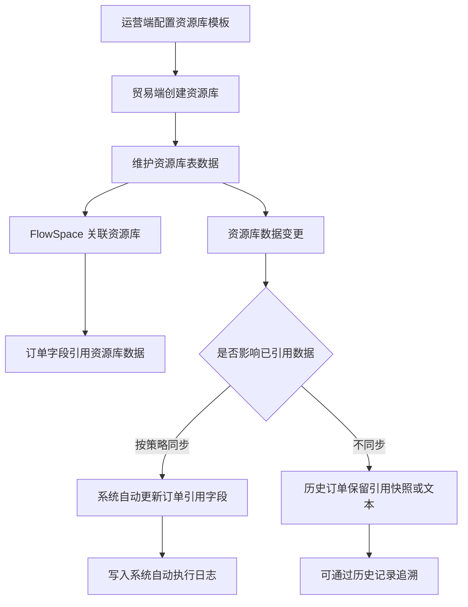

---
title: 资源库引用与同步
type: knowledge
domain: 贸易端
module: 业务流程
submodule: 资源库应用
status: authoritative
version: v0.1
owner: 产品
maintainer: Daren
updated_at: 2026-05-25
permission: internal
tags:
  - 资源库
  - 引用
  - 同步
  - 历史记录
source_files:
  - source:thoughts-v2-current/V2.4.x/贸易端/【贸易端】【资源库】第一阶段.md
  - source:thoughts-v2-current/v2.7/贸易端/【贸易端】【资源库】SCCS应用数据范围、数据编辑历史记录.md
  - source:thoughts-v2-current/V2.4.x/贸易端/系统自动执行的相关操作日志.md
related_docs:
  - ../20-业务对象/资源库.md
  - ../20-业务对象/FlowSpace.md
  - ../40-权限与安全/权限体系总表.md
search_keywords:
  - 资源库引用
  - FlowSpace应用数据范围
  - 资源库同步
  - 数据编辑历史
---

# 资源库引用与同步

## 1. 流程定位

资源库引用与同步描述团队资源库如何被 FlowSpace 订单字段引用，以及资源库数据变化后如何影响订单中的已引用数据和历史记录。

## 2. 流程图

## 3. FlowSpace 应用数据范围

资源库可按表设置 FlowSpace 应用权限：

| 配置 | 说明 |
| --- | --- |
| 所有数据 | FlowSpace 关联资源库后，所有用户在订单中引用资源库数据时，可引用所有数据 |
| 根据用户权限 | 用户在 FlowSpace 订单中引用资源库数据时，只可引用本人可查看的资源库数据 |

规则：

- 此处 FlowSpace 指与资源库所属同一团队下的 FlowSpace。
- 暂不考虑协作团队 FlowSpace 引用协作资源库的复杂场景。
- 修改配置后，不影响 FlowSpace 已引用的数据。
- 再次编辑订单数据时，可引用数据范围按最新配置生效。

## 4. 引用与删除规则

| 场景 | 规则 |
| --- | --- |
| 删除资源库 | 新订单不可再引用；历史订单保留已引用文本 |
| 删除资源库数据 | 新订单不可继续引用该数据；历史引用保留 |
| 修改资源库数据 | 按同步策略影响已引用字段 |
| 修改 FlowSpace 应用范围 | 不影响已引用数据；影响后续编辑引用范围 |

## 5. 历史记录

- 资源库数据列表每条数据增加历史记录查看按钮。
- 可见该条数据的人可以查看历史记录。
- 历史记录按操作时间正序排序。
- 默认查看最新一条记录。
- 游客操作需增加分享人信息。

## 6. 日志与审计

需要记录：

- 资源库数据创建、编辑、删除。
- 资源库数据导入、导出。
- FlowSpace 应用数据范围配置变更。
- 资源库同步触发的系统自动执行日志。
- 资源库历史记录。

## 7. 待确认问题

- 资源库同步与自动化更新同一字段时的优先级。
- 资源库引用字段被手动修改后的冲突处理。
- 协作资源库和协作团队 FlowSpace 引用场景是否纳入近期范围。

## 8. 来源需求

- `source:thoughts-v2-current/V2.4.x/贸易端/【贸易端】【资源库】第一阶段.md`
- `source:thoughts-v2-current/v2.7/贸易端/【贸易端】【资源库】SCCS应用数据范围、数据编辑历史记录.md`
- `source:thoughts-v2-current/V2.4.x/贸易端/系统自动执行的相关操作日志.md`

