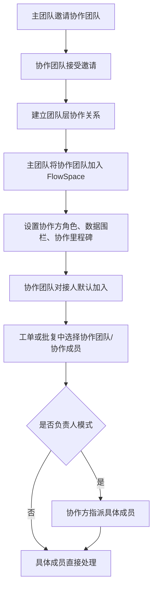

# 跨团队协作

## 1. 流程定位

跨团队协作描述主团队如何邀请外部团队建立协作关系，并将协作团队加入具体 FlowSpace 参与订单、里程碑、工单和批复处理。

## 2. 流程图

## 3. 两层协作关系

| 层级 | 说明 |
| --- | --- |
| 团队层协作 | 当前团队与外部团队建立协作关系，是加入 FlowSpace 的前置关系 |
| FlowSpace 层协作 | 将已建立关系的协作团队加入具体 FlowSpace，并设置角色、数据围栏和协作里程碑 |

## 4. 权限规则

| 场景 | 权限来源 |
| --- | --- |
| 邀请协作团队 | 团队设置权限 |
| 将协作团队加入 FlowSpace | FlowSpace 设置权限 |
| 设置协作方角色 | FlowSpace 设置权限 |
| 协作成员查看订单/工单 | 协作方角色 + 数据围栏 |
| 协作方指派成员 | 对应里程碑或工单的指派权限 |
| 协作成员采集/批复 | 被指派或被授权为处理人 |

## 5. 关键规则

- 团队层协作使用团队码发起邀请。
- 被邀请团队中有团队设置权限的成员收到邀请。
- 协作团队接受后，才能被加入具体 FlowSpace。
- 添加协作团队到 FlowSpace 时，可设置协作方角色、数据围栏、协作里程碑。
- 协作团队拥有者默认成为该 FlowSpace 的对接人。
- 删除协作团队会同步影响其参与的 FlowSpace。
- 相关邮件和消息跳转时，如果权限已失效，应提示暂无权限。

## 6. 通知与日志

需要记录：

- 协作团队邀请。
- 接受或拒绝协作邀请。
- 将协作团队加入 FlowSpace。
- 设置协作方角色、数据围栏、协作里程碑。
- 删除协作团队。
- 协作方指派、采集、批复相关动态。

## 7. 待确认问题

- 对接人、负责人、有指派权限成员三者边界是否完全一致。
- 删除协作团队后的任务批量移交规则。
- 协作团队创建的 FlowSpace 引用主团队授权资源库数据的完整规则。

## 8. 来源需求

- `source:thoughts-v2-current/v2.0.x/贸易端/【贸易端】【团队设置】团队信息、角色、成员、协作团队管理.md`
- `source:thoughts-v2-current/v2.1.x/贸易端/【贸易端】【协作SCCS设置】.md`
- `source:thoughts-v2-current/v2.1.x/贸易端/【贸易端】【SCCS设置】.md`
- `source:thoughts-v2-current/v2.2.x/贸易端/【贸易端】【订单详情】工单&里程碑批复操作.md`
