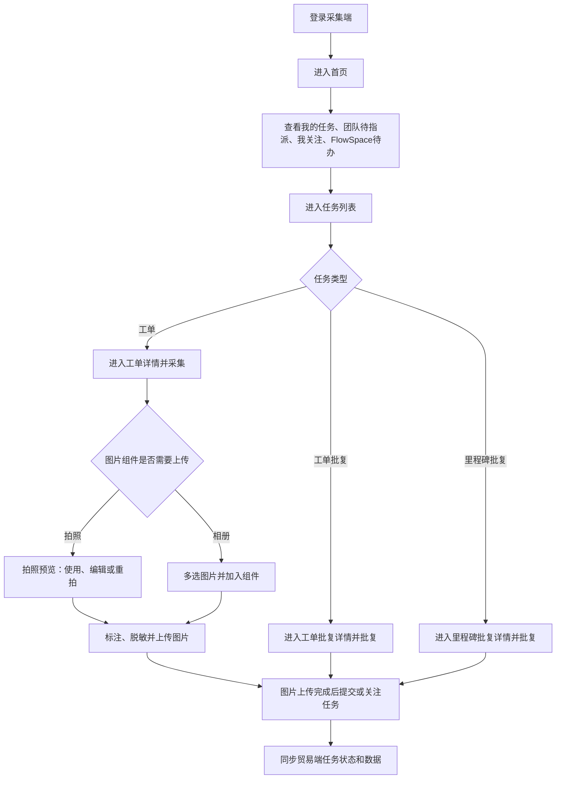

# 移动端采集

## 1. 流程定位

移动端采集是采集端承接贸易端任务的执行流程，主要用于查看和处理工单、工单批复、里程碑批复任务，并支持首页统计、任务列表、搜索、详情、消息和个人中心。

## 2. 流程图

## 3. 首页

首页展示：

- 我的任务。
- 团队待指派任务。
- 我关注任务。
- FlowSpace 任务数据。
- 团队切换列表中的待办数量。
- 底部导航任务待办数。

FlowSpace 数据：

- 订单：该团队下需要我处理的任务对应订单数。
- 任务：该团队下需要我处理的任务数。
- 里程碑数字：对应里程碑需要我处理的任务数。
- 待办数：进行中的待办工单、里程碑批复、工单批复。
- 外部协作标识：非本团队 FlowSpace 需展示协作标识和所属团队信息。

## 4. 任务列表

| 列表 | 规则 |
| --- | --- |
| 进行中任务 | 包含待办和已处理任务 |
| 已完成任务 | 里程碑完成/取消、工单已批复、工单终止采集等 |
| 我发起任务 | 发起人为本人的工单或批复 |
| 团队指派任务 | 有指派权限的待指派、已指派、已完成任务 |
| 我关注任务 | 本人关注的任务 |

任务需排除互用自的工单，仅展示正常创建的工单。

## 5. 待办与已处理判断

进行中待办：

- 里程碑批复：里程碑进行中且处理人未提交。
- 工单批复：里程碑进行中且处理人未提交。
- 工单：里程碑进行中、无工单批复、未终止，且处理人未提交。
- 协作工单/批复指派：可编辑、未提交、未指派、且有指派权限。

进行中已处理：

- 里程碑批复：里程碑进行中且处理人已提交。
- 工单批复：里程碑进行中且处理人已提交。
- 工单：里程碑进行中、无工单批复、未终止，且处理人已提交。
- 协作工单/批复指派：可编辑、有指派权限，且已提交或已指派。

## 6. 操作规则

- 支持下拉刷新、上拉加载更多。
- 多 Tab 点击切换。
- 超过两屏高度出现返回顶部按钮。
- 搜索跳转任务搜索页。
- 点击任务进入对应详情页。
- 点击关注后进入我关注列表。
- 点击团队名称可切换团队，切换后任务列表同步切换。

## 7. 图片采集与上传

- 图片组件适用于工单、工单批复和里程碑批复。
- 拍照完成后进入单图预览，可直接使用、编辑或重拍。
- 相册支持多选，选择数量不超过组件剩余可上传数量。
- 图片编辑支持方框、文字、马赛克、撤销、清空和重新编辑。
- 编辑后的图片替换当前图片，数量和顺序不变。
- 每张图片独立展示待上传、上传中、上传成功或上传失败状态。
- 编辑已上传图片时，重新上传成功前保留原图片。
- 图片未上传完成时不允许提交表单；上传失败时保留本地图片并允许重新上传。

详细规则见 [采集端图片编辑](../10-功能模块详情/采集端图片编辑.md)。

## 8. 与贸易端同步

采集端处理的工单、工单批复、里程碑批复数据需与贸易端实时同步。采集端状态限制应与贸易端保持一致：

- 订单已完成/取消时不可继续处理。
- 里程碑已完成/取消时不可继续处理。
- 工单已终止或已批复时不可继续采集。
- 权限变化后跳转或提交需提示暂无权限或刷新。

## 9. 待确认问题

- 采集端是否完整覆盖贸易端所有状态限制和提示文案。
- 离线或弱网场景是否支持草稿或重试。
- 采集端任务关注、搜索、消息之间的数据同步频率。
- 弱网或离线场景下图片编辑结果和上传队列是否持久化。

## 10. 来源需求

- `source:thoughts-v2-current/v2.3.x/采集端/【采集端】【首页】任务相关数据展示.md`
- `source:thoughts-v2-current/v2.3.x/采集端/【采集端】【任务列表】工单、工单批复、里程碑批复任务列表.md`
- `source:thoughts-v2-current/v2.3.x/采集端/【采集端】【任务详情页】工单、工单批复、里程碑批复详情页.md`
- `source:thoughts-v2-current/v2.3.x/采集端/【采集端】【任务搜索页】工单、工单批复、里程碑批复任务搜索.md`
- `source:thoughts-v2-current/v2.7/采集端/采集端图片编辑功能.md`
