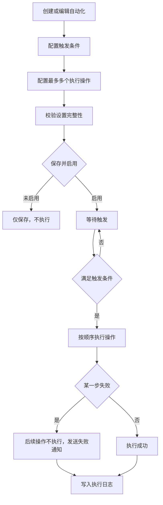

# 自动化执行

## 1. 流程定位

自动化用于在 FlowSpace 内基于触发条件执行机械性业务动作。自动化由触发条件和执行操作组成，启用后才会执行。执行失败时可通知指定对象，并记录执行日志。

## 2. 流程图

## 3. 触发条件

| 触发条件 | 说明 |
| --- | --- |
| 数据新增时 | 当订单基本信息、里程碑批复、里程碑工单等数据新增并满足条件时触发 |
| 数据内容变更时 | 当指定数据源字段发生变更并满足条件时触发 |
| 到达记录中的时间时 | 当到达某数据源内日期字段的指定时间点时触发 |
| 定时任务 | 按不重复、每天、每周、每月、每月第 xx 个周 xx 等周期触发 |

自动化触发条件和执行操作在同一订单内发生，不跨订单执行。

## 4. 执行操作

| 执行动作 | 说明 |
| --- | --- |
| 发送通知 | 向 FlowSpace 成员、协作团队、业务角色、协作方角色、系统角色、模板控件等对象发送站内或邮件通知 |
| 新增数据 | 主要用于自动新增工单，并设置处理人和默认值 |
| 更新数据 | 更新订单基本信息、里程碑批复、工单等数据源字段 |

定时任务下的执行操作有特殊限制：

- 发送通知时，通知对象仅保留 FlowSpace 成员、协作团队、业务角色、协作方角色 4 个分组。
- 新增数据时需增加订单筛选条件，筛选符合条件的订单再创建工单。
- 更新数据时需增加记录范围设置，过滤符合条件的订单、里程碑批复或工单。
- 设置的时间不存在时不执行，且不属于执行失败。

## 5. 权限与状态限制

| 限制 | 说明 |
| --- | --- |
| 自动化配置权限 | 自动化配置入口由运营端团队列表的功能权限配置授权，不再由贸易端 FlowSpace 业务角色勾选 |
| 启用校验 | 条件和操作都至少有一个节点，且设置完整 |
| 顺序执行 | 任一步失败，后续操作不执行 |
| 订单状态 | 订单已完成或已取消时，新增或更新数据通常不执行 |
| 里程碑状态 | 里程碑已完成或已取消时，里程碑批复或工单相关动作不执行 |
| 互用限制 | 里程碑互用自其他订单、工单互用自其他订单时，部分动作不执行 |

自动化写入需要遵守系统自动计算与更新规则：订单结束、里程碑结束、工单采集结束后，自动化不能继续改写对应业务字段；定时任务命中但目标对象状态不允许时不执行。设置时间不存在时不执行，且不算执行失败。

## 6. 通知规则

自动化通知对象包括：

- FlowSpace 成员。
- FlowSpace 协作团队。
- 业务角色和协作方角色。
- 订单模板控件。
- 步骤一数据源角色。
- 系统角色，如订单创建人、订单更新人、里程碑负责人、工单采集人、工单批复人等。

通知渠道：

- Linkincrease 消息。
- 邮件。
- 失败通知可配置站内、邮件、短信。

## 7. 日志与审计

执行日志需记录：

- 执行数据。
- 执行时间。
- 执行状态：成功、失败、部分成功。
- 满足的条件。
- 每个执行节点的配置和执行结果。
- 操作人：团队成员、协作方成员或机器人。
- 新增或变更的数据内容。

系统自动执行日志中，自动化操作人应标识为机器人或具体自动程序。

## 8. 待确认问题

- 部分成功的完整处理规则。
- 自动化与资源库同步同时更新同一字段时的优先级。
- 定时任务的时区、夏令时和不存在日期处理是否需要额外规则。

## 9. 来源需求

- `source:thoughts-v2-current/V2.4.x/贸易端/【贸易端】【自动化】一期.md`
- `source:thoughts-v2-current/V2.5.x/贸易端/【贸易端】【自动化】二期：定时任务.md`
- `source:thoughts-v2-current/V2.4.x/贸易端/系统自动执行的相关操作日志.md`
- `source:thoughts-v2-current/平台自动计算、更新规则说明.md`
