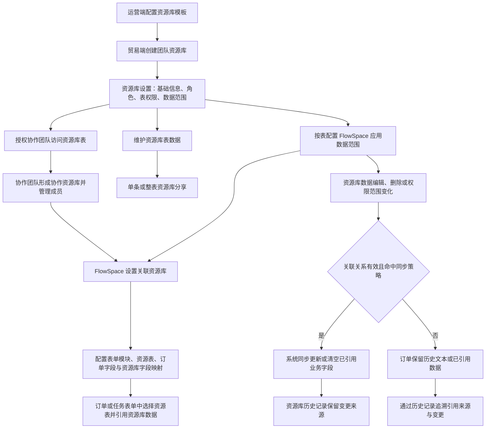

# 资源库引用与同步

## 1. 流程定位

资源库引用与同步描述团队资源库、协作资源库、分享数据与 FlowSpace 订单数据之间的应用关系。

本页使用 `FlowSpace` 作为标准产品术语；来源文档中的 `SCCS` 对应当前知识库中的 `FlowSpace`。

资源库应用不只是一期中的“订单字段引用资源库数据”，v2.5.x 已补充资源库分享、协作资源库权限、FlowSpace 关联多个资源表、订单引用时选择资源表等规则；v2.7 又补充 FlowSpace 应用数据范围和数据编辑历史记录。因此本页以 v2.5.x 和 v2.7 的迭代后口径为准。

## 2. 完整业务流程



## 3. 资源库分享与协作资源库

### 3.1 资源库设置链路

资源库设置是资源库应用到 FlowSpace 前的前置链路，不能只理解为“创建资源库后维护数据”。完整设置顺序如下：


设置项说明：

| 设置项 | 作用 | 对 FlowSpace 应用的影响 |
| --- | --- | --- |
| 基础信息 | 资源库名称等基础配置 | 影响资源库列表和引用弹窗中的资源库识别 |
| 成员角色 | 控制本团队成员可见表、可操作表、可操作数据范围 | 当 FlowSpace 应用范围为“根据用户权限”时，影响用户可引用数据 |
| 协作方角色 | 控制协作团队可见表、可操作表、可操作数据范围 | 决定协作资源库可见表，以及协作团队 FlowSpace 可引用的数据基础 |
| 表权限 | 查看、创建、编辑、删除、导入、导出、批量操作等 | 没有查看权限的数据不可被引用或分享 |
| 数据范围 | 全部、本人创建、自定义条件 | 与 FlowSpace 应用数据范围共同决定引用弹窗数据 |
| FlowSpace 应用数据范围 | 所有数据、根据用户权限 | 控制同团队 FlowSpace 内引用资源库数据时是否按用户资源库权限过滤 |
| 分享设置 | 单条或整表分享、只读、密码、失效 | 外部编辑会反向更新资源库数据，并可能触发同步策略 |

缺少以上任一设置，都可能导致 FlowSpace 关联后出现“可选表为空、引用弹窗无数据、协作团队不可见、同步范围不符合预期”等问题。

### 3.2 分享能力

资源库分享用于让平台外用户或外部协作方查看、填写或维护资源库数据。典型场景包括工厂信息填报、规范文件共享、款式信息共享等。

| 分享对象 | 发起条件 | 数据范围 | 关键规则 |
| --- | --- | --- | --- |
| 单条数据分享 | 内部成员或协作团队成员拥有该条数据查看权限 | 当前单条数据 | 同一条数据可被多个成员分别分享，分享链接互不干扰 |
| 整表数据分享 | 内部成员或协作团队成员拥有资源表查看权限 | 当前分享者可见的表数据范围 | 整表分享和单条数据分享可同时存在 |
| 分享链接管理 | 按当前用户权限查看分享记录 | 管理员看权限范围内分享，成员看本人分享 | 列表仅展示有效分享记录 |

分享配置规则：

- 分享默认关闭，开启后展示分享配置并生成分享链接。
- 只读默认开启；关闭只读后，被分享者是否可编辑取决于分享者是否拥有编辑权限。
- 密码默认启用，随机生成 4 位密码，支持手动修改和重新生成；修改后原密码立即失效。
- 复制链接时，如启用密码，需要同时复制链接和密码。
- 分享者权限变更后，被分享者的数据查看和编辑权限同步变化。
- 分享者失去该条数据或该表查看权限后，分享链接失效；分享者重新获得权限后，原链接仍保持失效，需要重新分享。

### 3.3 外部访问与编辑

| 场景 | 规则 |
| --- | --- |
| 打开启用密码的链接 | 先输入密码，密码错误提示“密码错误，请重新输入” |
| 打开未启用密码的链接 | 直接进入分享数据页面 |
| 链接失效 | 提示“链接已失效” |
| 查看数据 | 可查看链接范围内的数据详情 |
| 编辑数据 | 需未开启只读，且分享者仍拥有编辑权限；提交时再次校验权限 |
| 筛选、排序、导出、批量下载、列统计 | 仅在当前链接数据范围内执行 |
| 批量编辑 | 当前分享表数据可编辑时展示批量编辑入口 |

外部用户编辑后，更新资源库数据，并记录更新人、更新时间和游客信息。游客操作需要可追溯到分享人；若分享人为协作团队成员，还需体现所属团队和协作标识。

### 3.4 协作资源库

主团队授权协作团队后，协作团队资源库列表展示协作类型资源库，并只展示授权给该协作团队且有查看权限的表。

协作资源库规则：

- 主团队资源库下展示已授权团队信息。
- 协作团队拥有多个角色时，权限叠加。
- 协作资源库设置包含成员管理。
- 具备协作资源库管理权限的成员可管理协作资源库设置和成员。
- 协作资源库成员角色包括资源库管理员和普通成员。
- 协作资源库管理员拥有当前协作资源库设置权限，以及主团队授权给本团队的相关表权限。

## 4. FlowSpace 应用数据范围

资源库可按表配置 FlowSpace 应用数据范围，用于控制用户在 FlowSpace 订单中引用资源库数据时能看到哪些数据。

| 配置 | 说明 |
| --- | --- |
| 所有数据 | FlowSpace 关联该资源库表后，所有用户在订单中引用资源库数据时，可引用该表所有数据 |
| 根据用户权限 | 用户在 FlowSpace 订单中引用资源库数据时，只可引用本人可查看的资源库数据 |

规则：

- 此处 FlowSpace 指与资源库所属同一团队下的 FlowSpace。
- 表头可批量设置所有资源表的应用数据范围。
- 修改配置后，需要保存才生效。
- 修改配置不影响 FlowSpace 已引用的数据。
- 再次编辑订单数据时，可引用数据范围按最新配置生效。
- 协作团队创建的 FlowSpace 引用协作资源库时，按主团队授权给该协作团队的数据范围处理；v2.7 来源中特别说明，此类协作场景暂不纳入同团队应用数据范围的复杂配置。

### 4.1 引用弹窗数据计算口径

用户在 FlowSpace 中打开资源库引用弹窗时，可选数据不是单一权限决定，而是以下范围叠加后的结果：

```text
可选资源库数据 =
已关联的资源表
∩ 当前资源表仍有效
∩ 当前用户对资源表有查看权限
∩ 当前用户命中的资源库数据范围
∩ 当前资源表的 FlowSpace 应用数据范围
∩ 协作资源库授权范围（如引用协作资源库）
```

其中：

- FlowSpace 应用数据范围为“所有数据”时，不再按当前用户资源库数据范围过滤。
- FlowSpace 应用数据范围为“根据用户权限”时，必须按当前用户在资源库中的表权限和数据范围过滤。
- 协作资源库引用时，先受主团队授权给协作团队的资源表和数据范围限制，再受协作资源库成员角色限制。
- 已删除、已失效、已移除授权的资源表，不可继续出现在新引用选择范围中。

## 5. FlowSpace 关联资源库

### 5.1 入口与配置对象

FlowSpace 关联资源库在 FlowSpace 设置中配置，用于建立 FlowSpace 表单字段与资源库表字段之间的映射关系。拥有 FlowSpace 业务角色中“关联资源库”权限的成员才可配置。

关联配置不是全局只对订单主表单生效，而是按 FlowSpace 模板中的业务模块配置。来源文档中按 SCCS 模板列出主表单和各个里程碑，每个模块下可分别添加多组资源库关联关系。

可配置对象：

| 配置对象 | 规则 |
| --- | --- |
| 关联表单 | 订单模块沿用原有逻辑；资源库表可多选 |
| 资源库表 | 最多选择 5 个资源表 |
| 可选资源表范围 | 本团队创建的资源库表 + 协作团队授权的资源库表 |
| 订单字段 | 同一订单字段只可出现在一组关联关系中 |
| 资源库字段 | 选择几个资源表，就展示几列资源库字段映射 |

模块应用规则：

- 主表单字段可配置资源库引用，用于订单基础信息录入和编辑。
- 各里程碑下的工单采集、工单批复、里程碑批复字段，如配置了资源库关联，也应按对应模块的引用入口和同步策略处理。
- 同一模块下可添加多组关联关系。
- 同一订单字段在当前模块内不可被多组关联关系重复使用。
- 资源库关联配置属于 FlowSpace 设置类功能，需纳入 FlowSpace 设置操作日志。

### 5.2 字段映射规则

- 关联资源库字段可以非必填。
- 每个订单字段后至少需要选择一个资源库表字段。
- 一组关联关系关联了几个资源表，订单中引用时即可从几个资源表中选择数据。
- 如果某个订单字段未关联某个资源表字段，引用该资源表整行数据时，该订单字段按空值处理，并清空该字段的关联关系。
- 地址控件可关联引用到 FlowSpace，但当资源库地址精度低于 FlowSpace 地址精度时，无法补齐的精度需要留空或按控件能力处理。

### 5.3 保存校验

| 校验场景 | 提示或处理 |
| --- | --- |
| 当前用户无关联资源库权限 | 提示“暂无权限，请联系管理员” |
| 关联资源表被删除 | 提示“资源库表已被删除，请重新选择” |
| 协作资源表被主团队移除授权 | 提示关联资源表已不可用，需要重新选择 |
| 订单模板字段被删除 | 对应字段提示“字段已被删除，请重新选择” |
| 资源库字段被删除 | 对应字段提示“字段已被删除，请重新选择” |
| 订单字段重复设置关联 | 提示“该字段已设置关联资源库，不可重复关联” |

## 6. 订单引用资源库数据

### 6.1 引用入口与选择资源表

用户点击已配置资源库关联的订单字段进行引用时，需要先选择资源表。

规则：

- 可选择范围为该字段已配置关联字段的所有资源表。
- 默认选中第一组配置关系中的第一个资源表。
- 选择资源表后，再选择对应资源表数据。
- 打开的引用弹窗数据都应为最新数据。
- 允许手动修改的字段，用户可手动输入，也可引用资源库数据；引用后仍可继续修改。
- 不允许手动修改的字段，点击输入框或引用按钮都打开引用数据弹窗。
- 再次进入引用弹窗时，需要记住上一次选中的选项。

### 6.2 控件引用规则

| 订单字段类型 | 引用规则 |
| --- | --- |
| 单行文本、多行文本 | 直接填入文本；引用多选或关联引用时，多值用逗号分隔 |
| 单选、多选 | 配置资源库引用后统一使用下拉样式；原运营端配置选项隐藏，只可通过资源库引用填值 |
| 成员单选、多选 | 资源库数据中的成员未加入当前 FlowSpace 时不引用，并提示仅引用当前 FlowSpace 成员 |
| 协作方单选、多选 | 资源库数据中的协作团队未加入当前 FlowSpace 时不引用，并提示仅引用当前 FlowSpace 协作团队 |
| 关联引用 | 需要进入二级引用页面，一级选择当前资源表数据，二级选择关联引用控件关联的源表数据 |

关联引用特殊规则：

- 一级弹窗展示订单控件关联的资源表完整字段。
- 二级弹窗展示运营端配置的关联引用显示字段。
- 同一组关联关系中，多个订单字段关联了资源库的关联引用控件时，需要在二级弹窗一次性展示。
- 订单字段为单选时只能选一条数据。
- 订单字段为多选时可选择多条数据。
- 订单字段为其他类型时可选择多条数据，并以逗号分隔展示。

## 7. 同步资源库策略

同步资源库用于控制资源库数据编辑、删除后，是否影响已经引用过资源库数据的订单主表单、工单采集、里程碑批复或工单批复数据。

### 7.1 同步范围

| 同步策略 | 说明 |
| --- | --- |
| 不同步 | 资源库数据修改不影响已引用数据，默认选中 |
| 同步指定日期及之后创建的新订单 | 需设置具体日期；该日期及之后创建的订单命中同步范围，包含当天 |
| 同步所有进行中的订单 | 配置保存后，当下状态为进行中的订单命中同步范围 |
| 同步所有订单 | 所有订单命中同步范围 |

规则：

- 配置修改本身不立即批量更新已有订单数据。
- 需要在后续资源库数据修改或删除时，按最新配置判断是否同步订单数据。
- 如果此前未设置同步资源库，后续改为同步，不因保存配置本身立即同步历史引用数据。
- 当开启同步资源库时，资源库数据更新需要同步到已引用过资源库数据的订单、里程碑批复和工单中。
- 若被同步字段位于工单、工单批复或里程碑批复中，需要遵循该业务对象当前是否允许系统自动更新的规则；当前知识库仍将“批复后是否允许字段被资源库同步更新”列为待确认风险。
- 资源库中的关联引用控件发生源头表数据修改，或运营端修改该关联引用控件的显示字段时，也需要同步更新订单中的引用值。

### 7.2 同步触发

| 触发动作 | 处理 |
| --- | --- |
| 资源库数据编辑 | 命中同步策略时，更新已引用字段 |
| 资源库数据删除 | 命中同步策略时，清空对应已引用字段或按失效规则处理 |
| 资源库关联引用源数据修改 | 命中同步策略时，同步更新订单引用值 |
| 关联引用显示字段配置变化 | 命中同步策略时，同步更新订单引用值 |
| 分享链接外部用户编辑资源库数据 | 本质为资源库数据编辑，命中同步策略时同样触发同步 |

同步不由“保存关联配置”立即触发；保存配置只改变后续资源库变更时的判断规则。

## 8. 失效、删除与历史保留

### 8.1 关联关系失效

以下情况视为关联关系失效：

- 整个关联关系被删除。
- 字段关联关系被删除。
- 运营端模板中删除已关联的订单字段。
- 运营端模板中删除已关联的资源库字段。
- 资源库表被删除。
- 协作资源库表被主团队移除授权。

处理规则：

- 新订单不可继续引用失效的资源库表或字段。
- 已引用过资源库数据的订单保留历史文本或已引用数据。
- 关联关系失效后，即使资源库主团队继续修改资源库数据，也不再通过该失效关系同步更新历史引用数据。

### 8.2 协作资源库数据不可见

当主团队修改资源库数据，导致授权给协作团队的数据范围发生变化，例如数据不再符合自定义权限条件时，v2.5.x 评审先按简单方案处理：

- 资源库主团队修改资源库数据时，也同步已经无权限的协作团队 FlowSpace 订单数据。
- 当满足同步资源库条件时，若资源库数据按删除或不可见处理，则对应订单字段按同步规则清空或失效。
- 后续如需改为“协作团队历史引用数据保留但关联断开，不再同步”，需要另行确认。

## 9. 历史记录

资源库数据列表每条数据增加历史记录查看按钮。

规则：

- 可见该条数据的人可以查看历史记录。
- 历史记录按操作时间正序排序。
- 点击历史记录时默认查看最新一条记录。
- 导入成功时，资源库数据历史记录增加导入人操作的新增或修改记录。
- 批量编辑成功后，被编辑的数据增加编辑历史记录。
- 游客通过分享链接编辑数据时，需要记录游客操作，并增加分享人信息。

## 10. 日志与审计

需要记录以下行为：

| 类型 | 记录内容 |
| --- | --- |
| 资源库操作 | 创建、编辑、删除资源库 |
| 资源库权限 | 角色、成员、协作团队授权、表权限、数据范围变更 |
| 分享操作 | 开启分享、关闭分享、复制链接、删除分享链接、外部编辑 |
| FlowSpace 关联资源库 | 创建、编辑、删除关联关系，字段映射变更，同步策略变更 |
| 资源库数据 | 创建、编辑、删除、导入、导出、批量编辑、批量下载 |
| 系统同步 | 关联资源库数据同步更新时，订单侧不新增普通操作记录；资源库自身历史记录保留数据变更来源 |
| 历史记录 | 单条资源库数据的编辑历史和游客操作追溯 |

审计口径：

- 资源库基础信息和权限管理变更，进入资源库设置操作日志。
- FlowSpace 关联资源库配置变更，进入 FlowSpace 设置操作日志。
- 资源库数据编辑、导入、批量编辑、外部分享编辑，进入资源库数据历史记录。
- 关联资源库数据同步更新时，来源需求明确“因关联的是资源库数据 ID，所以订单这边不增加记录”。
- 如果自动化被“资源库数据变更”触发，则自动化执行日志中操作人显示为自动程序，名称可体现“资源库数据变更”；这属于自动化执行审计，不等同于订单侧人工操作记录。

## 11. 待确认问题

- 资源库同步与自动化更新同一字段时的优先级。
- 资源库引用字段被手动修改后，再次资源库同步时是否覆盖手动修改值。
- 协作资源库数据不可见后的长期规则是否继续沿用 v2.5.x 评审的简单方案。
- 关联关系失效后的历史快照字段范围是否需要明确为文本、引用 ID、来源资源库、来源表、来源数据 ID。
- 工单、工单批复、里程碑批复完成或锁定后，资源库同步是否仍可更新对应字段。

## 12. 来源需求

- `source:thoughts-v2-current/V2.4.x/贸易端/【贸易端】【资源库】第一阶段.md`
- `source:thoughts-v2-current/V2.5.x/贸易端/【贸易端】【资源库】资源库分享.md`
- `source:thoughts-v2-current/v2.7/贸易端/【贸易端】【资源库】SCCS应用数据范围、数据编辑历史记录.md`
- `source:thoughts-v2-current/V2.4.x/贸易端/【贸易端】【操作日志】所有设置类功能.md`
- `source:thoughts-v2-current/V2.4.x/贸易端/系统自动执行的相关操作日志.md`