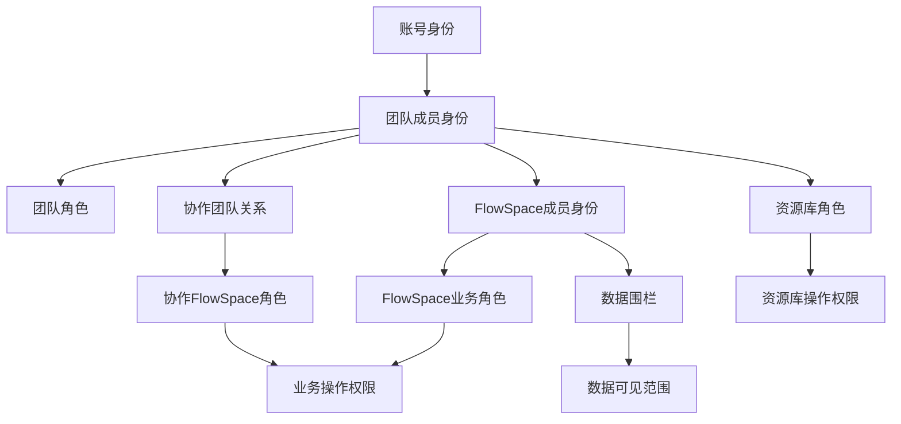

# 权限体系总表

## 1. 功能定位

权限体系用于控制用户在 Linkincrease 中“能否看到、能否进入、能否操作、能否管理、能否导出或分享”。权限不能只按页面入口判断，还必须结合业务对象状态、成员关系、数据围栏和服务端校验。

## 2. 权限分层



## 3. 权限域总表

| 权限域 | 控制对象 | 典型权限点 | 主要来源 |
| --- | --- | --- | --- |
| 账号权限 | 登录、个人信息、语言、退出 | 登录、修改密码、查看个人信息 | 账号、个人中心需求 |
| 团队权限 | 团队信息、成员、角色、协作团队、资源库入口 | 邀请成员、删除成员、设置角色、邀请协作团队、创建资源库 | 团队设置、资源库需求 |
| FlowSpace 业务权限 | 订单、里程碑、工单、批复、自动化、仪表盘 | 查看、创建、编辑、删除、状态修改、指派、采集、批复、互用、导入导出 | FlowSpace 设置、订单详情需求 |
| 协作 FlowSpace 权限 | 协作团队成员在 FlowSpace 内的业务操作 | 指派、采集、批复、查看、修改处理人 | 协作 FlowSpace 设置、工单批复需求 |
| 数据围栏 | 字段、标签、订单、里程碑、工单数据范围 | 可见范围控制 | FlowSpace 设置需求 |
| 资源库权限 | 资源库设置、表数据、分享、导入导出 | 查看、创建、编辑、删除、导入、导出、批量操作、分享 | 资源库需求 |
| 仪表盘权限 | FlowSpace 仪表盘 | 查看、管理、汇总查看 | 仪表盘权限需求 |
| 报告权限 | 报告 | 查看、管理 | 报告权限需求 |
| 运营端权限 | 平台用户、团队、FlowSpace、资源库、模板、软件管理 | 平台级查看、配置、监管 | 运营端需求 |

## 4. 通用判断模型

```text
入口是否展示 =
  用户身份
  + 所属团队 / FlowSpace / 协作团队关系
  + 角色权限
  + 对象状态
  + 数据围栏或数据范围

提交是否成功 =
  服务端权限校验
  + 对象是否存在
  + 对象状态是否允许
  + 数据版本是否最新
  + 表单字段是否通过校验
```

## 5. 角色与权限关系

| 角色类型 | 所属层级 | 说明 |
| --- | --- | --- |
| 团队角色 | 团队 | 控制团队设置、团队成员、协作团队、资源库等团队级能力 |
| FlowSpace 业务角色 | FlowSpace | 控制主团队成员在当前 FlowSpace 内的订单、里程碑、工单等能力 |
| 协作方角色 | 协作 FlowSpace | 控制协作团队成员在当前 FlowSpace 内的业务能力 |
| 资源库角色 | 资源库 | 控制资源库设置和表数据操作 |
| 运营端角色 | 平台后台 | 控制运营端平台管理能力，当前资料未完整沉淀角色模型 |

## 6. 数据围栏

数据围栏负责控制“看得见什么”，不等同于“能不能操作”。

需要沉淀的范围：

- 订单字段可见性。
- 里程碑字段和标签可见性。
- 工单表单字段可见性。
- 订单详情左侧树展示范围。
- 标签展示范围。
- 历史记录、动态、跟踪记录是否受围栏影响。

## 7. 状态限制

权限存在不代表一定可操作，状态会进一步限制入口。

典型限制：

- 订单已完成或已取消时，订单编辑、工单采集、批复、指派等动作受限。
- 里程碑已完成或已取消时，创建工单、采集、批复、互用等动作受限。
- 工单已终止采集或已批复时，采集动作受限。
- 资源库或资源库数据删除后，新业务不可继续引用。

## 8. 通知、日志与审计

权限相关变更必须可追溯：

- 团队角色变更。
- 团队成员邀请、删除、角色设置。
- 协作团队邀请、删除。
- FlowSpace 业务角色变更。
- FlowSpace 成员和协作团队权限变更。
- 资源库角色和成员变更。
- 数据围栏变更。
- 仪表盘和报告权限变更。

## 9. 待拆细页

- 团队权限。
- FlowSpace 业务角色权限。
- 协作 FlowSpace 权限。
- 数据围栏。
- 资源库权限。
- 仪表盘权限。
- 报告权限。

## 10. 来源需求

- `source:thoughts-v2-current/v2.0.x/贸易端/【贸易端】【团队设置】团队信息、角色、成员、协作团队管理.md`
- `source:thoughts-v2-current/v2.1.x/贸易端/【贸易端】【团队设置】邀请成 员_协作团队流程变更.md`
- `source:thoughts-v2-current/v2.1.x/贸易端/【贸易端】【SCCS设置】.md`
- `source:thoughts-v2-current/v2.1.x/贸易端/【贸易端】【协作SCCS设置】.md`
- `source:thoughts-v2-current/v2.2.x/贸易端/【贸易端】【订单详情】工单&里程碑批复操作.md`
- `source:thoughts-v2-current/V2.4.x/贸易端/【贸易端】【资源库】第一阶段.md`
- `source:thoughts-v2-current/V2.5.x/贸易端/【贸易端】【仪表盘】权限管理.md`
- `source:thoughts-v2-current/V2.5.x/贸易端/【贸易端】报告权限.md`

## 11. 待确认问题

- 各端是否存在统一的权限矩阵表，可导出为本地来源。
- 数据围栏是否影响历史记录、动态、跟踪记录中的字段展示。
- 协作团队负责人、对接人、有指派权限成员的边界是否完全一致。
