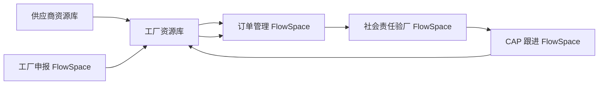

# 数据流转与校验规则

本页用于把业务对象和数据模型转化为测试人员可执行的数据校验规则。

## 数据层级校验

| 数据层级 | 校验重点 | 来源 |
| --- | --- | --- |
| 业务模板 | 主表单唯一、里程碑、工单表单、批复表单配置正确 | [业务模板](../20-业务对象与数据模型/业务模板.md) |
| FlowSpace | 模板实例化后结构、权限、数据围栏正确 | [FlowSpace](../20-业务对象与数据模型/FlowSpace.md) |
| 订单 | 主表单字段、状态、订单级数据、跟踪记录正确 | [订单数据模型](../20-业务对象与数据模型/订单数据模型.md) |
| 里程碑 | 计划时间、负责人、状态、工单挂载正确 | [里程碑](../20-业务对象与数据模型/里程碑.md) |
| 工单 | 工单字段、附件、采集数据、批复关系正确 | [工单数据模型](../20-业务对象与数据模型/工单数据模型.md) |
| 资源库 | 主数据、引用、同步、历史记录、权限过滤正确 | [资源库数据模型](../20-业务对象与数据模型/资源库数据模型.md) |
| 子表 | 子表行新增、编辑、删除、导入导出、历史记录正确 | [字段、组件、子表、引用关系](../20-业务对象与数据模型/字段、组件、子表、引用关系.md) |

## 外贸供应链场景数据流转

## 校验规则

| 场景 | 必验规则 |
| --- | --- |
| 工厂申报通过 | 工厂资源库生成或更新记录，准入状态、资质附件、所属供应商正确 |
| 订单选择工厂 | 只能选择当前供应商名下且符合状态要求的工厂 |
| 验厂审核完成 | 审核报告、审核结论、审核日期可以回到工厂资源库或被后续 CAP 引用 |
| CAP 关闭 | CAP 状态、未关闭数量、风险等级可以影响工厂资源库和订单风险展示 |
| 资源库引用断链 | 被引用记录删除、停用或权限变化后，订单/工单展示和保存行为明确 |
| 自动化写入 | 写入目标层级正确，并有系统执行日志 |

