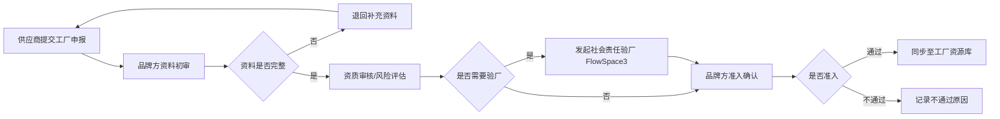
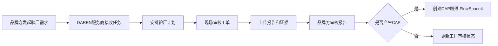

# 品牌方供应商与工厂准入协同方案

本方案面向品牌方管理一级供应商、工厂准入、订单工厂报备、社会责任验厂和 CAP 整改闭环的业务场景。它的目标是把供应商和工厂管理从分散表格升级为可配置、可协作、可追溯、可分析的低代码供应链管理模式。

## 一句话方案

品牌方用资源库维护供应商与工厂主数据，用多个 FlowSpace 承载不同业务流程：工厂申报准入、订单工厂报备、社会责任验厂、CAP 整改跟进。流程中确认有效的数据可以同步回资源库，后续订单、验厂和整改继续引用同一套主数据。

## 业务对象分层

| 层级 | 对象 | 建议承载方式 | 说明 |
| --- | --- | --- | --- |
| 主数据 | 一级供应商清单 | 资源库 | 品牌方长期维护，作为供应商身份、准入、评级、联系人、关联工厂的基础资料 |
| 主数据 | 工厂清单 | 资源库 | 记录工厂基础信息、工厂资质、社会责任状态、准入状态、有效期、关联供应商 |
| 主数据 | 工厂资质/证书 | 资源库或工厂资源库子表/附件字段 | 用于记录营业执照、认证、审计报告、有效期和附件 |
| 流程数据 | 工厂申报流程 | FlowSpace1 | 供应商提交工厂申请，品牌方审批，确认后同步到工厂资源库 |
| 流程数据 | 订单管理流程 | FlowSpace2 | 供应商在订单中选择关联工厂进行生产工厂报备，品牌方查看订单工厂生产情况 |
| 流程数据 | 社会责任验厂审核 | FlowSpace3 | 品牌方发起给 DAREN 服务商或验厂团队，围绕工厂完成社会责任审核工单 |
| 流程数据 | CAP 跟进 | FlowSpace4 | 根据资质报告或验厂报告中的改进项进行整改、提交证据、复核和关闭 |

## 推荐资源库设计

### 供应商资源库

| 字段 | 类型建议 | 用途 |
| --- | --- | --- |
| 供应商名称 | 单行文本 | 供应商主标识 |
| 供应商编码 | 单行文本 | 与客户内部系统或历史数据对齐 |
| 供应商等级 | 单选 | A/B/C 或客户自定义等级 |
| 准入状态 | 单选 | 待准入、已准入、暂停、黑名单、退出 |
| 供应商联系人 | 文本/成员/附件 | 业务联系人和协作联系人 |
| 关联工厂 | 关联引用 | 关联工厂资源库中的工厂记录 |
| 资质有效性 | 单选/公式 | 根据证书有效期、审核结论、CAP 状态辅助判断 |
| 最近审核日期 | 日期 | 支持后续提醒和复审 |
| 风险等级 | 单选 | 低、中、高或客户自定义 |

### 工厂资源库

| 字段 | 类型建议 | 用途 |
| --- | --- | --- |
| 工厂名称 | 单行文本 | 工厂主标识 |
| 工厂编码 | 单行文本 | 对接客户内部编号 |
| 所属供应商 | 关联引用 | 关联供应商资源库 |
| 工厂地址 | 地址/定位/文本 | 支持验厂、物流和区域分析 |
| 工厂类型 | 多选 | 自有、外协、分包、指定工厂等 |
| 准入状态 | 单选 | 申报中、已准入、待整改、暂停使用、禁用 |
| 资质附件 | 附件 | 营业执照、认证证书、资质文件 |
| 社会责任审核状态 | 单选 | 未审核、审核中、通过、待整改、不通过 |
| 最近验厂日期 | 日期 | 支持复审提醒 |
| CAP 未关闭数量 | 数字/公式 | 支持风险看板 |
| 可用于订单 | 单选/布尔 | 控制订单报备时是否可选 |

## FlowSpace1：工厂申报与准入流程

### 目标

让供应商可以按品牌方要求提交工厂资料，品牌方完成资料审核、补充要求、准入确认，并将通过的数据沉淀到工厂资源库。

### 角色

| 角色 | 权限建议 |
| --- | --- |
| 品牌方管理员 | 查看全部申报、审批、退回、准入确认、同步资源库 |
| 品牌方审核人 | 查看分配给自己的申报和审核工单，填写审核结论 |
| 一级供应商 | 创建或提交自己名下工厂申请，只查看自己相关数据 |
| 工厂联系人 | 可通过协作或邮件补充资料，不应看到品牌方内部审核意见 |

### 推荐流程

### 数据流转

| 阶段 | 数据写入位置 | 后续去向 |
| --- | --- | --- |
| 供应商提交申请 | FlowSpace1 订单主表单或申报工单 | 用于品牌方审批 |
| 补充资质附件 | FlowSpace1 工单附件字段 | 审核通过后同步到工厂资源库 |
| 品牌方审核意见 | FlowSpace1 工单批复或里程碑批复 | 作为准入审计依据 |
| 准入结论 | FlowSpace1 批复字段 | 同步为工厂资源库的准入状态 |
| 工厂基础信息 | 工厂资源库 | 后续订单管理 FlowSpace2 选择引用 |

## FlowSpace2：订单管理与生产工厂报备

### 目标

供应商在订单执行中按权限选择自己名下、已准入或允许申报中的工厂进行生产报备，品牌方能够按订单查看工厂使用情况和生产风险。

### 推荐设计

| 位置 | 字段/工单 | 说明 |
| --- | --- | --- |
| 订单主表单 | 供应商、采购订单号、产品、交期、订单状态 | 订单主数据 |
| 订单主表单或里程碑工单 | 生产工厂 | 关联引用工厂资源库，按供应商和准入状态过滤 |
| 订单主表单或里程碑工单 | 是否使用未准入工厂 | 用于触发申报提醒或自动化 |
| 里程碑 | 工厂报备确认 | 品牌方确认供应商选择的生产工厂 |
| 工单 | 生产进度、现场照片、异常说明 | 供应商或工厂按权限提交 |

### 数据流转

1. 品牌方或供应商创建订单，订单进入 FlowSpace2。
2. 供应商在订单中选择自己名下关联工厂。
3. 系统通过资源库引用带出工厂准入状态、资质有效期、社会责任审核状态、CAP 未关闭数量。
4. 如果工厂已准入，订单继续推进，品牌方可在订单详情、视图或仪表盘查看工厂使用情况。
5. 如果工厂未在资源库或未准入，供应商需进入 FlowSpace1 发起工厂申报。
6. FlowSpace1 准入通过后，工厂同步进资源库，FlowSpace2 订单再选择该工厂。

### 订单内数据建议

| 数据 | 存放层级 | 原因 |
| --- | --- | --- |
| 订单号、产品、交期 | 订单主表单 | 订单级主数据 |
| 生产工厂 | 订单字段或指定里程碑工单字段 | 如果整笔订单只有一个生产工厂，放订单主表单；如果不同批次/阶段可不同工厂，放里程碑工单 |
| 工厂资质状态 | 资源库引用字段 | 避免在每个订单中重复维护 |
| 生产进度 | 工单字段 | 属于过程数据，需要多次采集 |
| 品牌方确认意见 | 工单批复或里程碑批复 | 需要保留审批结论和责任人 |

## FlowSpace3：社会责任验厂审核

### 目标

当工厂准入、复审、订单风险或品牌方要求触发社会责任审核时，品牌方可以把验厂需求发给 DAREN 服务商或验厂团队，形成可追踪的审核协同流程。

### 推荐流程

### 数据流转

| 数据 | 存放层级 | 后续去向 |
| --- | --- | --- |
| 验厂需求 | FlowSpace3 订单主表单 | 作为一次验厂项目 |
| 工厂信息 | 关联引用工厂资源库 | 保持与主数据一致 |
| 审核计划 | 里程碑或工单字段 | 支持日程提醒 |
| 现场审核记录 | 工单字段、图片、附件、签名 | 形成报告依据 |
| 审核报告 | 工单附件或批复附件 | 同步或回填到工厂资源库 |
| 审核结论 | 批复字段 | 更新工厂社会责任审核状态 |

## FlowSpace4：CAP 整改跟进

### 目标

将审核报告中的改进项拆成可跟踪、可提交证据、可复核关闭的整改任务。

### 推荐数据结构

| 对象 | 字段建议 | 说明 |
| --- | --- | --- |
| CAP 订单主表单 | 工厂、来源报告、审核日期、责任供应商、总状态 | 一次 CAP 跟进项目 |
| CAP 工单 | 问题项、风险等级、整改要求、责任人、截止日期 | 每个改进项一条或一组工单 |
| 整改提交工单 | 整改说明、图片、附件、完成日期 | 供应商或工厂提交 |
| 复核批复 | 复核结论、复核人、是否关闭、退回原因 | 品牌方或 DAREN 服务商确认 |

### 数据流转

1. FlowSpace3 验厂报告形成 CAP 项。
2. CAP 项进入 FlowSpace4，可按问题项创建多个工单。
3. 供应商或工厂按权限提交整改证据。
4. 品牌方或 DAREN 服务商复核。
5. CAP 关闭后，工厂资源库更新 CAP 未关闭数量、风险等级、审核状态。
6. 未关闭 CAP 可在 FlowSpace2 订单报备时作为风险提示。

## 跨 FlowSpace 数据关系

| 来源 | 目标 | 关系 |
| --- | --- | --- |
| FlowSpace1 工厂申报 | 工厂资源库 | 准入通过后同步工厂基础信息和资质 |
| 工厂资源库 | FlowSpace2 订单管理 | 订单选择生产工厂时引用 |
| 工厂资源库 | FlowSpace3 验厂审核 | 发起验厂时引用工厂资料 |
| FlowSpace3 验厂审核 | 工厂资源库 | 审核结论和报告回写 |
| FlowSpace3 验厂审核 | FlowSpace4 CAP 跟进 | 审核报告产生改进项 |
| FlowSpace4 CAP 跟进 | 工厂资源库 | CAP 状态、未关闭数量、风险等级回写 |
| 工厂资源库 | FlowSpace2 订单管理 | 订单执行中展示工厂风险和可用状态 |

## 运营配置建议

1. 先建供应商资源库和工厂资源库，再设计准入、订单、验厂、CAP 四类 FlowSpace。
2. 工厂是否可用于订单，不应只靠人工判断，建议由准入状态、审核状态、CAP 状态共同决定。
3. 订单中选择工厂时，优先使用资源库关联引用，避免供应商手填工厂名称造成重复和错别字。
4. 未准入工厂不要直接进入订单生产，应该通过工厂申报流程形成准入记录。
5. DAREN 服务商参与验厂时，应作为协作团队或指定任务处理人进入 FlowSpace，而不是共享品牌方全部数据。
6. CAP 跟进要按问题项拆分责任和截止日期，避免整份报告只有一个总状态。

## 可分析指标

| 指标 | 业务意义 |
| --- | --- |
| 已准入供应商数/工厂数 | 评估供应链基础资源规模 |
| 待审核工厂数 | 评估品牌方准入处理压力 |
| 订单使用未准入工厂次数 | 识别合规风险 |
| 工厂社会责任审核通过率 | 评估供应链合规水平 |
| CAP 未关闭数量 | 识别整改风险和供应商管理重点 |
| CAP 平均关闭周期 | 评估整改效率 |
| 高风险工厂关联订单数 | 支持品牌方优先干预 |

