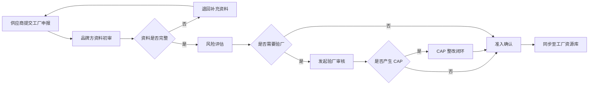

# 场景1：新工厂准入完整配置流程

## 场景目标

品牌方需要让供应商申报可用工厂，经过资料审核、必要验厂、准入确认后，将合格工厂沉淀到资源库，供订单管理流程引用。

## 推荐配置

| 对象 | 配置建议 |
| --- | --- |
| 工厂资源库 | 工厂名称、地址、所属供应商、准入状态、资质附件、审核状态、CAP 状态、可用于订单 |
| 工厂申报 FlowSpace | 供应商提交申报，品牌方审核，必要时触发验厂 |
| 验厂审核 FlowSpace | 服务商或审核团队执行现场审核，提交报告和结论 |
| CAP FlowSpace | 对不符合项进行整改、复核和关闭 |

## 流程

## 数据流转

1. 供应商在申报流程中提交工厂基础信息和资质附件。
2. 品牌方审核通过后，将稳定字段同步到工厂资源库。
3. 验厂结论、报告附件、风险等级、CAP 状态回写工厂资源库。
4. 订单流程选择生产工厂时，只允许选择满足准入条件的工厂。

## 运营检查点

- 是否区分“申报中、已准入、待整改、暂停使用、禁用”等状态。
- 是否有未准入工厂的申报入口。
- 是否避免供应商直接修改已准入主数据。
- 是否能追溯准入依据、审核人和审核时间。
