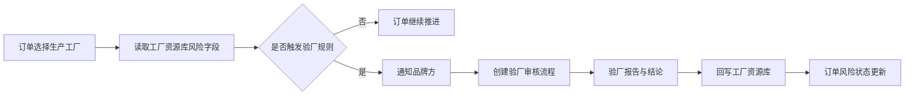

# 场景2：订单触发验厂的自动化配置

## 场景目标

当订单选择的生产工厂存在审核过期、高风险、首次使用、未完成 CAP 等情况时，系统提醒品牌方，并按规则发起验厂审核流程。

## 触发条件

| 条件 | 建议动作 |
| --- | --- |
| 工厂未验厂 | 创建验厂审核任务或提示品牌方确认 |
| 最近验厂日期超过有效期 | 自动提醒或发起复审 |
| 工厂风险等级为高 | 要求品牌方批复后才允许继续推进 |
| CAP 未关闭 | 订单上展示风险提示，必要时阻断出货节点 |
| 首次用于该供应商或客户订单 | 发起额外确认 |

## 配置思路

1. 在订单主表单中引用工厂资源库。
2. 在工厂资源库中维护审核状态、最近审核日期、有效期、CAP 未关闭数量、风险等级。
3. 配置自动化规则：订单创建或生产工厂变更时读取工厂风险字段。
4. 对不同风险级别配置提醒、审批或新建验厂 FlowSpace。

## 数据流转

## 运营注意事项

- 自动创建流程前，要确认是否会产生重复验厂任务。
- 阻断规则要谨慎，优先使用“提醒 + 批复确认”，避免影响紧急订单。
- 验厂结果必须回写资源库，否则订单侧只能看到一次性流程结果。
