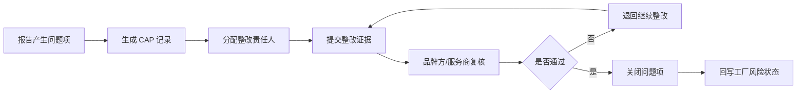

# 场景3：CAP整改闭环运营

## 场景目标

CAP 用于跟进验厂报告、资质报告或订单异常中提出的改进项。运营需要确保每个问题项都有责任人、整改证据、复核结论和关闭记录。

## 推荐对象

| 对象 | 说明 |
| --- | --- |
| CAP 主记录 | 关联工厂、供应商、来源报告、风险等级、整体状态 |
| CAP 问题项 | 问题描述、分类、整改要求、截止日期、责任方 |
| 整改工单 | 供应商或工厂提交整改说明、图片、附件 |
| 复核批复 | 品牌方或服务商确认是否关闭 |

## 标准流程

## 运营指标

- CAP 未关闭数量。
- 超期 CAP 数量。
- 高风险问题项数量。
- 供应商平均整改时长。
- 重复问题发生率。

## 数据回写

CAP 关闭后，应回写工厂资源库的 CAP 状态、未关闭数量、最近关闭日期、风险等级变化。订单流程选择该工厂时，应能看到未关闭 CAP 对订单风险的影响。
