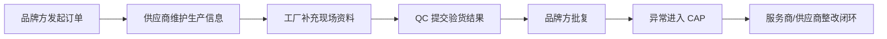

# 多团队协同实战

Linkincrease 的多团队协同适合品牌方、供应商、工厂、DAREN 服务商、QC 或第三方机构共同推进同一业务对象。运营设计的核心是让不同角色在同一流程中看到该看的数据、完成该做的任务、留下可追溯记录。

## 常见协同角色

| 角色 | 典型动作 |
| --- | --- |
| 品牌方 | 发起需求、审核资料、确认结果、查看全局仪表盘 |
| 一级供应商 | 提交工厂、维护订单生产信息、提交整改证据 |
| 工厂联系人 | 补充工厂资料、配合验厂、上传现场材料 |
| DAREN 服务商 | 执行验厂、提交报告、复核整改 |
| QC/现场人员 | 通过采集端提交图片、附件、定位、签名 |

## 配置原则

- 品牌方拥有全局管理视角，供应商和工厂只看自身相关数据。
- 外部协作入口优先使用明确授权，不使用宽泛共享。
- 敏感字段如内部评分、价格、审核意见应单独控制可见性。
- 每个跨团队任务都要有负责人、截止时间、状态和通知。

## 协同流程示例

## 运营检查点

- 协作团队是否只被加入必要的 FlowSpace。
- 外部用户离职或项目结束后是否有移除机制。
- 消息通知是否覆盖关键任务节点。
- 仪表盘是否区分内部视图和客户/供应商视图。
