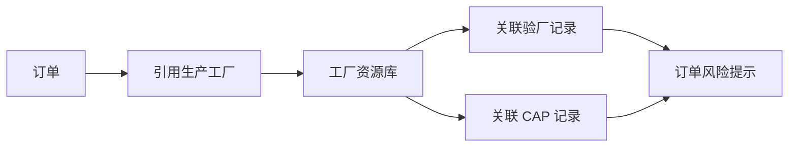

# 跨 FlowSpace 数据整合实例

外贸供应链场景中，一个业务问题往往跨越多个 FlowSpace：订单、工厂申报、验厂审核、CAP 整改。运营需要把这些数据通过资源库和引用关系串起来。

## 示例：订单工厂风险视图

| 数据来源 | 关键字段 |
| --- | --- |
| 订单管理 FlowSpace | 订单号、供应商、生产工厂、交期、订单状态 |
| 工厂资源库 | 准入状态、风险等级、最近验厂日期、CAP 未关闭数量 |
| 验厂审核 FlowSpace | 审核类型、报告结论、审核日期、服务商 |
| CAP FlowSpace | 问题项、风险等级、关闭状态、截止日期 |

## 整合逻辑

## 运营价值

- 品牌方查看订单时可以同时看到工厂风险。
- 供应商选择工厂时可以被准入状态限制。
- 运营可以发现订单集中在哪些高风险工厂。
- CAP 未关闭时可以触发订单侧提醒或审批。

## 注意事项

- 资源库字段应作为主数据入口，不要让每个 FlowSpace 各自维护一套工厂状态。
- 跨 FlowSpace 统计前，要先统一字段命名和状态枚举。
- 对外展示视图要剔除内部审核意见和敏感评分。
