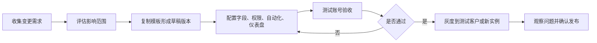

# 模板版本管理与灰度发布规范

模板变更会影响后续 FlowSpace 实例、字段口径、权限和报表统计。运营不能直接在生产模板上随意调整，应建立版本、验证和发布流程。

## 版本命名

建议使用：

`模块/客户/场景 + 版本号 + 日期 + 变更类型`

示例：

- 订单管理模板 v1.2 2026-05-29 字段优化
- 工厂准入模板 v2.0 2026-05-29 流程重构

## 发布流程

## 必查项

- 字段是否影响历史数据。
- 选项值是否影响报表口径。
- 权限是否影响外部协作方可见范围。
- 自动化是否会重复触发。
- 新旧模板实例是否需要迁移。

## 变更记录

每次发布应记录变更原因、变更内容、影响模块、验证人员、发布时间、回滚方案和后续观察结果。
