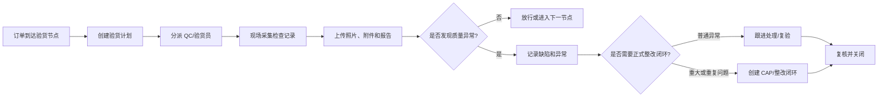

# QC 验货与质量异常

## 1. 业务定义

QC 验货与质量异常是品牌方、贸易公司、采购团队或第三方服务商在生产、出货前后对产品质量进行检查、记录、判定和跟进处理的过程。它关注“检查什么、谁检查、发现问题如何判定、是否放行、异常如何关闭”。

本页重点覆盖成品检验、过程抽检、装运前验货、质量异常记录和复验协同；不直接替代专业 QMS、实验室测试或完整质量标准体系。

## 2. 适用客户与前提

| 客户类型 | 适用方式 |
| --- | --- |
| 品牌方 | 管理供应商/工厂验货计划、结果、放行和质量风险 |
| 贸易公司 | 跟踪订单验货进度、异常、复验和客户确认 |
| Sourcing Agency | 协调品牌方、工厂、QC 服务商和内部采购团队 |
| QC 服务商 | 接收验货任务、现场采集记录、上传报告和证据 |

前提是客户已经有基本验货节点、判定标准、责任人和放行规则；若客户没有明确质量标准，Linkincrease 只能承载协同和记录，不能自动判定专业质量结论。

## 3. 参与角色与责任

| 角色 | 主要责任 | 提供的数据 | 做出的决策 |
| --- | --- | --- | --- |
| 品牌方/客户质量负责人 | 定义验货要求和放行规则 | 检验标准、缺陷等级、放行要求 | 放行、拒收、复验、让步接收 |
| 供应商/工厂 | 配合验货、提交整改和复验资料 | 生产批次、现场照片、整改证据 | 是否接受整改和复验安排 |
| QC/验货员 | 执行现场检查并记录证据 | 检查记录、图片、缺陷、报告 | 给出检验结论或建议 |
| 贸易/跟单人员 | 协调订单、工厂和客户确认 | 订单、交期、出货计划 | 是否推进下一节点 |
| 产品成功/实施 | 将验货流程配置为平台模板 | 字段、工单、权限、报表 | 判断平台配置方案 |

## 4. 核心业务对象

| 对象 | 定义 | 关键字段 | 与其他对象的关系 |
| --- | --- | --- | --- |
| 验货计划 | 一次验货安排 | 订单、工厂、验货类型、计划日期、验货员 | 关联订单、工厂和验货工单 |
| 验货工单 | 现场执行和结果记录单元 | 检查项、缺陷、图片、结论、附件 | 可由采集端提交 |
| 缺陷/问题项 | 验货发现的不符合事项 | 缺陷等级、数量、位置、照片、责任方 | 可触发复验或整改任务 |
| 验货报告 | 验货结果汇总 | 报告编号、结论、附件、签名 | 作为放行或整改依据 |
| 质量异常 | 需要后续跟进的质量问题 | 等级、责任人、期限、处理状态 | 严重或重复问题可升级为 CAP |
| 复验记录 | 对整改后结果的再次验证 | 复验日期、结果、证据 | 关闭异常或继续处理 |

## 5. 标准业务流程

## 6. 状态与业务规则

| 对象 | 状态或规则 | 进入条件 | 允许操作 | 退出条件 |
| --- | --- | --- | --- | --- |
| 验货计划 | 待安排 | 订单进入验货节点 | 指派验货员、调整日期 | 确认验货安排 |
| 验货计划 | 执行中 | 已分派人员 | 现场填写、上传附件 | 提交验货结果 |
| 验货结果 | 待确认 | 报告已提交 | 批复、退回补充、要求复验 | 放行、拒收或整改 |
| 质量异常 | 待处理 | 验货发现问题 | 指派责任人、填写措施 | 提交处理结果 |
| 质量异常 | 待复核 | 责任方提交证据 | 复核、退回、关闭 | 复核通过或退回 |
| CAP | 整改中 | 严重、重复或合规相关问题 | 提交根因、纠正预防措施、证据 | 复核关闭 |

普通缺陷不等于 CAP。只有需要根因、纠正措施、预防措施、责任人、期限、证据和复核闭环时，才建议使用 CAP。

## 7. 异常、风险与控制措施

| 风险或异常 | 业务影响 | 识别方式 | 控制措施 |
| --- | --- | --- | --- |
| 验货计划未及时安排 | 出货延误或漏验 | 订单节点临近但无验货任务 | 自动化提醒、待办看板 |
| 现场证据不完整 | 质量结论难以复核 | 图片、附件、签名缺失 | 表单必填、附件校验、退回补充 |
| 缺陷等级和结论混乱 | 放行决策失真 | 结论与缺陷严重度不一致 | 标准化缺陷字段和批复规则 |
| 异常未关闭即出货 | 客户投诉或索赔 | 未关闭异常关联出货节点 | 出货前检查未关闭问题 |
| 把所有异常都做 CAP | 流程过重，运营负担高 | CAP 数量异常膨胀 | 设置 CAP 触发边界 |

## 8. 管理指标

| 指标 | 用途 | 建议口径 | 数据来源 | 管理动作 |
| --- | --- | --- | --- | --- |
| 验货准时完成率 | 判断验货执行效率 | 准时完成验货数/应完成验货数 | 验货计划、工单 | 调整排期和提醒 |
| 验货通过率 | 判断批次质量水平 | 通过或放行验货数/已完成验货数 | 验货结论 | 识别高风险工厂/品类 |
| 缺陷数量和等级分布 | 判断质量问题类型 | 按缺陷等级、品类、工厂统计 | 缺陷字段/子表 | 优先整改高频缺陷 |
| 复验率 | 判断一次通过能力 | 需要复验批次数/已验货批次数 | 验货结果 | 优化生产前控制 |
| 质量异常关闭周期 | 判断处理效率 | 关闭时间减发现时间 | 异常/CAP 工单 | 催办和升级 |

## 9. Linkincrease 能力映射

| 行业需求或规则 | Linkincrease 对象或能力 | 数据、状态或权限影响 | 支持度 | 推荐方案 |
| --- | --- | --- | --- | --- |
| 创建验货计划 | FlowSpace、里程碑、工单 | 需要订单、工厂、计划日期、验货员 | L2 | 在订单 FlowSpace 中设置验货里程碑和验货工单 |
| 现场采集记录 | 采集端、表单组件、附件、图片编辑 | 需要移动端提交、附件权限和离线/上传规则 | L2 | 将检查项、照片、签名配置为工单字段 |
| 缺陷记录 | 工单字段、子表、问题库 | 需要缺陷等级、数量、照片和责任方 | L2/LX | 简单场景用工单字段，复杂缺陷库待产品确认 |
| 验货结论 | 批复、状态、报告附件 | 需要放行/拒收/复验状态和审批记录 | L2 | 用工单批复或里程碑批复承载结论 |
| 质量异常跟进 | 工单、异常字段、自动化 | 需要责任人、期限、处理状态 | L2 | 普通异常用跟进工单，不默认 CAP |
| CAP 整改闭环 | 独立 FlowSpace 或 CAP 工单 | 需要根因、纠正预防、证据、复核 | L2 | 仅严重、重复、合规相关问题使用 CAP |
| 管理看板 | 仪表盘、报告 | 需要统一指标口径和数据权限 | L2/LX | 先做验货进度和异常看板，复杂质量绩效待确认 |

## 10. 测试关注点

| 类别 | 需要验证的内容 |
| --- | --- |
| 主流程 | 创建计划、分派、采集、提交、批复、关闭 |
| 权限 | QC 只能看分派任务，供应商/工厂只能看自己相关问题 |
| 状态 | 退回补充、复验、拒收、让步接收、CAP 升级 |
| 数据 | 图片附件、缺陷子表、报告附件、历史快照 |
| 异常 | 网络中断、附件上传失败、人员变更、验货日期变更 |
| 审计 | 提交、退回、批复、结论变更和系统提醒记录 |

## 11. 产品差距与需求候选

| 差距 | 业务影响 | 当前替代方案 | 建议优先级 | 去向 |
| --- | --- | --- | --- | --- |
| 缺陷库和 AQL/抽样规则尚未形成通用产品模型 | 难以做专业质量统计 | 用工单字段或子表记录 | P1 调研 | 产品维护区评估 |
| 验货结论对出货节点的强校验规则待确认 | 可能出现异常未关闭仍出货 | SOP 检查和仪表盘提醒 | P0 调研 | 待确认问题 |
| 跨订单质量绩效指标口径待验证 | 难以形成可靠供应商质量评分 | 导出分析或 Tower 自定义 | P1 | 数据分析支持 |

## 12. 产品成功应用

### 客户识别信号

- 客户说验货计划、现场照片、报告和批复都散在聊天和 Excel。
- 客户无法追踪某批货是否验过、是否放行、是否有未关闭问题。
- 客户希望 QC 服务商或工厂按权限提交资料。
- 客户想看工厂/供应商质量表现，但指标口径不清。

### 重点诊断问题

- 验货是订单级、批次级、出货级还是工厂级？
- 谁安排验货，谁现场执行，谁确认结论？
- 缺陷是否需要按等级、数量、图片和责任方记录？
- 质量异常什么时候只是普通跟进，什么时候必须 CAP？
- 验货结论是否影响出货、付款或订单结案？

### 方案输出入口

- 对应运营方案：[品牌方 QC 验货协同方案](../../50-运营支持知识/03-业务场景案例库/品牌方QC验货协同方案.md)
- 需要说明的平台边界：Linkincrease 可承载验货协同、证据、批复、提醒和看板；专业抽样规则、实验室测试和完整 QMS 需单独确认。

## 13. 来源与可信度

| 来源 | 类型 | 证据等级 | 支撑结论 | 版本或日期 |
| --- | --- | --- | --- | --- |
| Linkincrease 验货组件、采集端、工单和批复知识页 | 内部产品知识 | 不适用 | 平台能力映射 | 当前版本 |
| 订单管理类模板最佳实践 | 内部配置实践 | E3 | 验货节点与订单协同 | 当前版本 |
| 行业常见 QC 实践 | 待补充来源 | E4 | 缺陷、复验、放行和异常处理 | 待验证 |

## 14. 待确认问题

- [ ] 产品确认验货结论是否支持对出货/结案节点做强校验。
- [ ] 产品成功补充至少 2 个客户的验货字段、角色和报告样本。
- [ ] 数据分析确认验货通过率、复验率和缺陷统计的字段口径。

## 15. 关联知识

- 产品权威规则：[验货组件流程](../../10-功能模块详情/验货组件流程.md)、[采集端](../../10-功能模块详情/采集端.md)、[工单与批复](../../10-功能模块详情/工单与批复.md)
- 权限审计：[权限体系总表](../../40-权限、安全与审计/权限体系总表.md)
- 数据分析：[核心指标口径](../../60-数据分析支持/核心指标口径.md)
