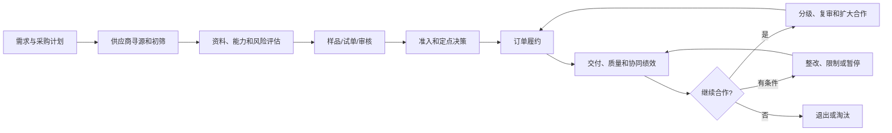
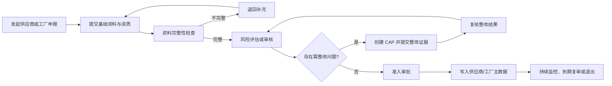

# 供应商开发、准入与生命周期管理

## 1. 业务定义

供应商开发、准入与生命周期管理是品牌方、采购团队或贸易企业识别潜在合作方，评估商业和供应能力，批准合作，并在后续订单中持续评价、复审、暂停或淘汰供应商和实际生产工厂的过程。

供应商准入关注商业合作主体及履约能力，工厂准入关注实际生产场所、生产能力、质量和合规风险。两者可能合并执行，也可能分别审批。本页不把单个客户的审批层级视为统一行业标准。

当前页面重点详细展开“准入、审核、整改和持续维护”。寻源、询报价、样品或试单、商务谈判、绩效和淘汰只定义其与准入的关系，后续可拆为独立场景。

## 1.1 在端到端供应链中的位置

准入不是供应商管理的终点。没有订单履约、质量、交付和风险数据回流，准入状态会逐渐失去管理意义。

## 2. 适用客户与前提

| 客户类型 | 典型诉求 |
| --- | --- |
| 品牌方、进口商 | 识别实际生产工厂，控制质量、社会责任和供应链风险 |
| 贸易公司 | 建立可复用供应商和工厂档案，降低跟单与审厂成本 |
| 采购团队、Sourcing Agency | 统一多个项目和客户的供应商开发、评价与审批过程 |
| 一级供应商 | 申报自身及合作工厂，提交资质并跟进补充要求 |
| QC 或审核服务商 | 执行现场审核、提交报告并验证整改结果 |

该场景通常依赖明确的准入标准、资料清单、审批责任人、有效期规则和退出机制。

## 3. 参与角色与责任

| 角色 | 主要责任 | 提供的数据 | 做出的决策 |
| --- | --- | --- | --- |
| 品牌方或采购负责人 | 制定准入要求并承担最终业务决策 | 准入标准、风险等级、审批意见 | 通过、条件通过、驳回、暂停或退出 |
| 供应商 | 提交企业和合作工厂资料，响应补充要求 | 企业信息、联系人、证照、工厂关系 | 确认申报内容和整改计划 |
| 工厂 | 提交生产场所、产能、质量和合规资料 | 工厂档案、证书、设备、产能、审核材料 | 确认现场信息和整改证据 |
| QC 或审核服务商 | 执行文件审核或现场审核 | 审核记录、问题项、报告和建议 | 给出专业结论，不一定承担最终准入决策 |
| 产品成功或实施人员 | 将客户规则配置为可执行流程 | 模板、角色、字段、权限和报表方案 | 判断配置方案，不替代客户业务审批 |

## 4. 核心业务对象

| 对象 | 定义 | 关键字段 | 与其他对象的关系 |
| --- | --- | --- | --- |
| 供应商 | 与采购方建立商业合作关系的组织 | 编码、名称、区域、类别、联系人、状态、风险等级 | 可关联一个或多个工厂 |
| 工厂 | 实际承担生产活动的场所或法人主体 | 编码、地址、产品类别、产能、证书、审核状态 | 归属或服务于供应商，可参与订单生产 |
| 准入申请 | 一次新增、变更或重新准入请求 | 申请类型、申请人、对象、提交时间、当前状态 | 关联供应商、工厂和审批记录 |
| 证书与资质 | 支撑合法经营、质量或合规判断的材料 | 类型、编号、签发机构、生效日、失效日、附件 | 关联供应商或工厂 |
| 审核记录 | 对资料、现场或能力进行核验的过程记录 | 审核类型、审核人、日期、结论、报告 | 可产生问题项和 CAP |
| 问题项与 CAP | 对不符合项的整改要求和闭环记录 | 等级、责任人、期限、证据、复核结论 | 来源于审核，关闭后影响准入结果 |
| 寻源或候选记录 | 供应商正式准入前的发现、接触和初步筛选记录 | 来源、品类、地区、能力、联系人、初筛结果 | 通过初筛后可发起准入 |
| 评价与绩效记录 | 对供应商或工厂在订单中的表现进行周期评价 | 交付、质量、成本、协同、合规、评价周期 | 影响等级、复审、业务分配和退出 |

供应商和工厂应有稳定唯一标识。名称、地址或联系人变化不应产生无法识别的重复主体。

## 4.1 典型评价维度

| 维度 | 关注内容 | 常见证据 |
| --- | --- | --- |
| 商务 | 价格、付款条件、报价响应和合同接受能力 | 报价、合同、沟通记录 |
| 产品与技术 | 品类经验、开发能力、规格理解和样品表现 | 产品清单、样品、技术评审 |
| 产能与交付 | 设备、人员、产能、旺季负荷和历史交付 | 产能资料、生产计划、订单绩效 |
| 质量 | 质量体系、过程控制、缺陷和验货表现 | 体系证书、审核和验货报告 |
| 合规 | 合法经营、社会责任、环境和客户特定要求 | 证照、证书、审核报告 |
| 财务与连续性 | 财务稳定性、关键依赖和中断风险 | 信用资料、风险调查、业务连续性计划 |
| 协同 | 数据及时性、问题响应、整改和跨团队配合 | 任务、消息、CAP 和历史记录 |

不同品类和客户的权重不同。行业知识应沉淀评价框架，不应假设存在统一评分公式。

## 5. 标准业务流程

典型控制点：

1. 发起前检查主体是否已经存在，避免重复建档。
2. 资料完整不等于满足准入要求，需要区分完整性检查和业务审批。
3. 审核机构的专业结论与品牌方的最终商业决策可以分离。
4. 条件通过时需要记录条件、责任人、期限和后续复核。
5. 准入后仍需管理证书到期、信息变更、风险升级和退出。

## 6. 状态与业务规则

以下状态是建议模型，不代表所有客户必须采用相同枚举。

| 对象 | 状态或规则 | 进入条件 | 允许操作 | 退出条件 |
| --- | --- | --- | --- | --- |
| 准入申请 | 草稿 | 已创建但未正式提交 | 编辑、补充、删除 | 提交申请 |
| 准入申请 | 待补充 | 资料不完整或审核要求补件 | 补充资料、重新提交 | 完整性检查通过 |
| 准入申请 | 审核中 | 资料完整，进入文件或现场审核 | 审核、记录问题、发起 CAP | 进入审批或退回补充 |
| 准入申请 | 整改中 | 存在需要关闭的问题项 | 提交证据、复核、调整期限 | 问题关闭或审批终止 |
| 准入申请 | 待审批 | 已达到客户设定的审批条件 | 审批、退回 | 通过、条件通过或驳回 |
| 主体 | 已准入 | 审批通过且满足生效条件 | 被新业务引用、持续维护 | 暂停、失效、退出或重新评估 |
| 主体 | 条件准入 | 允许有限合作但仍有未完成条件 | 按限制被引用、继续整改 | 转正式准入或暂停 |
| 主体 | 暂停/退出 | 风险、过期、违规或合作终止 | 查看历史、整改或重新申请 | 恢复或重新准入 |

建议区分“申请状态”和“供应商/工厂主数据状态”，避免一次申请的结束状态覆盖主体长期生命周期。

## 7. 异常、风险与控制措施

| 风险或异常 | 业务影响 | 识别方式 | 控制措施 |
| --- | --- | --- | --- |
| 同一供应商或工厂重复申报 | 档案、审核和订单数据分裂 | 名称、统一编码、地址或证照重复 | 发起前查重，设置唯一标识和合并机制 |
| 供应商申报的实际工厂不透明 | 未准入工厂参与生产 | 订单工厂与已申报关系不一致 | 订单关联已准入工厂，新增工厂触发准入 |
| 证书过期仍被使用 | 合规风险和审核失真 | 到期日、状态和订单引用检查 | 到期预警、失效状态、新业务引用限制 |
| 条件准入缺少后续跟踪 | 临时例外长期化 | 条件、责任人或期限缺失 | 将条件转为有期限任务或 CAP |
| 审核问题未闭环 | 风险持续存在 | CAP 状态、逾期天数、复核结果 | 明确责任、证据、复核和升级机制 |
| 历史审批记录被覆盖 | 无法审计当时决策依据 | 资料和结论仅保留当前值 | 保存申请、批复、附件和变更历史 |

## 8. 管理指标

| 指标 | 用途 | 建议口径 | 数据来源 | 管理动作 |
| --- | --- | --- | --- | --- |
| 平均准入周期 | 判断流程效率 | 准入生效时间减首次正式提交时间 | 准入申请、审批记录 | 定位补件、审核和审批瓶颈 |
| 首次资料完整率 | 判断申报质量 | 首次提交即通过完整性检查的申请数/首次提交申请数 | 申请和退回记录 | 优化资料清单和供应商培训 |
| 准入通过率 | 判断对象质量及标准严苛程度 | 通过或条件通过申请数/完成审批申请数 | 审批结果 | 分析供应商来源和驳回原因 |
| CAP 按期关闭率 | 判断整改执行力 | 期限内关闭 CAP 数/应关闭 CAP 数 | CAP、期限和复核记录 | 催办、升级或调整合作等级 |
| 有效证书覆盖率 | 判断资质维护健康度 | 关键证书有效的主体数/应具备证书的主体数 | 主体和证书档案 | 到期提醒、暂停新增业务 |

正式进入仪表盘前，应在数据分析支持区补充字段口径和统计范围。

## 9. 产品研发映射

| 行业需求或规则 | 产品对象或能力 | 数据、状态或权限影响 | 支持度 | 产品依据 |
| --- | --- | --- | --- | --- |
| 供应商、工厂和证书需要长期维护并跨流程复用 | 资源库 | 需要主体唯一标识、对象关联、有效期和历史变更 | L2 | [资源库](../../20-业务对象与数据模型/资源库.md) |
| 一次准入申请需要经历补件、审核、整改和审批 | 业务模板、FlowSpace、订单、里程碑、工单、批复 | 需要区分申请状态、任务状态和主体长期状态 | L2 | [从模板到 FlowSpace](../../30-业务流程与产品流程图/从模板到FlowSpace.md) |
| 供应商、工厂和服务商需要参与同一流程 | 协作团队、业务角色、处理人 | 需要验证组织关系、处理人变化和协作方退出后的规则 | L2 | [协作 FlowSpace 权限](../../40-权限、安全与审计/协作FlowSpace权限.md) |
| 不同参与方只能查看和填写职责范围内的数据 | 角色权限、数据围栏、表单显隐 | 字段可见、数据可见和操作权限需要组合判断 | L2 | [权限体系总表](../../40-权限、安全与审计/权限体系总表.md) |
| 准入通过后应形成可复用主数据 | 资源库写入或同步 | 需要明确触发条件、字段映射、重复判断、覆盖和失败处理 | LX | [资源库引用与同步](../../30-业务流程与产品流程图/资源库引用与同步.md) |
| 证书到期和整改期限需要主动提醒 | 日期字段、自动化、消息通知 | 需要验证时间触发、通知对象、重复提醒和失败日志 | L2 | [自动化](../../10-功能模块详情/自动化.md) |
| 管理层需要查看准入、审核和整改进度 | 仪表盘、报告、跨 FlowSpace 数据 | 需要统一指标口径、统计范围和数据权限 | L2 | [Tower 仪表盘配置指南](../../50-运营支持知识/04-监控与数据分析/Tower仪表盘配置指南.md) |
| 申请、审批和资料变化必须可追溯 | 动态、历史记录、操作日志 | 需要区分人工操作、业务过程和系统写入记录 | L1/L2 | [历史记录与快照](../../40-权限、安全与审计/历史记录与快照.md) |

“审批完成后自动写入资源库”的具体触发、字段映射和冲突处理需要依据当前产品规则进一步确认，因此暂记为 LX。

## 10. 测试关注点

| 类别 | 需要验证的内容 |
| --- | --- |
| 主流程 | 申报、补件、审核、CAP、审批、主数据沉淀是否形成完整闭环 |
| 权限 | 品牌方、供应商、工厂、服务商只能查看和处理职责范围内的数据 |
| 状态 | 已驳回、已暂停、已退出、条件准入和证书失效后的操作限制 |
| 数据 | 重复主体、资源库引用、历史快照、申请数据与主数据之间的一致性 |
| 异常 | 处理人离职、协作团队退出、附件失效、自动化失败、并发编辑 |
| 审计 | 提交、退回、补充、审核、批复、状态变化和系统写入是否可追溯 |

可结合 [测试支持](../../45-测试支持/README.md) 中的权限矩阵、数据校验和异常边界继续拆分测试用例。

## 11. 产品差距与需求候选

| 差距 | 业务影响 | 当前替代方案 | 建议优先级 | 去向 |
| --- | --- | --- | --- | --- |
| 准入通过后写入资源库的规则和冲突策略待确认 | 可能需要重复录入，或覆盖已有主体数据 | 人工复核后维护资源库 | P0 调研 | [待研究问题](../99-待研究问题/README.md) |
| 主体重复识别和合并机制尚未形成行业方案 | 供应商、工厂档案可能重复 | 配置唯一编码并人工查重 | P1 | 产品维护区评估 |
| 条件准入、暂停、退出的通用状态模型待验证 | 不同客户模板难以复用 | 按客户定制状态字段和流程 | P1 调研 | [待研究问题](../99-待研究问题/README.md) |

以上为需求候选和调研项，不代表已经进入产品计划。

## 12. 产品成功应用

### 客户识别信号

客户出现以下情况时，可以优先使用本场景知识：

- 供应商、工厂和证书分散在多个 Excel、邮件或聊天记录中。
- 品牌方无法确认订单实际使用的生产工厂。
- 新工厂申报、资料补充、审核和审批缺少统一进度。
- 审核问题和 CAP 整改无法持续跟踪。
- 证书过期、条件准入和工厂退出主要依靠人工记忆。

### 重点诊断问题

- 客户是否分别管理供应商和工厂，两者是什么关系？
- 谁发起准入、谁检查资料、谁审核、谁最终批准？
- 存在哪些准入类型和状态，是否允许条件准入或临时使用？
- 哪些证书、报告和信息有有效期？
- 审核发现问题后，是否必须完成 CAP 才能准入？
- 准入结果如何影响新订单选择供应商或工厂？
- 历史订单是否必须保留当时的主体信息和审批依据？

### 方案输出入口

- 使用 [客户场景诊断清单](../07-产品成功应用/客户场景诊断清单.md) 补齐客户现状。
- 使用 [平台能力边界表达规范](../07-产品成功应用/平台能力边界表达规范.md) 标记 L1 至 L4 和 LX。
- 参考 [品牌方供应商与工厂准入协同方案](../../50-运营支持知识/03-业务场景案例库/外贸供应商治理/品牌方供应商与工厂准入协同方案.md) 设计配置方案。
- 使用 [业务方案输出模板](../07-产品成功应用/业务方案输出模板.md) 形成客户交付内容。

## 13. 来源与可信度

| 来源 | 类型 | 证据等级 | 支撑结论 | 版本或日期 |
| --- | --- | --- | --- | --- |
| [品牌方供应商与工厂准入协同方案](../../50-运营支持知识/03-业务场景案例库/外贸供应商治理/品牌方供应商与工厂准入协同方案.md) | 内部场景方案 | E3 | 角色、对象、FlowSpace 组合和客户配置方式 | 当前版本 |
| [业务场景总览](../../50-运营支持知识/03-业务场景案例库/业务场景总览.md) | 内部场景总结 | E3 | 行业问题到产品能力的初步映射 | 当前版本 |
| 产品业务对象、流程和权限权威页 | 内部产品知识 | 不适用 | Linkincrease 当前产品能力 | 当前版本 |

当前版本主要基于内部场景方案建立结构，尚需补充标准、更多客户样本和行业专家确认，不能视为完整行业标准。

## 14. 待确认问题

- [ ] 由产品成功归纳不同客户的准入层级、状态和审批角色，验证是否可以形成三至五种稳定模式。
- [ ] 由产品确认准入结果自动写入资源库时的触发条件、字段映射、重复数据和覆盖规则。
- [ ] 由测试补充证书失效、协作关系变化、并发处理和自动化失败的完整异常用例。
- [ ] 补充至少一个 E1 或 E2 来源，校正当前主要来自内部方案的行业描述。

## 15. 关联知识

- 客户配置方案：[品牌方供应商与工厂准入协同方案](../../50-运营支持知识/03-业务场景案例库/外贸供应商治理/品牌方供应商与工厂准入协同方案.md)
- 产品权威规则：[资源库](../../20-业务对象与数据模型/资源库.md)、[FlowSpace](../../20-业务对象与数据模型/FlowSpace.md)、[权限体系总表](../../40-权限、安全与审计/权限体系总表.md)
- 测试支持：[测试支持价值](../../45-测试支持/测试支持价值.md)
- 数据分析：[核心指标口径](../../60-数据分析支持/核心指标口径.md)
- 产品维护：[竞品分析](../../70-产品维护知识/竞品分析.md)、[需求池](../../70-产品维护知识/需求池.md)
- 产品成功应用：[客户场景诊断清单](../07-产品成功应用/客户场景诊断清单.md)、[业务方案输出模板](../07-产品成功应用/业务方案输出模板.md)
