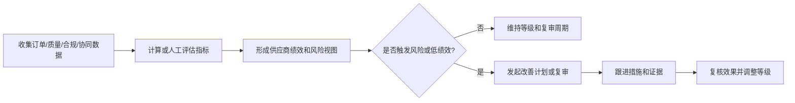

# 供应商绩效与风险管理

## 1. 业务定义

供应商绩效与风险管理是基于供应商、工厂在准入、订单履约、质量、交付、协同、合规和整改中的表现，形成评价、分级、预警、复审和业务调整的过程。

本页关注绩效和风险的业务建模与平台承载方式，不替代完整 SRM、财务风控或专业 ESG 尽调系统。

## 2. 适用客户与前提

| 客户类型 | 适用方式 |
| --- | --- |
| 品牌方/采购团队 | 建立供应商分级、风险预警和业务分配依据 |
| 贸易公司 | 评估供应商协同、交付和质量表现 |
| Sourcing Agency | 为多客户、多品类供应商池做运营管理 |
| 供应商 | 查看自身协同问题和待改进事项 |

前提是客户已经有稳定的订单、验货、审核或协同数据来源；没有数据来源时，只能先做资料完整性和流程执行看板。

## 3. 参与角色与责任

| 角色 | 主要责任 | 提供的数据 | 做出的决策 |
| --- | --- | --- | --- |
| 采购/供应商管理负责人 | 定义评价维度和分级规则 | 权重、等级、复审规则 | 分级、暂停、扩大合作 |
| 质量/合规负责人 | 提供质量和合规结果 | 验货、审核、CAP | 风险升级或限制 |
| 跟单/运营 | 提供交付和协同数据 | 延期、任务响应、异常 | 流程改进建议 |
| 供应商/工厂 | 提供整改和解释 | 证据、原因、计划 | 承诺改善 |
| 产品成功/实施 | 配置数据来源和仪表盘 | 资源库、FlowSpace、指标 | 判断可实现口径 |

## 4. 核心业务对象

| 对象 | 定义 | 关键字段 | 与其他对象的关系 |
| --- | --- | --- | --- |
| 供应商绩效档案 | 某周期供应商表现汇总 | 周期、交付、质量、协同、合规、等级 | 关联供应商资源库 |
| 风险记录 | 某个风险事件或风险状态 | 类型、等级、原因、影响、责任人 | 可来自订单、验货、审核、CAP |
| 指标口径 | 绩效计算规则 | 分子、分母、时间范围、排除项 | 支撑仪表盘 |
| 改善计划 | 针对低绩效或高风险的行动 | 措施、责任人、期限、证据 | 可形成工单或 CAP |
| 供应商等级 | 业务分层结果 | A/B/C、观察、暂停、禁用 | 影响准入、订单选择和复审 |

## 5. 标准业务流程

## 6. 状态与业务规则

| 对象 | 状态或规则 | 进入条件 | 允许操作 | 退出条件 |
| --- | --- | --- | --- | --- |
| 绩效周期 | 数据收集中 | 周期开始 | 补充数据、校验口径 | 周期结束 |
| 绩效周期 | 待评审 | 数据汇总完成 | 评审、调整、确认 | 等级发布 |
| 风险记录 | 待处理 | 触发风险规则 | 指派责任、提交措施 | 进入验证 |
| 改善计划 | 进行中 | 低绩效或高风险 | 提交证据、延期、升级 | 复核通过 |
| 供应商等级 | 已生效 | 评审确认 | 查看、引用、复审 | 下周期调整 |

## 7. 异常、风险与控制措施

| 风险或异常 | 业务影响 | 识别方式 | 控制措施 |
| --- | --- | --- | --- |
| 指标口径不清 | 排名和决策失真 | 同一指标多种算法 | 在 `docs/60` 固化口径 |
| 数据来源不稳定 | 看板不可信 | 缺字段、缺状态、手工补录 | 先做字段治理和必填规则 |
| 将一次异常外推成长期风险 | 误伤供应商关系 | 单一事件影响等级 | 设置周期和复核机制 |
| 等级不影响业务动作 | 看板变成展示 | 等级发布后无后续措施 | 绑定复审、限制、改善计划 |
| 客户自定义权重差异大 | 通用方案难复用 | 各客户评分表不同 | 沉淀维度，不固化统一权重 |

## 8. 管理指标

| 指标 | 用途 | 建议口径 | 数据来源 | 管理动作 |
| --- | --- | --- | --- | --- |
| 准时交付率 | 判断交付表现 | 准时完成订单/应完成订单 | 订单、里程碑 | 调整供应分配 |
| 验货通过率 | 判断质量稳定性 | 通过验货/完成验货 | 验货工单 | 质量改进 |
| CAP 按期关闭率 | 判断整改执行力 | 按期关闭 CAP/应关闭 CAP | CAP 工单 | 风险升级 |
| 资料完整率 | 判断协同基础 | 完整关键资料主体/应维护主体 | 资源库 | 补齐主数据 |
| 任务响应及时率 | 判断协同效率 | 按时完成任务/应完成任务 | 工单 | 培训或升级 |
| 高风险事件数 | 判断供应风险 | 周期内高风险事件 | 风险记录 | 暂停、复审、备选 |

## 9. Linkincrease 能力映射

| 行业需求或规则 | Linkincrease 对象或能力 | 数据、状态或权限影响 | 支持度 | 推荐方案 |
| --- | --- | --- | --- | --- |
| 维护供应商/工厂基础档案 | 资源库 | 主体唯一标识、等级、风险状态 | L2 | 供应商库/工厂库作为主数据 |
| 汇总订单履约表现 | 跨 FlowSpace 数据、仪表盘 | 订单状态、计划/实际日期 | L2/LX | 先做可用字段看板，复杂 OTIF 待确认 |
| 汇总质量和 CAP 表现 | 验货工单、CAP FlowSpace | 验货结论、CAP 状态和周期 | L2 | 质量和整改指标看板 |
| 风险预警 | 自动化、消息、仪表盘 | 风险等级、逾期、证书到期 | L2 | 设置到期和逾期提醒 |
| 供应商分级 | 资源库字段、人工评审 | 等级、原因、有效期、审批记录 | L2/LX | 首版建议人工评审后维护等级 |
| 改善计划 | 工单或 FlowSpace | 措施、责任人、期限、证据 | L2 | 低绩效触发改善工单 |

## 10. 测试关注点

| 类别 | 需要验证的内容 |
| --- | --- |
| 主流程 | 数据汇总、评审、等级发布、改善跟进 |
| 权限 | 管理层、采购、供应商、服务商的指标可见边界 |
| 状态 | 等级生效、暂停、观察、改善中、恢复 |
| 数据 | 指标来源、去重、周期、历史快照 |
| 异常 | 数据缺失、字段口径变化、人工调整 |
| 审计 | 等级调整、风险变更、改善关闭记录 |

## 11. 产品差距与需求候选

| 差距 | 业务影响 | 当前替代方案 | 建议优先级 | 去向 |
| --- | --- | --- | --- | --- |
| 供应商评分权重和综合得分模型未固化 | 难以跨客户复用 | 客户自定义字段 + 仪表盘 | P1 | 产品维护区评估 |
| 跨 FlowSpace 指标口径依赖配置质量 | 看板可靠性受限 | 先做核心字段规范 | P0 | 数据分析支持 |
| 风险等级自动更新规则待确认 | 自动化可能误判 | 人工评审后更新 | P1 | 待确认问题 |

## 12. 产品成功应用

### 客户识别信号

- 客户想知道哪些供应商表现好、哪些高风险。
- 客户已有订单、验货、CAP 数据，但无法联动分析。
- 客户想按供应商等级、风险、证书状态筛选订单或工厂。

### 重点诊断问题

- 客户是否已有稳定数据来源？
- 绩效用于什么决策：分配订单、复审、暂停、谈判还是培训？
- 哪些指标必须精确计算，哪些可以先作为运营观察？
- 是否允许人工评审调整等级？

### 方案输出入口

- 对应运营方案：[供应商绩效与风险看板方案](../../50-运营支持知识/03-业务场景案例库/供应商绩效与风险看板方案.md)
- 能力边界：平台可以汇总流程数据和资源库状态；复杂评分模型和外部财务/产能风险需确认数据来源。

## 13. 来源与可信度

| 来源 | 类型 | 证据等级 | 支撑结论 | 版本或日期 |
| --- | --- | --- | --- | --- |
| 跨 FlowSpace 数据整合实例 | 内部配置实践 | E3 | 跨流程指标和看板 | 当前版本 |
| 供应链必备知识地图 | 行业总纲 | E4 | 供应商绩效维度 | 当前版本 |
| 客户绩效评价样本 | 待补充 | E3 | 指标、权重和等级 | 待收集 |

## 14. 待确认问题

- [ ] 收集至少 2 个客户供应商评分表或供应商月报样本。
- [ ] 数据分析确认首批可稳定落地的供应商绩效指标。
- [ ] 产品确认供应商等级是否应支持自动变更或仅人工评审。

## 15. 关联知识

- 数据分析：[核心指标口径](../../60-数据分析支持/核心指标口径.md)
- 运营方案：[跨 FlowSpace 数据整合实例](../../50-运营支持知识/04-监控与数据分析/跨FlowSpace数据整合实例.md)
- 产品对象：[资源库](../../20-业务对象与数据模型/资源库.md)
