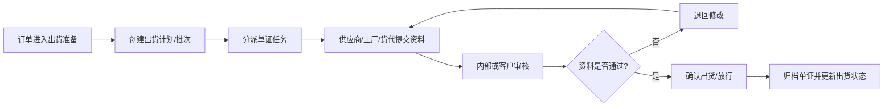

# 出货计划与单证协同

## 1. 业务定义

出货计划与单证协同是围绕订单或出货批次安排发货时间、装运方式、关键截止节点，并收集、审核和归档商业发票、装箱单、提单、原产地证、保险单、报关资料等单证的过程。

本页关注协同、资料收集、审批和追踪；不替代专业货代系统、报关系统或贸易合规判断。

## 2. 适用客户与前提

| 客户类型 | 适用方式 |
| --- | --- |
| 贸易公司 | 跟踪出货计划、工厂资料和客户单证确认 |
| 品牌方/进口商 | 管理供应商出货资料、到港风险和单证完整性 |
| Sourcing Agency | 协调供应商、工厂、货代、客户和内部团队 |
| 供应商/工厂 | 提交出货信息、箱唛、装箱资料和附件 |

前提是客户明确出货节点、单证清单、责任人、截止日期和审核规则。

## 3. 参与角色与责任

| 角色 | 主要责任 | 提供的数据 | 做出的决策 |
| --- | --- | --- | --- |
| 跟单/物流协调 | 维护出货计划和节点 | 出货日期、方式、货代、状态 | 是否推进单证审核 |
| 供应商/工厂 | 提交出货和包装资料 | 箱数、重量、体积、装箱单、照片 | 确认资料准确 |
| 货代/服务商 | 提供运输和单证信息 | 订舱、提单、截单、船期 | 运输安排建议 |
| 客户/品牌方 | 审核关键单证和放行 | 审核意见、修改要求 | 放行、退回修改 |
| 产品成功/实施 | 配置出货协同流程 | 模板、字段、权限和提醒 | 判断配置方案 |

## 4. 核心业务对象

| 对象 | 定义 | 关键字段 | 与其他对象的关系 |
| --- | --- | --- | --- |
| 出货计划 | 一次发货安排 | 订单、批次、预计出货日、运输方式 | 关联订单和单证任务 |
| 出货批次 | 一笔订单的一次或多次发货 | 批次数量、箱数、重量、体积 | 可关联多个单证 |
| 单证任务 | 单证收集和审核任务 | 单证类型、责任人、截止日、状态 | 关联出货计划 |
| 单证附件 | 具体文件 | 文件类型、版本、提交人、审核结果 | 作为审计资料 |
| 异常记录 | 出货或单证问题 | 原因、影响、责任人、处理状态 | 可影响出货放行 |

## 5. 标准业务流程

## 6. 状态与业务规则

| 对象 | 状态或规则 | 进入条件 | 允许操作 | 退出条件 |
| --- | --- | --- | --- | --- |
| 出货计划 | 待确认 | 订单达到出货准备 | 编辑计划、分派任务 | 计划确认 |
| 单证任务 | 待提交 | 单证清单生成 | 提交附件、补充字段 | 提交审核 |
| 单证任务 | 待审核 | 附件已提交 | 批复、退回、通过 | 审核通过或退回 |
| 出货计划 | 待放行 | 单证基本齐全 | 放行、退回、标记异常 | 放行或暂缓 |
| 出货计划 | 已出货 | 确认发货 | 查看、补充单证、归档 | 到货或结案 |

## 7. 异常、风险与控制措施

| 风险或异常 | 业务影响 | 识别方式 | 控制措施 |
| --- | --- | --- | --- |
| 单证缺失或版本错误 | 清关、收款或客户确认受阻 | 单证状态未通过 | 单证清单、必填附件、版本记录 |
| 出货计划频繁变更 | 客户承诺和物流安排失真 | 日期变更历史 | 变更原因和批复 |
| 分批出货不清 | 数量、箱数和订单完成状态错误 | 出货批次缺少结构 | 批次字段或独立出货 FlowSpace |
| 截单/截港节点遗漏 | 运输延误 | 关键日期无提醒 | 自动化提醒 |
| 单证涉及合规判断 | 错误承诺风险 | 客户要求专业判断 | 标记平台边界，交由专业方确认 |

## 8. 管理指标

| 指标 | 用途 | 建议口径 | 数据来源 | 管理动作 |
| --- | --- | --- | --- | --- |
| 单证按时提交率 | 判断资料准备效率 | 按时提交单证/应提交单证 | 单证任务 | 催办责任方 |
| 单证一次通过率 | 判断资料质量 | 首次审核通过单证/已审核单证 | 批复记录 | 培训供应商 |
| 出货准时率 | 判断交付执行 | 准时出货批次/计划出货批次 | 出货计划 | 识别延期原因 |
| 出货异常数 | 管理风险 | 按异常类型统计 | 异常记录 | 升级处理 |

## 9. Linkincrease 能力映射

| 行业需求或规则 | Linkincrease 对象或能力 | 数据、状态或权限影响 | 支持度 | 推荐方案 |
| --- | --- | --- | --- | --- |
| 出货计划管理 | 订单、里程碑、工单 | 计划日期、批次、责任人 | L2 | 订单 FlowSpace 中设出货里程碑 |
| 单证清单和提交 | 工单、附件、表单组件 | 单证类型、版本、状态 | L2 | 每类单证作为工单或字段 |
| 单证审核 | 批复、状态、历史记录 | 审核意见、退回原因 | L2 | 用工单批复保留记录 |
| 分批出货 | 子表、工单、关联 FlowSpace | 批次数量、日期、单证关联 | L2/LX | 简单用子表/工单，复杂批次模型待确认 |
| 截止提醒 | 自动化、消息通知 | 日期触发、通知对象 | L2 | 单证截止和出货日期提醒 |
| 出货看板 | 仪表盘、报告 | 出货状态、单证状态、逾期 | L2 | 建出货进度和单证完整性看板 |

## 10. 测试关注点

| 类别 | 需要验证的内容 |
| --- | --- |
| 主流程 | 计划、提交、审核、退回、放行、归档 |
| 权限 | 供应商/工厂/货代只能提交自己负责的资料 |
| 状态 | 退回修改、分批出货、计划变更、暂缓放行 |
| 数据 | 附件版本、批次数量、订单状态和历史快照 |
| 异常 | 附件失效、重复提交、计划延期、任务逾期 |
| 审计 | 日期变更、批复和出货放行记录 |

## 11. 产品差距与需求候选

| 差距 | 业务影响 | 当前替代方案 | 建议优先级 | 去向 |
| --- | --- | --- | --- | --- |
| 出货批次对象模型待确认 | 分批出货统计和状态汇总复杂 | 子表或工单记录批次 | P0 调研 | 待确认问题 |
| 单证版本比较和结构化校验能力有限 | 需要人工审核文件内容 | 附件版本 + 批复 | P2 | 产品维护区评估 |
| 物流节点和货代系统集成待评估 | 运输信息依赖外部系统 | 手工维护关键日期 | P1 | 集成需求候选 |

## 12. 产品成功应用

### 客户识别信号

- 客户说出货资料、装箱单、发票、提单等文件靠邮件催。
- 客户不知道某个订单是否可以出货、单证是否齐全。
- 客户存在分批出货、延期、退回修改和客户审核。

### 重点诊断问题

- 出货是订单级还是批次级？
- 需要收集哪些单证，谁提交，谁审核？
- 哪些日期需要提醒？
- 单证审核是否影响出货放行？
- 是否需要和货代、ERP 或报关系统协同？

### 方案输出入口

- 对应运营方案：[出货单证收集与审批方案](../../50-运营支持知识/03-业务场景案例库/出货单证收集与审批方案.md)
- 能力边界：平台管理协同、附件、审批和提醒，不替代专业报关、清关或运输执行系统。

## 13. 来源与可信度

| 来源 | 类型 | 证据等级 | 支撑结论 | 版本或日期 |
| --- | --- | --- | --- | --- |
| 订单管理类模板最佳实践 | 内部配置实践 | E3 | 出货节点、附件和批复配置 | 当前版本 |
| 外贸供应链全景与端到端业务地图 | 行业总纲 | E4 | 出货与单证在链路中的位置 | 当前版本 |
| 外贸单证协同行业实践 | 待补充来源 | E4 | 单证清单和出货流程 | 待验证 |

## 14. 待确认问题

- [ ] 产品确认出货批次在订单、工单、子表或独立 FlowSpace 中的推荐模式。
- [ ] 产品成功补充客户常见单证清单和审核责任样本。
- [ ] 数据分析确认出货准时率和单证完整性的口径。

## 15. 关联知识

- 产品权威规则：[订单](../../10-功能模块详情/订单.md)、[工单与批复](../../10-功能模块详情/工单与批复.md)、[自动化](../../10-功能模块详情/自动化.md)
- 业务流程：[订单生命周期](../../30-业务流程与产品流程图/订单生命周期.md)
