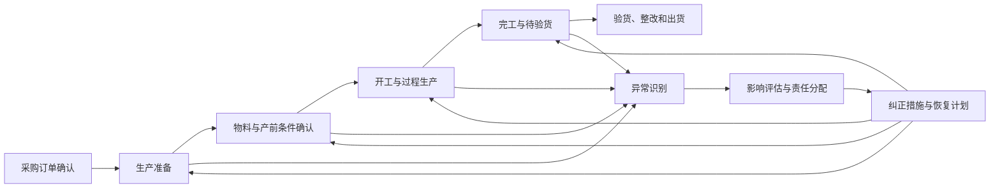
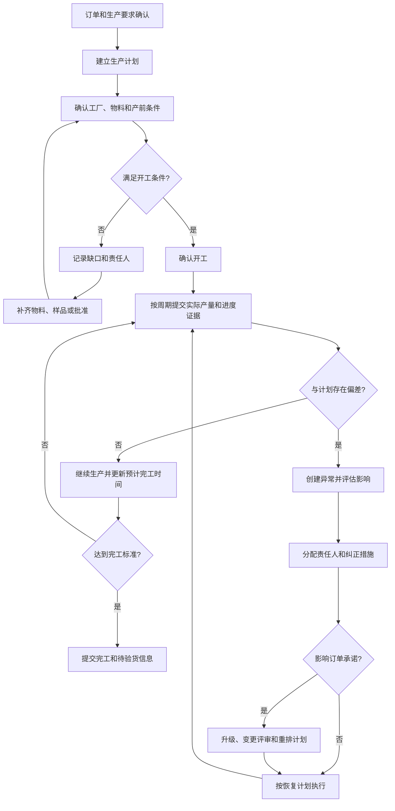
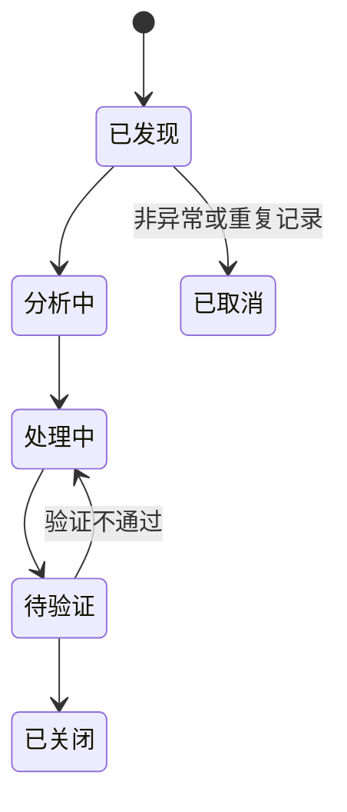

# 生产进度与异常协同

## 1. 业务定义

生产进度与异常协同是采购方、贸易公司、供应商和工厂围绕采购订单或生产批次，管理生产准备、开工、过程进展、完工、偏差、纠正措施和预计恢复时间的过程。

该场景关注跨组织的信息透明和责任协同，回答：

- 订单是否具备开工条件。
- 当前实际完成了什么，而不是主观填报了多少百分比。
- 哪个阶段偏离计划，会不会影响验货和出货。
- 异常由谁负责、采取什么措施、何时恢复。
- 计划和承诺是否需要正式调整。

Linkincrease适合承载计划、任务、进度证据、异常、通知和审计，不等同于MES的工序排程、设备控制、工时采集和实时产量管理。

## 1.1 在端到端供应链中的位置

## 2. 适用客户与前提

| 客户类型 | 典型诉求 |
| --- | --- |
| 品牌方、进口商 | 查看关键订单生产风险，提前干预可能延期或质量异常 |
| 贸易公司、跟单团队 | 统一供应商和工厂进度填报，减少反复催问 |
| 采购团队、Sourcing Agency | 跨供应商比较计划达成和异常响应 |
| 供应商 | 汇总工厂执行情况，对采购方提供可信承诺 |
| 工厂 | 按阶段提交物料、开工、产量、完工和现场异常 |
| QC 或现场人员 | 核实现场进度、质量状态和待验货条件 |

落地前需要明确：

- 跟踪对象是订单、订单行还是生产批次。
- 是否需要物料级齐套和工序级进度。
- 进度由谁填报、谁确认、多久更新一次。
- 哪些数据必须提供照片、附件、数量或现场核实。
- 哪些异常会影响交期、质量或出货。

## 3. 参与角色与责任

| 角色 | 主要责任 | 提供的数据 | 做出的决策 |
| --- | --- | --- | --- |
| 采购方或品牌方 | 明确订单要求、优先级和升级规则 | 要求交期、质量标准、变更 | 是否接受恢复计划或调整承诺 |
| 跟单或采购人员 | 建立计划、催办、识别偏差和组织升级 | 阶段计划、沟通、影响判断 | 是否发起变更、验货或管理升级 |
| 供应商 | 对整体履约承诺负责 | 生产安排、预计日期、异常和措施 | 提交恢复计划、协调工厂资源 |
| 工厂计划或生产人员 | 执行并反馈实际生产 | 物料、开工、产量、完工、现场证据 | 调整生产安排和现场措施 |
| QC 或现场人员 | 核实进度或质量事实 | 现场检查、照片、检验记录 | 提供专业核实结论 |
| 管理者 | 处理跨订单和高风险问题 | 风险汇总、资源负荷、异常趋势 | 资源协调、优先级和供应商决策 |

## 4. 核心业务对象

| 对象 | 定义 | 关键字段 | 关系 |
| --- | --- | --- | --- |
| 生产计划 | 对生产准备、开工、产出和完工的时间及数量安排 | 计划日期、数量、负责人、版本 | 来源于订单或订单行 |
| 生产批次 | 一次相对独立的生产安排 | 批次号、产品、数量、工厂、计划 | 可对应一个或多个订单行 |
| 生产阶段 | 用于管理生产过程的业务节点 | 阶段、计划起止、完成标准 | 包含进度任务 |
| 进度记录 | 某次填报或核实的实际执行事实 | 日期、状态、完成数量、预计完成日、证据 | 关联阶段或批次 |
| 物料或产前条件 | 开工前必须满足的条件 | 物料、样品、工艺、设备、包装、批准状态 | 影响是否允许开工 |
| 异常 | 偏离计划、标准或承诺的事件 | 类型、发现时间、影响、等级、责任人、状态 | 影响订单、阶段或批次 |
| 纠正或恢复措施 | 为消除异常影响采取的行动 | 措施、负责人、截止时间、预计恢复时间 | 关联异常 |
| 变更记录 | 对订单或生产计划的正式调整 | 原值、新值、原因、批准和生效时间 | 可能由异常触发 |

## 4.1 进度记录与当前状态

进度记录是多次发生的过程事实；当前状态是根据最新有效记录形成的视图。两者不能混为一个反复覆盖的字段。

建议保留：

- 每次填报的时间和填报人。
- 本次完成数量和累计完成数量。
- 当前阶段。
- 最新预计完成时间。
- 附件或现场证据。
- 审核或确认状态。
- 与上次填报相比的变化。

## 5. 生产层级与粒度

| 粒度 | 适用情况 | 优点 | 风险 |
| --- | --- | --- | --- |
| 订单级 | 产品单一、周期短、一次生产 | 配置简单 | 容易掩盖订单行差异 |
| 订单行级 | 多产品、不同交期或不同工厂 | 可准确跟踪产品明细 | 数据量和任务量增加 |
| 生产批次级 | 分批生产、分批验货或分批出货 | 贴近真实执行 | 需要批次与订单行关系 |
| 工序级 | 关键工序决定交期或质量 | 可定位瓶颈 | 更接近MES范围，维护成本高 |

Linkincrease应优先覆盖订单、订单行或关键生产批次的协同。若客户要求设备、工位、工时和工序级实时数据，应评估MES集成或外部数据接入。

## 6. 标准业务流程

## 6.1 推荐阶段

| 阶段 | 完成标准示例 | 典型证据 |
| --- | --- | --- |
| 生产计划确认 | 工厂、数量、计划日期和责任人已确认 | 生产计划、排期或确认记录 |
| 物料准备 | 关键物料齐套或缺口有明确计划 | 物料清单、到料日期、照片 |
| 产前确认 | 样品、规格、工艺和包装要求已批准 | 批准记录、样品或文件版本 |
| 已开工 | 满足客户定义的真实开工条件 | 开工日期、首件或现场照片 |
| 生产中 | 按约定频率提交数量、阶段和预计完成日 | 产量、进度、图片、说明 |
| 已完工 | 完成约定数量并达到待验货条件 | 完工数量、日期、包装状态 |
| 待验货 | 货物和资料满足验货安排条件 | 验货申请、地点、数量 |

“已开工”和“已完工”的行业定义必须由客户确认，不能只依赖人工选择状态。

## 7. 进度模型

## 7.1 进度表达方式

| 表达方式 | 适用场景 | 注意事项 |
| --- | --- | --- |
| 阶段状态 | 高层管理和跨组织协同 | 需要明确阶段完成标准 |
| 完成数量/目标数量 | 可量化生产 | 注意不良、返工和单位换算 |
| 完成百分比 | 管理摘要 | 应由数量或阶段推导，避免主观填写 |
| 实际日期 | 开工、完工和提交事实 | 不能被计划日期覆盖 |
| 预计完成日期 | 前瞻性判断 | 每次变化应保留历史和原因 |
| 证据附件 | 现场核实 | 需要时间、来源和权限 |

## 7.2 计划、实际与预测

建议区分：

- 基准计划：首次批准的生产计划。
- 当前计划：经过批准调整后的执行计划。
- 实际结果：真实发生的开工、产量和完工。
- 最新预测：根据当前情况预计的完成日期。

最新预测晚于基准计划不一定代表批准延期；是否修改对外承诺仍需业务决策。

## 7.3 更新频率

更新频率可按风险和阶段设置：

- 长周期低风险订单：每周或关键节点更新。
- 临近交付订单：每日更新。
- 高风险或已延期订单：按恢复计划频率更新。
- 关键现场事件：发生后立即更新。

要求所有订单高频填报会增加无效工作，频率应服务于管理决策。

## 8. 异常管理模型

异常不是普通评论或备注，应具备独立生命周期。

## 8.1 异常分类

| 类别 | 示例 |
| --- | --- |
| 订单与技术 | 规格、数量、样品、包装或批准变化 |
| 物料 | 缺料、来料延期、来料不合格、替代料待批 |
| 产能与计划 | 排期冲突、产能不足、人员不足、插单 |
| 设备与工艺 | 设备故障、模具问题、工艺不稳定 |
| 质量 | 过程缺陷、返工、测试不通过、良率不足 |
| 协作 | 信息未确认、处理人缺失、审批等待 |
| 外部事件 | 停电、天气、政策、运输或不可抗力 |

## 8.2 严重程度

| 等级 | 判断示例 | 管理动作 |
| --- | --- | --- |
| 一般 | 不影响当前订单承诺，可在阶段内解决 | 责任人跟进并按期关闭 |
| 重要 | 可能影响关键阶段、质量或成本 | 通知采购方并提交恢复计划 |
| 严重 | 已影响交期、质量放行或关键客户 | 管理升级、变更评审和每日跟踪 |
| 紧急 | 可能造成重大损失、合规或停产风险 | 立即升级并启动应急方案 |

具体分级标准应结合客户品类、订单价值和影响定义。

## 8.3 异常生命周期

每个异常至少记录：

- 发现时间、发现人和影响对象。
- 异常类型、描述和证据。
- 对数量、质量、计划和交付的影响。
- 责任人、措施和截止时间。
- 最新预计恢复时间。
- 是否需要订单变更或客户确认。
- 验证结果和关闭依据。

## 9. 生产异常与CAP的边界

| 类型 | 关注点 | 适合的处理方式 |
| --- | --- | --- |
| 即时生产异常 | 恢复当前订单执行 | 异常任务、恢复措施、升级 |
| 质量不合格 | 控制不合格品和放行 | 返工、复验、批复 |
| CAP | 解决系统性根因并防止重复发生 | 根因、纠正、预防、验证 |
| 订单变更 | 正式调整商业或交付承诺 | 变更申请、影响分析、批准 |

并非所有生产异常都需要CAP。重复、高风险或暴露系统性问题的异常，才适合进一步进入CAP。

## 10. 异常、风险与控制措施

| 风险或异常 | 业务影响 | 识别方式 | 控制措施 |
| --- | --- | --- | --- |
| 进度长期不更新 | 风险发现滞后 | 超过规定时间无有效记录 | 定时提醒和升级 |
| 主观百分比与实际数量不一致 | 管理判断失真 | 百分比缺少数量或证据 | 用数量、阶段和附件校验 |
| 预计完工日反复变化 | 供应商承诺不可靠 | 多次修改但无原因 | 保留预测历史和变化原因 |
| 物料未齐套却标记开工 | 后续进度和交期失真 | 开工状态与物料状态冲突 | 定义开工前置条件 |
| 生产异常只写在评论中 | 无法分派、统计和关闭 | 评论存在问题但无异常记录 | 建立结构化异常对象 |
| 异常关闭但交期未更新 | 订单风险仍未消除 | 恢复结果与计划日期不一致 | 关闭时复核计划和承诺 |
| 多个订单争用同一工厂产能 | 单订单视图无法识别冲突 | 工厂订单负荷超过能力 | 跨订单看板或外部产能数据 |
| 工厂自行分包 | 实际生产主体不透明 | 现场或资料与订单工厂不一致 | 工厂变更审批和准入检查 |
| 订单变更未传递到生产任务 | 按旧要求继续生产 | 任务字段与订单最新版本不一致 | 变更通知和版本校验 |

## 11. 管理指标

| 指标 | 用途 | 建议口径 | 数据来源 | 管理动作 |
| --- | --- | --- | --- | --- |
| 进度更新及时率 | 判断信息透明度 | 时限内有效更新数/应更新数 | 进度任务和提交时间 | 催办和供应商协同评价 |
| 阶段计划达成率 | 判断计划执行能力 | 按期完成阶段数/应完成阶段数 | 计划和实际日期 | 识别瓶颈阶段 |
| 生产按期完工率 | 判断生产交付能力 | 按计划完工批次数/应完工批次数 | 生产批次和完工日期 | 供应商和工厂绩效 |
| 预计完工日变更次数 | 判断计划稳定性 | 每个订单或批次预测日期变化次数 | 进度历史 | 识别承诺不稳定订单 |
| 异常发生率 | 判断生产稳定性 | 异常订单或批次数/执行订单或批次数 | 异常记录 | 分析高发类型和供应商 |
| 异常按期关闭率 | 判断问题处理能力 | 时限内关闭异常数/应关闭异常数 | 异常和措施 | 升级超期异常 |
| 平均恢复周期 | 判断纠偏效率 | 恢复或关闭时间减发现时间 | 异常记录 | 优化响应机制 |
| 重复异常率 | 判断根因治理效果 | 重复异常数/异常总数 | 异常分类和历史 | 触发CAP或供应商改进 |

## 12. 产品研发映射

| 行业需求或规则 | 产品对象或能力 | 数据、状态或权限影响 | 支持度 | 产品依据 |
| --- | --- | --- | --- | --- |
| 按订单或阶段提交生产计划 | 订单、里程碑、工单 | 计划字段所属层级和负责人需要明确 | L2 | [里程碑](../../20-业务对象与数据模型/里程碑.md) |
| 供应商或工厂周期性提交进度 | 工单、采集端、邮件协作 | 同一阶段可创建多个进度工单或更新指定工单 | L2 | [工单与批复](../../20-业务对象与数据模型/工单与批复.md) |
| 保存多次进度历史 | 多工单、子表、历史记录 | 需要区分新增进度记录与覆盖当前字段 | L2/LX | [字段、组件、子表、引用关系](../../20-业务对象与数据模型/字段、组件、子表、引用关系.md) |
| 用数量、阶段和证据表达进度 | 表单字段、子表、附件、公式 | 需要数量单位、累计规则和附件权限 | L2 | [表单设计组件](../../20-业务对象与数据模型/表单设计组件.md) |
| 将异常作为可分派、可关闭对象 | 工单、独立FlowSpace或子表 | 需要异常状态、负责人、措施、期限和关联订单 | L2/LX | [工单数据模型](../../20-业务对象与数据模型/工单数据模型.md) |
| 跨团队讨论和升级异常 | 动态、评论、@通知、协作团队 | 评论不能替代结构化异常数据 | L2 | [动态与评论](../../40-权限、安全与审计/动态与评论.md) |
| 进度逾期或异常超期提醒 | 自动化、定时任务、消息 | 需要防重复、接收人和失败日志 | L2 | [自动化执行](../../30-业务流程与产品流程图/自动化执行.md) |
| 更新计划、风险和业务状态 | 自动化、公式、标签、订单字段 | 需要处理人工修改和系统更新冲突 | L2/LX | [自动化与系统执行日志](../../40-权限、安全与审计/自动化与系统执行日志.md) |
| 跨订单识别工厂产能和异常集中度 | 仪表盘、报告、资源库和外部数据 | Linkincrease缺少精细产能模型，可能依赖外部系统 | L3/LX | [Tower仪表盘配置指南](../../50-运营支持知识/04-监控与数据分析/Tower仪表盘配置指南.md) |
| 工序级实时生产控制 | 外部MES或API集成 | 设备、工时、工序和实时产量不属于当前协同模型 | L4/集成 | [集成方案](../../80-架构与技术方案/集成方案.md) |

## 12.1 关键产品边界

- Linkincrease可以收集计划、阶段、数量、预计日期和证据，但不默认验证工厂填报是否与现场设备数据一致。
- 周期性进度适合使用多工单、子表明细或独立进度对象，推荐方式需要结合更新频率和统计要求。
- 动态和评论用于沟通，不应替代异常的类型、责任、期限、措施和状态。
- 自动化可提醒和更新字段，但复杂计划重排、产能平衡和关键路径计算需要另行评估。
- 生产工序、设备状态、工时、在制品和实时产量通常属于MES边界。

## 13. 测试关注点

| 类别 | 需要验证的内容 |
| --- | --- |
| 主流程 | 生产计划、产前确认、开工、进度提交、完工和待验货 |
| 多次记录 | 新增进度、累计数量、修改历史和最新状态汇总 |
| 数量 | 0、负数、超订单量、单位变化、不良和返工数量 |
| 日期 | 基准、当前计划、预测和实际日期的修改与延期判断 |
| 权限 | 品牌方、供应商、工厂和QC的字段、附件和异常可见范围 |
| 异常 | 创建、分派、升级、措施、验证、退回和关闭 |
| 协作 | 处理人离职、协作团队退出、评论@和通知链接 |
| 自动化 | 重复提醒、异常超期、计划更新冲突和执行失败 |
| 状态 | 阶段完成、订单完成或取消后进度和异常是否还能处理 |
| 审计 | 进度、预测日期、异常、措施和状态变化均可追溯 |
| 集成 | 外部数据重复、延迟、乱序、失败和人工修正冲突 |

## 14. 产品差距与需求候选

| 差距 | 业务影响 | 当前替代方案 | 建议优先级 | 去向 |
| --- | --- | --- | --- | --- |
| 周期性生产进度缺少统一对象模型 | 不同模板的数据结构和统计方式不一致 | 多工单或子表记录 | P0调研 | [待研究问题](../99-待研究问题/README.md) |
| 异常缺少跨场景通用状态和字段规范 | 难以形成统一看板和测试资产 | 使用异常工单模板 | P0规范 | 行业知识和模板规范 |
| 计划、预测和实际日期的变化规则未统一 | 无法准确判断延期和恢复 | 配置独立字段并人工复核 | P0调研 | 数据和产品评审 |
| 缺少原生产计划与当前计划对比视图 | 难以衡量计划稳定性 | 历史记录或导出分析 | P1 | 产品维护区评估 |
| 工厂产能和订单负荷缺少标准模型 | 无法跨订单预测产能冲突 | 外部数据或人工看板 | P1/集成 | 产品边界评估 |

## 15. 产品成功应用

### 客户识别信号

- 跟单人员每天通过群消息逐个询问生产进度。
- 供应商只提交“完成百分比”，但无法说明产量和预计完工日。
- 物料、样品或批准未完成，订单却已经显示生产中。
- 生产异常分散在聊天和邮件中，没有责任人和恢复计划。
- 管理层直到临近出货才发现延期。
- 多个订单集中在同一工厂，但无法看到风险聚集。

### 重点诊断问题

- 客户按订单、订单行、生产批次还是工序跟踪？
- 生产过程有哪些关键节点，各节点如何判定完成？
- 是否需要物料齐套、样品批准和产前会等开工前置条件？
- 进度多久更新一次，由供应商还是工厂填报？
- 进度必须包含哪些数量、日期、照片或附件？
- 哪些异常需要立即升级，如何划分严重程度？
- 异常是否需要恢复措施、订单变更或CAP？
- 是否已有ERP或MES，哪些数据需要集成？
- 管理层需要按订单、供应商还是工厂查看哪些指标？

### 方案输出入口

- 结合 [采购订单履约与交期跟踪](./采购订单履约与交期跟踪.md) 确定订单和交期主线。
- 参考 [订单管理类模板最佳实践](../../50-运营支持知识/02-日常运营任务/模板配置/订单管理类模板最佳实践.md) 设计里程碑和工单。
- 使用 [平台能力边界表达规范](../07-产品成功应用/平台能力边界表达规范.md) 说明MES、产能和计划重排边界。
- 使用 [业务方案输出模板](../07-产品成功应用/业务方案输出模板.md) 形成客户方案。

## 16. 来源与可信度

| 来源 | 类型 | 证据等级 | 支撑结论 | 版本或日期 |
| --- | --- | --- | --- | --- |
| [订单管理类模板最佳实践](../../50-运营支持知识/02-日常运营任务/模板配置/订单管理类模板最佳实践.md) | 内部配置实践 | E3 | 生产计划、进度、异常和协作配置 | 当前版本 |
| [工单与批复](../../20-业务对象与数据模型/工单与批复.md)等产品权威页 | 内部产品知识 | 不适用 | 任务、采集、批复、权限和状态边界 | 当前版本 |
| [采购订单履约与交期跟踪](./采购订单履约与交期跟踪.md) | 行业场景 | E1/E3组合 | 订单、计划、交期和变更主线 | 当前版本 |
| ASCM SCOR Digital Standard | 国际行业框架 | E1 | 生产转化和履约过程范围 | 当前公开版本 |

当前页面已形成生产协同的基础模型，但物料齐套、产能、工序和MES集成仍需结合具体客户与品类验证。

## 17. 待确认问题

- [ ] 由产品确认周期性进度推荐使用多工单、子表还是独立FlowSpace。
- [ ] 由产品和测试定义累计产量、返工、不良和超量填报的通用校验规则。
- [ ] 由产品成功收集不同品类客户的生产节点、更新频率和证据要求。
- [ ] 确认异常与CAP之间的升级条件和数据关联方式。
- [ ] 评估ERP/MES进度数据进入Linkincrease后的去重、覆盖和人工修正规则。

## 18. 关联知识

- 上游场景：[采购订单履约与交期跟踪](./采购订单履约与交期跟踪.md)
- 产品规则：[里程碑](../../20-业务对象与数据模型/里程碑.md)、[工单与批复](../../20-业务对象与数据模型/工单与批复.md)
- 协作规则：[动态与评论](../../40-权限、安全与审计/动态与评论.md)
- 运营方案：[订单管理类模板最佳实践](../../50-运营支持知识/02-日常运营任务/模板配置/订单管理类模板最佳实践.md)
- 测试支持：[异常场景与边界值库](../../45-测试支持/异常场景与边界值库.md)
- 产品成功应用：[客户场景诊断清单](../07-产品成功应用/客户场景诊断清单.md)
