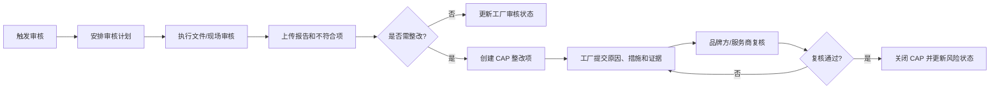

# 社会责任审核与 CAP 整改

## 1. 业务定义

社会责任审核与 CAP 整改用于评估工厂在劳工、健康安全、环境、管理体系和客户合规要求方面的表现，并对发现的不符合项进行整改、证据提交、复核和关闭。

本页关注审核协同和整改闭环，不替代专业审核标准、法规判断或第三方认证结论。

## 2. 适用客户与前提

| 客户类型 | 适用方式 |
| --- | --- |
| 品牌方 | 管理工厂审核计划、报告、风险和整改闭环 |
| 贸易公司/Sourcing Agency | 协调品牌方、工厂和审核服务商 |
| 供应商/工厂 | 提交资料、接受审核、提交整改证据 |
| 审核服务商 | 执行审核、提交报告、复核整改 |

前提是客户已经明确审核标准、审核频率、问题等级、整改要求和最终决策责任。

## 3. 参与角色与责任

| 角色 | 主要责任 | 提供的数据 | 做出的决策 |
| --- | --- | --- | --- |
| 品牌方合规/采购负责人 | 定义审核要求和准入/暂停规则 | 审核标准、风险等级、复审规则 | 通过、条件通过、暂停、退出 |
| 工厂 | 提交资料和整改证据 | 证书、制度、照片、整改说明 | 承诺整改计划 |
| 审核服务商 | 执行现场或文件审核 | 审核记录、问题项、报告 | 给出专业建议 |
| 供应商 | 协调工厂整改 | 责任人、计划、补充证据 | 确认整改执行 |
| 产品成功/实施 | 设计审核和 CAP 配置方案 | 模板、权限、仪表盘 | 判断平台边界 |

## 4. 核心业务对象

| 对象 | 定义 | 关键字段 | 与其他对象的关系 |
| --- | --- | --- | --- |
| 审核计划 | 一次审核安排 | 工厂、审核类型、日期、审核方 | 关联工厂资源库 |
| 审核报告 | 审核结果文档和结论 | 结论、等级、报告附件、有效期 | 可写回工厂资源库 |
| 不符合项 | 审核发现的问题 | 类别、等级、描述、证据 | 可生成 CAP 项 |
| CAP 项 | 针对不符合项的整改闭环 | 根因、纠正措施、预防措施、责任人、期限、证据、复核结论 | 关联审核报告和工厂 |
| 风险状态 | 工厂当前合规风险 | 等级、原因、有效期、限制 | 影响订单或准入使用 |

## 5. 标准业务流程

## 6. 状态与业务规则

| 对象 | 状态或规则 | 进入条件 | 允许操作 | 退出条件 |
| --- | --- | --- | --- | --- |
| 审核 | 待安排 | 达到准入、复审或风险触发条件 | 指派服务商、确认日期 | 审核开始 |
| 审核 | 报告待确认 | 审核已完成 | 上传/批复报告 | 结论确认 |
| CAP | 待提交计划 | 不符合项需整改 | 填根因、纠正/预防措施 | 计划提交 |
| CAP | 整改中 | 计划已确认 | 提交证据、延期申请 | 提交复核 |
| CAP | 待复核 | 工厂提交证据 | 通过、退回、补充 | 关闭或退回 |
| 工厂风险 | 有条件/暂停 | 严重问题或逾期未关闭 | 限制订单、升级审批 | CAP 关闭或重新评估 |

## 7. 异常、风险与控制措施

| 风险或异常 | 业务影响 | 识别方式 | 控制措施 |
| --- | --- | --- | --- |
| CAP 没有根因和预防措施 | 整改流于形式 | 只提交照片或描述 | 表单必填根因/纠正/预防 |
| 审核结论和准入状态脱节 | 高风险工厂继续被使用 | 工厂状态未更新 | 审核结论回写资源库 |
| 整改逾期未升级 | 合规风险持续 | CAP 逾期 | 自动化提醒和升级 |
| 报告有效期失效 | 复审漏做 | 有效期字段到期 | 到期提醒和复审计划 |
| 把所有审核问题都强制 CAP | 运营过重 | 低风险建议项过多 | 按等级设置 CAP 触发规则 |

## 8. 管理指标

| 指标 | 用途 | 建议口径 | 数据来源 | 管理动作 |
| --- | --- | --- | --- | --- |
| 审核完成率 | 看审核计划执行 | 已完成审核/计划审核 | 审核 FlowSpace | 催办服务商或工厂 |
| 审核通过率 | 判断工厂合规水平 | 通过/完成审核 | 审核结论 | 分析风险来源 |
| CAP 按期关闭率 | 判断整改执行力 | 按期关闭 CAP/应关闭 CAP | CAP 工单 | 催办和升级 |
| 平均 CAP 关闭周期 | 判断整改效率 | 关闭时间减创建时间 | CAP 状态历史 | 优化整改流程 |
| 高风险工厂数 | 管理供应链风险 | 高风险状态工厂数 | 工厂资源库 | 限制订单或复审 |

## 9. Linkincrease 能力映射

| 行业需求或规则 | Linkincrease 对象或能力 | 数据、状态或权限影响 | 支持度 | 推荐方案 |
| --- | --- | --- | --- | --- |
| 审核计划协同 | FlowSpace、里程碑、工单 | 工厂、服务商、计划时间、任务处理人 | L2 | 建审核 FlowSpace |
| 审核报告提交 | 附件、批复、资源库引用 | 报告附件、审核结论、有效期 | L2 | 报告作为工单附件并回写工厂库 |
| 不符合项拆分 | 工单、子表、问题库 | 问题等级、责任人、期限 | L2/LX | 首版用 CAP 工单，复杂问题库待确认 |
| CAP 闭环 | 独立 FlowSpace/工单、批复、自动化 | 根因、措施、证据、复核、关闭 | L2 | 按问题项创建 CAP 跟进 |
| 工厂风险更新 | 资源库、自动化、仪表盘 | 风险等级、限制、有效期 | L2/LX | 关键状态人工复核后更新 |
| 合规看板 | 仪表盘、报告 | 审核完成、CAP 逾期、高风险工厂 | L2 | 建审核与 CAP 看板 |

## 10. 测试关注点

| 类别 | 需要验证的内容 |
| --- | --- |
| 主流程 | 审核计划、报告、CAP、复核、关闭 |
| 权限 | 服务商、工厂、供应商、品牌方的数据隔离 |
| 状态 | 条件通过、暂停、逾期、关闭、退回 |
| 数据 | 报告附件、问题项、证据和资源库回写 |
| 异常 | 延期、复核不通过、服务商变更、报告撤回 |
| 审计 | 审核结论、CAP 关闭和风险等级变化 |

## 11. 产品差距与需求候选

| 差距 | 业务影响 | 当前替代方案 | 建议优先级 | 去向 |
| --- | --- | --- | --- | --- |
| 审核标准和问题库未形成统一产品模型 | 难以跨客户复用问题分类 | 模板自定义字段 | P1 | 产品维护区评估 |
| CAP 与工厂可用状态的强联动规则待确认 | 高风险工厂管控可能依赖人工 | 仪表盘提醒 + 人工状态维护 | P0 调研 | 待确认问题 |
| 复杂合规标准版本管理待确认 | 不同客户标准差异大 | 附件和自定义字段 | P2 | 待研究 |

## 12. 产品成功应用

### 客户识别信号

- 客户说审核报告、整改照片、复核结论散落在邮件和聊天里。
- 客户无法知道哪些工厂审核过期或 CAP 逾期。
- 客户希望服务商和工厂只看到自己相关任务。

### 重点诊断问题

- 审核是准入触发、周期复审、订单触发还是风险触发？
- 哪些问题必须 CAP，哪些只是观察项？
- CAP 关闭后是否影响工厂准入或订单使用？
- 谁拥有最终合规决策权？

### 方案输出入口

- 对应运营方案：[工厂准入与审核整改方案](../../50-运营支持知识/03-业务场景案例库/工厂准入与审核整改方案.md)
- 能力边界：平台承载流程、证据、复核、状态和看板，不替代专业合规判断。

## 13. 来源与可信度

| 来源 | 类型 | 证据等级 | 支撑结论 | 版本或日期 |
| --- | --- | --- | --- | --- |
| 品牌方供应商与工厂准入协同方案 | 内部场景方案 | E3 | 审核、CAP、工厂状态联动 | 当前版本 |
| 供应商与工厂准入行业页 | 内部行业样板 | E3 | 准入、审核、整改关系 | 当前版本 |
| 社会责任审核行业实践 | 待补充来源 | E4 | 审核和 CAP 通用闭环 | 待验证 |

## 14. 待确认问题

- [ ] 补充客户常用审核类型、问题等级和 CAP 字段样本。
- [ ] 产品确认 CAP 关闭是否可自动影响工厂风险状态。
- [ ] 确认不同审核报告有效期和复审提醒的通用配置模式。

## 15. 关联知识

- 行业页：[供应商开发、准入与生命周期管理](./供应商与工厂准入.md)
- 运营方案：[品牌方供应商与工厂准入协同方案](../../50-运营支持知识/03-业务场景案例库/外贸供应商治理/品牌方供应商与工厂准入协同方案.md)
- 产品权威规则：[资源库](../../20-业务对象与数据模型/资源库.md)、[自动化](../../10-功能模块详情/自动化.md)
