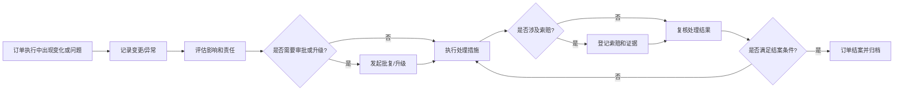

# 订单变更、异常、索赔与结案

## 1. 业务定义

订单变更、异常、索赔与结案覆盖采购订单执行过程中发生的交期、数量、规格、工厂、价格、质量、出货和责任问题，以及这些问题如何记录、确认、处理、追责和关闭。

本页关注协同和审计闭环，不替代法务索赔、财务结算或合同系统。

## 2. 适用客户与前提

| 客户类型 | 适用方式 |
| --- | --- |
| 贸易公司 | 处理订单执行中的延期、变更、客户投诉和结案 |
| 品牌方/采购团队 | 管理供应商责任、质量异常和结案条件 |
| Sourcing Agency | 协调供应商、工厂、客户和服务商处理异常 |
| 供应商/工厂 | 提交原因、措施、证据和结果确认 |

前提是客户能够区分订单正常进度、普通异常、重大异常、索赔和结案条件。

## 3. 参与角色与责任

| 角色 | 主要责任 | 提供的数据 | 做出的决策 |
| --- | --- | --- | --- |
| 跟单/订单负责人 | 记录和推进变更异常 | 变更原因、影响、处理结果 | 是否升级或关闭 |
| 采购/客户负责人 | 确认商业影响 | 客户要求、责任判断 | 是否接受变更或索赔 |
| 供应商/工厂 | 说明原因和改善措施 | 原因、计划、证据 | 是否承担责任 |
| 质量/物流/财务 | 提供专业影响判断 | 缺陷、出货、费用数据 | 是否放行、扣款或补偿 |
| 产品成功/实施 | 配置异常闭环和结案规则 | 模板、状态、权限、看板 | 判断平台边界 |

## 4. 核心业务对象

| 对象 | 定义 | 关键字段 | 与其他对象的关系 |
| --- | --- | --- | --- |
| 订单变更 | 对订单关键字段的调整 | 变更类型、原值、新值、原因、审批 | 关联订单和历史记录 |
| 异常记录 | 执行过程中需跟进的问题 | 类型、等级、责任方、影响、状态 | 可关联工单、附件和 CAP |
| 索赔记录 | 涉及费用、补偿或责任追溯的事项 | 金额、币种、责任方、证据、结论 | 关联订单和异常 |
| 结案检查 | 订单关闭前的核验 | 未完成任务、未关闭异常、单证、验货 | 决定是否结案 |
| 处理措施 | 对异常的行动 | 措施、责任人、期限、证据 | 可作为工单 |

## 5. 标准业务流程

## 6. 状态与业务规则

| 对象 | 状态或规则 | 进入条件 | 允许操作 | 退出条件 |
| --- | --- | --- | --- | --- |
| 变更 | 待确认 | 关键字段需要调整 | 提交原因、附件、审批 | 通过或驳回 |
| 异常 | 待处理 | 订单出现延期、质量、资料或责任问题 | 指派、补充、处理 | 提交复核 |
| 异常 | 待复核 | 处理措施完成 | 通过、退回、升级 | 关闭或继续处理 |
| 索赔 | 待协商 | 涉及费用或责任 | 补证、确认金额、审批 | 确认或撤销 |
| 订单 | 待结案 | 主要流程完成 | 检查未完成事项 | 结案或退回处理 |

## 7. 异常、风险与控制措施

| 风险或异常 | 业务影响 | 识别方式 | 控制措施 |
| --- | --- | --- | --- |
| 订单字段直接改掉无记录 | 历史责任无法追溯 | 缺少变更原因和审批 | 使用历史记录、变更工单或批复 |
| 异常无责任人和期限 | 问题长期悬挂 | 异常状态无推进 | 必填责任人/期限，自动提醒 |
| 索赔证据不完整 | 商业谈判被动 | 缺少照片、报告、邮件、费用 | 附件和证据清单 |
| 未关闭异常就结案 | 风险遗漏 | 结案前存在未关闭事项 | 结案检查清单 |
| 普通异常过度 CAP 化 | 流程过重 | 所有问题都要求根因预防 | 设置 CAP 升级边界 |

## 8. 管理指标

| 指标 | 用途 | 建议口径 | 数据来源 | 管理动作 |
| --- | --- | --- | --- | --- |
| 订单变更次数 | 判断订单稳定性 | 周期内变更记录数 | 历史记录/变更工单 | 分析变更原因 |
| 异常关闭率 | 判断问题处理效率 | 已关闭异常/总异常 | 异常工单 | 催办和复盘 |
| 平均异常关闭周期 | 判断协同效率 | 关闭时间减创建时间 | 异常状态 | 优化责任分派 |
| 索赔金额和件数 | 判断商业风险 | 按供应商/品类/原因统计 | 索赔记录 | 供应商谈判 |
| 结案一次通过率 | 判断流程质量 | 首次检查通过订单/待结案订单 | 结案检查 | 补流程控制 |

## 9. Linkincrease 能力映射

| 行业需求或规则 | Linkincrease 对象或能力 | 数据、状态或权限影响 | 支持度 | 推荐方案 |
| --- | --- | --- | --- | --- |
| 记录订单变更 | 历史记录、工单、批复 | 原值、新值、原因、审批 | L2/LX | 重要变更建议用工单/批复保留原因 |
| 异常处理闭环 | 工单、状态、自动化 | 类型、责任人、期限、证据 | L2 | 建异常处理工单 |
| 索赔资料归档 | 附件、批复、字段 | 金额、责任方、证据、结论 | L2/LX | 首版用附件和审批记录 |
| 结案检查 | 里程碑、工单、批复、视图 | 未完成任务、未关闭异常 | L2/LX | 建结案工单或结案前检查视图 |
| 异常升级 CAP | CAP FlowSpace/工单 | 根因、纠正预防、复核 | L2 | 仅重大、重复或质量合规问题升级 |
| 异常看板 | 仪表盘、报告 | 异常类型、状态、关闭周期 | L2 | 建异常运营看板 |

## 10. 测试关注点

| 类别 | 需要验证的内容 |
| --- | --- |
| 主流程 | 变更、异常、索赔、复核、结案 |
| 权限 | 供应商、工厂、内部团队、客户的可见和可操作边界 |
| 状态 | 驳回、升级、撤销、关闭、重开 |
| 数据 | 历史值、附件证据、金额、责任方 |
| 异常 | 并发修改、人员离职、附件缺失、结案回退 |
| 审计 | 变更原因、审批、关闭和结案记录 |

## 11. 产品差距与需求候选

| 差距 | 业务影响 | 当前替代方案 | 建议优先级 | 去向 |
| --- | --- | --- | --- | --- |
| 订单关键字段变更审批模型待统一 | 不同客户规则差异大 | 工单/批复记录重要变更 | P1 | 产品维护区评估 |
| 结案前强校验规则待确认 | 可能遗漏未关闭问题 | 视图/SOP 检查 | P0 调研 | 待确认问题 |
| 索赔金额与财务系统边界待明确 | 财务闭环不完整 | 附件和字段记录 | P2 | 集成或财务边界评估 |

## 12. 产品成功应用

### 客户识别信号

- 客户说订单经常变更但追不清责任。
- 客户说质量、交期、单证异常处理靠人工催。
- 客户想知道订单能不能结案，但未完成事项散落多处。

### 重点诊断问题

- 哪些变化必须审批，哪些只需记录？
- 异常分几类，谁负责，如何关闭？
- 什么情况下进入索赔或 CAP？
- 订单结案前必须满足哪些条件？

### 方案输出入口

- 对应运营方案：[订单异常与结案协同方案](../../50-运营支持知识/03-业务场景案例库/订单异常与结案协同方案.md)
- 能力边界：平台承载协同、证据和审计；商业索赔金额确认、合同责任和财务处理需客户专业流程确认。

## 13. 来源与可信度

| 来源 | 类型 | 证据等级 | 支撑结论 | 版本或日期 |
| --- | --- | --- | --- | --- |
| 订单生命周期 | 内部产品知识 | 不适用 | 订单流程与状态基础 | 当前版本 |
| 生产进度与异常协同 | 行业场景 | E3 | 异常处理和升级 | 当前版本 |
| 客户订单异常实践 | 待补充 | E3/E4 | 变更、索赔、结案规则 | 待收集 |

## 14. 待确认问题

- [ ] 产品确认订单结案前是否支持配置未关闭任务/异常强校验。
- [ ] 产品成功补充客户常见异常分类和索赔字段样本。
- [ ] 数据分析确认异常关闭周期和结案一次通过率口径。

## 15. 关联知识

- 行业页：[采购订单履约与交期跟踪](./采购订单履约与交期跟踪.md)、[生产进度与异常协同](./生产进度与异常协同.md)
- 产品规则：[订单生命周期](../../30-业务流程与产品流程图/订单生命周期.md)、[工单与批复](../../10-功能模块详情/工单与批复.md)
