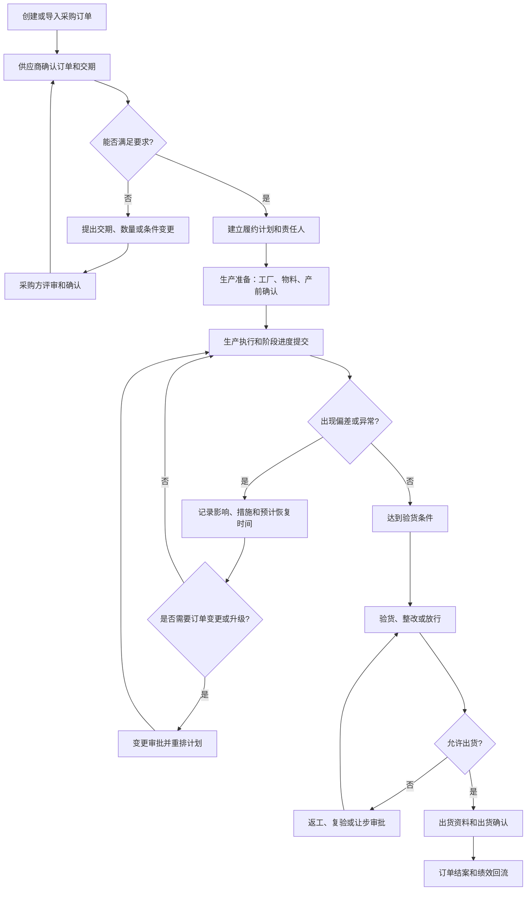

# 采购订单履约与交期跟踪

## 1. 业务定义

采购订单履约与交期跟踪是采购方、贸易公司、供应商和工厂围绕已确认采购订单，持续管理订单要求、阶段计划、责任人、进度、异常、质量放行、出货和结案的过程。

场景目标不是收集一个笼统的“完成百分比”，而是让各方基于相同订单、交期和阶段事实协作，尽早发现偏差，并形成可追溯的承诺、调整和处理记录。

本页重点覆盖采购订单确认后到出货或结案前的履约协同。需求预测、询报价、精细生产排程、库存核算、运输执行和财务结算属于相邻场景，只说明接口关系。

## 1.1 在端到端供应链中的位置

采购订单是商业承诺和履约跟踪的主线，但实际业务可能按照订单行、生产批次或出货批次分阶段执行。

## 2. 适用客户与前提

| 客户类型 | 典型诉求 |
| --- | --- |
| 品牌方、进口商 | 查看供应商和工厂执行进度，提前识别延期、质量和出货风险 |
| 贸易公司 | 协调客户订单、采购订单、供应商、工厂和物流节点 |
| 采购团队、Sourcing Agency | 统一多供应商订单跟踪方式，减少邮件和表格催办 |
| 供应商 | 接收订单要求、提交计划和进度、反馈异常与出货资料 |
| 工厂 | 提交生产准备、生产进度、完工和质量数据 |
| QC 或服务商 | 接收验货任务、提交结果并支持出货放行决策 |

实施该场景前，客户至少应明确：

- 跟踪对象是客户订单、采购订单、订单行还是生产批次。
- 谁承诺交期，谁维护计划，谁确认延期和出货。
- 各阶段需要提交什么证据。
- 哪些异常需要升级、审批或变更订单。

## 3. 参与角色与责任

| 角色 | 主要责任 | 提供的数据 | 做出的决策 |
| --- | --- | --- | --- |
| 采购方或品牌方 | 确认订单要求、优先级和关键变更 | 订单、规格、请求交期、质量和交付要求 | 接受承诺、批准变更、放行或取消 |
| 贸易公司或跟单人员 | 统筹订单计划、催办、异常和跨方沟通 | 计划、节点、沟通和风险信息 | 升级异常、调整协作计划 |
| 供应商 | 承担商务履约和对采购方的承诺 | 承诺交期、生产安排、进度、异常、出货资料 | 接受订单、提出变更和补救方案 |
| 工厂 | 执行生产并反馈实际进度 | 物料、开工、产量、完工、质量和现场异常 | 确认生产计划和纠偏措施 |
| QC 或验货人员 | 执行检验和提交专业结论 | 验货计划、样本、缺陷、报告 | 给出检验结论，不一定承担商业放行 |
| 物流或单证人员 | 准备出货计划和资料 | 订舱、截单、装柜、单证和运输节点 | 确认出货安排和资料完整性 |
| 管理者 | 监控交付、风险和供应商表现 | 仪表盘和异常汇总 | 资源协调、风险升级和供应商决策 |

专业结论与商业决策需要分离。例如，QC提交验货结果，是否让步放行仍可能由品牌方决定。

## 4. 核心业务对象与层级

| 对象 | 定义 | 关键字段 | 关系 |
| --- | --- | --- | --- |
| 客户订单或销售订单 | 客户对品牌方或贸易公司的需求承诺 | 客户、产品、数量、要求交期 | 可拆成多个采购订单 |
| 采购订单 | 采购方向供应商发出的采购承诺 | PO号、供应商、币种、条款、订单日期、状态 | 包含一个或多个订单行 |
| 订单行 | 采购订单中的产品和数量明细 | 产品/SKU、规格、数量、单价、交期 | 可拆成生产或出货批次 |
| 生产工厂 | 实际执行生产的场所 | 工厂、准入状态、风险状态 | 关联供应商和订单 |
| 履约计划 | 围绕订单建立的阶段和时间安排 | 阶段、负责人、计划起止时间 | 关联订单或订单行 |
| 生产批次 | 一次具体生产安排 | 批次、数量、计划、实际产出 | 来源于一个或多个订单行 |
| 出货批次 | 一次具体发运安排 | 批次、数量、计划出货日、实际出货日 | 可合并或拆分订单行 |
| 进度记录 | 某阶段或任务的实际执行事实 | 状态、数量、日期、证据、填报人 | 关联阶段、任务或批次 |
| 异常记录 | 对交期、质量、物料或协作偏差的结构化记录 | 类型、影响、责任人、措施、预计恢复时间 | 影响订单、阶段或批次 |
| 订单变更 | 对已确认要求的正式调整 | 变更项、原值、新值、原因、批准人 | 影响计划、成本、质量和交付 |

## 4.1 层级选择原则

| 业务情况 | 推荐跟踪层级 |
| --- | --- |
| 一个订单只有一个产品和一次交付 | 订单级 |
| 一个订单包含多个产品或不同交期 | 订单行级 |
| 同一产品分多次生产 | 生产批次级 |
| 多个订单合并出货或一个订单分批出货 | 出货批次级 |

如果只在订单头维护一个进度和交期，可能掩盖部分订单行或批次已经延期的事实。

## 5. 日期与交期口径

交期管理必须先统一日期含义，不能把所有日期都叫“交期”。

| 日期 | 业务含义 | 典型责任方 |
| --- | --- | --- |
| 请求交期 | 采购方希望完成或交付的日期 | 采购方 |
| 供应商承诺交期 | 供应商评估后承诺的完成或交付日期 | 供应商 |
| 当前计划日期 | 根据实际情况更新后的执行计划 | 跟单、供应商或工厂 |
| 计划开工/完工日 | 生产阶段计划日期 | 工厂 |
| 计划验货日 | 预计达到可验货条件的日期 | 供应商、工厂、QC |
| 计划出货日 | 预计完成交货或装运的日期 | 供应商、物流 |
| 实际完工日 | 实际达到完工标准的日期 | 工厂 |
| 实际出货日 | 实际完成约定出货动作的日期 | 物流或供应商 |
| 实际交付日 | 按约定地点完成交付的日期 | 由贸易条件和业务定义决定 |

不同贸易条件下“交付”发生的地点和风险转移节点可能不同。指标页面必须说明使用计划出货、实际出货、到港还是签收日期。

## 5.1 基准日期与当前计划

建议同时保留：

- 原始请求日期：采购方最初要求。
- 原始承诺日期：供应商首次正式承诺。
- 当前承诺或计划日期：经批准调整后的最新日期。
- 实际日期：真实完成时间。

只覆盖原始日期会导致无法衡量承诺变化和真实延期；只保留原始日期又不维护当前计划，会让执行视图失去可操作性。

## 6. 标准业务流程

## 6.1 推荐阶段

| 阶段 | 目标 | 典型任务或证据 |
| --- | --- | --- |
| 订单确认 | 确认产品、数量、价格、交期和要求 | 订单确认、差异反馈、承诺日期 |
| 生产准备 | 确认工厂、物料、样品和生产条件 | 工厂报备、物料齐套、产前确认 |
| 生产中 | 获取可信生产进度和异常 | 开工、产量、照片、预计完工日 |
| 验货与整改 | 判断质量是否满足放行条件 | 验货安排、报告、返工、复验 |
| 出货准备 | 准备订舱、装箱和贸易资料 | 订舱、装箱单、发票、出货审批 |
| 出货与结案 | 确认实际出货并沉淀结果 | 实际出货日、数量、异常、绩效 |

具体阶段应随品类、交付周期和客户管理方式调整，不应把模板阶段视为统一行业标准。

## 7. 业务状态模型

需要区分三类状态：

| 状态层 | 说明 | 示例 |
| --- | --- | --- |
| 平台订单状态 | Linkincrease对象是否仍允许业务处理 | 进行中、已完成、已取消 |
| 业务履约状态 | 采购订单当前所处业务阶段 | 待确认、生产准备、生产中、待验货、待出货、已出货、已结案 |
| 风险或健康状态 | 是否存在影响履约的偏差 | 正常、预警、延期、高风险、阻塞 |

业务履约状态和风险状态应通过字段、里程碑、标签、公式或仪表盘表达，不能直接假设平台订单状态已经覆盖全部行业状态。

## 7.1 阶段状态

| 阶段状态 | 含义 |
| --- | --- |
| 未开始 | 前置条件未满足或尚未到计划时间 |
| 进行中 | 阶段已经启动并持续执行 |
| 已完成 | 阶段完成标准已满足 |
| 已取消 | 阶段不再执行，并保留原因 |
| 阻塞 | 行业建议状态，可通过标签或字段表达；平台是否需要原生状态应另行评估 |

## 8. 进度与延期判断

## 8.1 进度证据

进度不能只有主观百分比，建议同时记录：

- 当前阶段和状态。
- 已完成数量与目标数量。
- 实际开始、完成或提交日期。
- 现场照片、报告、附件或系统数据。
- 填报人、填报时间和确认人。
- 下一步计划和预计完成时间。

## 8.2 延期分类

| 类型 | 判断示例 | 管理动作 |
| --- | --- | --- |
| 阶段延期 | 当前日期超过阶段计划结束日且未完成 | 催办、升级、重排后续计划 |
| 承诺延期 | 最新预计交付日晚于供应商承诺日 | 供应商提出恢复计划 |
| 客户要求延期 | 最新预计交付日晚于采购方请求日 | 评估业务影响和替代方案 |
| 已实际延期 | 实际交付日晚于目标日期 | 记录原因、影响和绩效 |
| 潜在延期 | 关键前置任务延迟但最终交付日尚未变化 | 提前预警并采取纠偏措施 |

## 8.3 延期原因

建议结构化分类：

- 订单或规格变更。
- 样品或确认延迟。
- 原材料短缺或质量问题。
- 产能、设备、人员或排期问题。
- 生产质量和返工。
- 验货、审核或审批等待。
- 物流、单证、报关或外部事件。
- 客户原因、供应商原因、工厂原因或不可抗力。

延期原因不能只用于事后统计，还应关联责任人、恢复措施和预计恢复时间。

## 9. 订单变更与影响分析

| 变更类型 | 可能影响 |
| --- | --- |
| 产品、规格或包装 | 样品、物料、工艺、质量标准和单证 |
| 数量 | 物料、产能、生产批次、出货批次和金额 |
| 交期 | 生产计划、验货、订舱、运输和客户承诺 |
| 供应商或工厂 | 准入、产能、质量、成本和合规风险 |
| 价格或付款条件 | 合同、发票、审批和结算 |
| 运输或贸易条件 | 成本、责任、风险、单据和交付日期口径 |

订单变更至少应记录：

1. 原值和新值。
2. 变更原因和提出人。
3. 影响范围。
4. 批准人和生效时间。
5. 是否需要重排阶段计划。
6. 是否通知供应商、工厂、QC和物流。

## 10. 异常、风险与控制措施

| 风险或异常 | 业务影响 | 识别方式 | 控制措施 |
| --- | --- | --- | --- |
| 订单要求版本不一致 | 按旧规格或旧交期执行 | 订单、附件和沟通记录版本冲突 | 保留变更历史和生效版本 |
| 供应商确认不及时 | 采购方无法判断是否能按期履约 | 超过确认时限仍无承诺 | 自动提醒、升级和替代评估 |
| 进度填报缺少证据 | 管理层看到的进度不可信 | 只有百分比，无日期、数量或附件 | 定义阶段完成标准和必填证据 |
| 未准入或高风险工厂生产 | 质量和合规风险 | 订单工厂与资源库状态不符 | 限制选择、风险提示或审批 |
| 关键阶段延期未传导 | 后续验货和出货计划失真 | 前置阶段延期但后续计划未调整 | 影响分析、重排和通知 |
| 订单变更未同步 | 工厂、QC或物流按旧要求执行 | 变更后相关任务仍使用旧数据 | 变更审批、版本和通知机制 |
| 验货不通过仍出货 | 客诉、返工和索赔风险 | 验货结论与出货状态不一致 | 放行批复、阻断或例外审批 |
| 分批交付被订单总状态掩盖 | 部分数量延期或缺失 | 订单头已完成但批次未完成 | 按订单行和出货批次跟踪 |
| 完成订单过早 | 后续任务和资料无法继续处理 | 仍有未完成任务时完成订单 | 完成前校验或运营检查清单 |

## 11. 管理指标

| 指标 | 用途 | 建议口径 | 数据来源 | 管理动作 |
| --- | --- | --- | --- | --- |
| 订单确认及时率 | 判断供应商响应效率 | 时限内确认订单数/应确认订单数 | 订单和确认任务 | 催办或调整供应商协同规则 |
| 准时出货率 | 判断按计划完成出货能力 | 按期实际出货订单或批次数/应出货订单或批次数 | 计划和实际出货日 | 分析延期原因和供应商表现 |
| OTIF | 判断是否按时足量交付 | 按约定日期且满足约定数量的交付数/应交付数 | 订单行、批次和实际交付 | 用于供应商绩效和采购决策 |
| 平均延期天数 | 判断延期严重程度 | 延期对象的实际或预计日期减目标日期 | 日期字段 | 识别重点订单和系统性瓶颈 |
| 阶段计划达成率 | 判断过程计划可靠性 | 按期完成阶段数/应完成阶段数 | 里程碑计划与实际时间 | 优化计划和提前预警 |
| 异常关闭周期 | 判断问题响应效率 | 异常关闭时间减异常创建时间 | 异常工单 | 升级超期问题 |
| 变更次数与影响订单数 | 判断需求稳定性 | 统计正式变更及受影响对象 | 历史和变更记录 | 改善前端确认和版本治理 |
| 验货后准时出货率 | 判断质量环节对交付影响 | 验货完成后按期出货批次数/应出货批次数 | 验货和出货数据 | 协调QC、返工和物流计划 |

OTIF、准时出货和准时交付必须明确统计层级、目标日期、允许偏差、足量标准、分批规则和取消订单处理。

## 12. 产品研发映射

| 行业需求或规则 | 产品对象或能力 | 数据、状态或权限影响 | 支持度 | 产品依据 |
| --- | --- | --- | --- | --- |
| 采购订单作为履约主记录 | FlowSpace订单、主表单 | 需要明确订单头与订单行/批次的数据层级 | L2 | [订单](../../20-业务对象与数据模型/订单.md) |
| 按阶段管理计划和实际时间 | 里程碑、里程碑计划 | 可承载阶段计划、状态、负责人和提前/延迟标签 | L2 | [里程碑](../../20-业务对象与数据模型/里程碑.md) |
| 供应商、工厂、QC提交进度和证据 | 工单、采集端、附件 | 需要按角色控制可编辑表单和处理人 | L2 | [工单与批复](../../20-业务对象与数据模型/工单与批复.md) |
| 对验货、出货和关键变更做确认 | 工单批复、里程碑批复 | 专业结论和商业放行可能需要不同批复 | L2 | [工单与批复](../../20-业务对象与数据模型/工单与批复.md) |
| 引用供应商、工厂、产品和风险信息 | 资源库、关联引用 | 需要历史快照、状态过滤和同步边界 | L2/LX | [资源库引用与同步](../../30-业务流程与产品流程图/资源库引用与同步.md) |
| 交期临近、延期和异常自动提醒 | 自动化、消息通知 | 需要日期触发、条件判断、通知对象和失败日志 | L2 | [自动化执行](../../30-业务流程与产品流程图/自动化执行.md) |
| 展示履约状态和风险 | 字段、标签、公式、仪表盘 | 业务状态和风险状态不能直接等同平台订单状态 | L2 | [订单生命周期](../../30-业务流程与产品流程图/订单生命周期.md) |
| 保存订单变更和执行依据 | 历史记录、跟踪记录、动态、日志 | 需要区分字段变更、关键业务事件和系统更新 | L1/L2 | [订单跟踪记录](../../40-权限、安全与审计/订单跟踪记录.md) |
| 支持订单行、生产批次和出货批次 | 子表、工单、关联FlowSpace或独立对象 | 通用对象模型和跨层状态汇总尚待评估 | LX | [字段、组件、子表、引用关系](../../20-业务对象与数据模型/字段、组件、子表、引用关系.md) |
| 计算OTIF和订单绩效 | 仪表盘、报告、跨FlowSpace数据 | 需要明确日期、数量、批次、去重和权限口径 | LX | [核心指标口径](../../60-数据分析支持/核心指标口径.md) |

## 12.1 关键产品边界

- 平台订单状态当前为进行中、已完成、已取消，不等于采购订单的完整履约状态。
- 里程碑计划可支持阶段日期，但复杂依赖关系、自动重排和关键路径能力需另行评估。
- Linkincrease适合收集和协同生产进度，不等同于MES的实时产量和工序控制。
- Linkincrease适合管理出货准备和单据协同，不等同于TMS、货代或报关系统。
- 订单行、生产批次、出货批次的通用建模方式尚未形成产品权威规则。

## 13. 测试关注点

| 类别 | 需要验证的内容 |
| --- | --- |
| 主流程 | 创建订单、生成阶段、供应商确认、进度提交、验货、出货和完成订单 |
| 数据层级 | 订单头、订单行、生产批次、出货批次之间的数量和状态汇总 |
| 日期 | 请求、承诺、当前计划、实际日期及跨时区、空值和修改后的判断 |
| 权限 | 品牌方、供应商、工厂、QC、物流只能查看和编辑授权范围 |
| 状态 | 平台订单状态、里程碑状态、业务状态和风险状态之间不互相覆盖 |
| 变更 | 数量、交期、产品、工厂变化后的计划、任务、通知和历史记录 |
| 异常 | 处理人变化、协作方退出、并发提交、附件失效、自动化失败 |
| 完成限制 | 完成或取消订单后，工单、批复、邮件和自动化行为符合产品规则 |
| 指标 | 分批出货、部分交付、取消、重启和变更订单的统计口径 |
| 审计 | 承诺、进度、异常、变更、验货放行和出货确认均可追溯 |

## 14. 产品差距与需求候选

| 差距 | 业务影响 | 当前替代方案 | 建议优先级 | 去向 |
| --- | --- | --- | --- | --- |
| 订单行、生产批次和出货批次缺少统一模型 | 分批生产和交付难以准确汇总 | 使用子表、工单或拆分订单 | P0调研 | [待研究问题](../99-待研究问题/README.md) |
| 原始承诺日期、当前计划和实际日期缺少统一口径 | 延期和供应商绩效可能失真 | 在模板中配置独立字段并保留历史 | P0调研 | 数据分析和产品评审 |
| 阶段延期后缺少通用计划重排机制 | 后续验货和出货计划需要人工调整 | 自动提醒后由跟单人员调整 | P1 | 产品维护区评估 |
| 业务履约状态与平台订单状态容易混淆 | 状态设计和测试结论不一致 | 使用独立业务状态字段和标签 | P0规范 | 产品知识和模板规范 |
| OTIF和分批交付统计能力待验证 | 无法形成可靠绩效看板 | 导出或外部分析 | P1 | 数据分析和产品评审 |

以上为调研和需求候选，不代表已进入产品计划。

## 15. 产品成功应用

### 客户识别信号

- 客户通过Excel、邮件或群消息逐单催生产和出货。
- 同一个订单在采购方、供应商和工厂之间存在不同交期。
- 管理层只能看到最终延期，无法提前识别阶段风险。
- 供应商填报“完成80%”，但缺少数量、日期和证据。
- 订单变更后，工厂、QC或物流仍按旧要求执行。
- 分批生产或出货时，订单总状态无法反映剩余数量。

### 重点诊断问题

- 客户主要跟踪客户订单、采购订单、订单行还是生产批次？
- 请求交期、供应商承诺交期和实际交付日分别是什么？
- 订单经过哪些固定阶段，每个阶段如何判定完成？
- 谁提交生产进度，需要哪些数量、日期、图片或报告证据？
- 哪些异常需要升级，谁负责提出和确认恢复计划？
- 订单变更由谁批准，如何通知所有受影响角色？
- 验货结论和商业出货放行是否由不同角色完成？
- 是否存在分批生产、分批验货、分批出货或合并出货？
- 客户希望用哪些指标评价订单和供应商？

### 方案输出入口

- 使用 [客户场景诊断清单](../07-产品成功应用/客户场景诊断清单.md) 补齐业务现状。
- 参考 [订单管理类模板最佳实践](../../50-运营支持知识/02-日常运营任务/模板配置/订单管理类模板最佳实践.md) 设计配置。
- 使用 [平台能力边界表达规范](../07-产品成功应用/平台能力边界表达规范.md) 说明订单行、批次、计划重排和指标边界。
- 使用 [业务方案输出模板](../07-产品成功应用/业务方案输出模板.md) 形成客户方案。

## 16. 来源与可信度

| 来源 | 类型 | 证据等级 | 支撑结论 | 版本或日期 |
| --- | --- | --- | --- | --- |
| [订单](../../20-业务对象与数据模型/订单.md)及订单相关权威页 | 内部产品知识 | 不适用 | Linkincrease订单、里程碑、工单、状态和权限边界 | 当前版本 |
| [订单管理类模板最佳实践](../../50-运营支持知识/02-日常运营任务/模板配置/订单管理类模板最佳实践.md) | 内部配置实践 | E3 | 订单阶段、资源库引用、协作和仪表盘方案 | 当前版本 |
| [外贸供应链全景与端到端业务地图](../外贸供应链全景与端到端业务地图.md) | 行业知识总纲 | E1/E3组合 | 场景在端到端供应链中的位置和系统边界 | 当前版本 |
| ASCM SCOR Digital Standard | 国际行业框架 | E1 | 订单、寻源、生产和履约过程范围 | 当前公开版本 |

当前版本已经形成行业模型和产品映射，但日期口径、订单行/批次模型和OTIF规则仍需结合客户样本与产品能力验证。

## 17. 待确认问题

- [ ] 由产品确认订单行、生产批次和出货批次在Linkincrease中的推荐建模方式。
- [ ] 由产品和数据团队定义请求交期、承诺交期、计划出货、实际出货和实际交付的标准字段口径。
- [ ] 由测试补充分批交付、订单变更、重启和跨角色并发的异常用例。
- [ ] 由产品成功收集至少三类客户的订单阶段、交期口径和异常升级方式。
- [ ] 确认完成订单前是否需要通用的未完成任务、未放行验货或未出货数量检查。

## 18. 关联知识

- 全景总纲：[外贸供应链全景与端到端业务地图](../外贸供应链全景与端到端业务地图.md)
- 产品规则：[订单](../../20-业务对象与数据模型/订单.md)、[里程碑](../../20-业务对象与数据模型/里程碑.md)、[工单与批复](../../20-业务对象与数据模型/工单与批复.md)
- 运营方案：[订单管理类模板最佳实践](../../50-运营支持知识/02-日常运营任务/模板配置/订单管理类模板最佳实践.md)
- 测试支持：[数据流转与校验规则](../../45-测试支持/数据流转与校验规则.md)
- 数据分析：[核心指标口径](../../60-数据分析支持/核心指标口径.md)
- 产品成功应用：[客户场景诊断清单](../07-产品成功应用/客户场景诊断清单.md)、[业务方案输出模板](../07-产品成功应用/业务方案输出模板.md)

