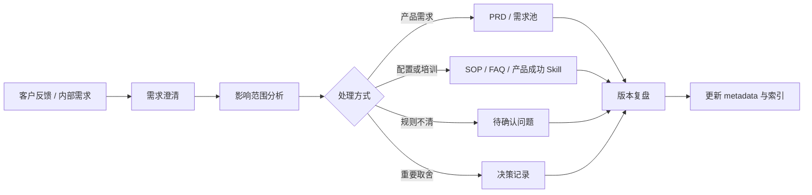

# 产品经理知识库工作台

本页说明产品经理如何把知识库当成日常工作工具，而不是只在需要查资料时打开。

## 工作台目标

| 目标 | 说明 |
| --- | --- |
| 需求澄清更快 | 用知识库快速定位业务对象、用户角色、权限边界和已有能力 |
| PRD 更完整 | 在写需求前先检查对象、流程、权限、数据、日志、报表和测试影响 |
| 决策可追溯 | 把重要取舍记录到决策记录，避免未来重复讨论 |
| 客户反馈可沉淀 | 把反馈转成需求池、FAQ、SOP、Skill 或待确认问题 |
| AI 协作更稳定 | 让 Agent 按任务读取正确知识资产，而不是按关键词过度联想 |

## 高频工作方式

| 工作场景 | 推荐入口 | 产出 |
| --- | --- | --- |
| 模糊需求澄清 | `skills/linkincrease-product-manager`、`docs/00`、`docs/70/需求池.md` | 问题定义、待确认问题、初步范围 |
| PRD 初稿 | `skills/linkincrease-product-manager` + `skills/linkincrease-requirement-design` | PRD 框架、功能清单、验收标准 |
| 影响范围分析 | `docs/20`、`docs/30`、`docs/40`、`docs/60` | 影响矩阵、拆分建议、风险 |
| 客户反馈整理 | `docs/70/客户反馈.md`、`docs/50` | 反馈分类、产品机会、SOP/FAQ 建议 |
| 产品决策沉淀 | `docs/70/决策记录.md` | 决策背景、选项、结论、复盘条件 |
| 周复盘 | `docs/50/06-运营规范与SOP/每周知识库复盘流程.md`、本页 | 本周入库清单、下周产品动作 |

## 推荐提示词

### 需求澄清

```text
使用 linkincrease-product-manager，基于知识库帮我分析这个需求：
{粘贴客户描述或内部想法}

请输出：
1. 我们先怎么理解这个问题
2. 需要确认的问题
3. 可能影响的产品对象、流程、权限、数据和报表
4. 哪些内容暂不进入范围
5. 下一步应该写 PRD、转配置/SOP，还是进入待确认
```

### 影响范围分析

```text
使用 linkincrease-product-manager，帮我做影响范围分析：
{需求描述}

请按产品端、业务对象、流程状态、权限数据围栏、通知自动化、报表指标、日志审计、导入导出、测试回归输出矩阵。
```

### PRD 初稿

```text
先使用 linkincrease-product-manager 做需求框架，再使用 linkincrease-requirement-design 补成可评审 PRD：
{需求描述}
```

### 产品周复盘

```text
使用 linkincrease-product-manager，基于以下本周客户反馈/会议纪要/需求讨论，帮我复盘：
1. 哪些应进入需求池
2. 哪些应沉淀成 FAQ/SOP/Skill
3. 哪些需要决策记录
4. 哪些旧文档需要更新或标记 deprecated
5. 下周产品动作建议
```

## 工作闭环



## 判断原则

1. 能通过配置、SOP 或培训解决的，不直接升级为产品功能。
2. 会改变对象、权限、流程、数据、报表或日志的，必须做影响范围分析。
3. 来自单一客户的诉求，先记录证据和适用边界，再判断是否产品化。
4. 涉及历史取舍、范围砍掉、规则变化的，必须补决策记录。
5. AI 输出不能直接当结论，必须回到权威知识页、来源和待确认问题做校验。
