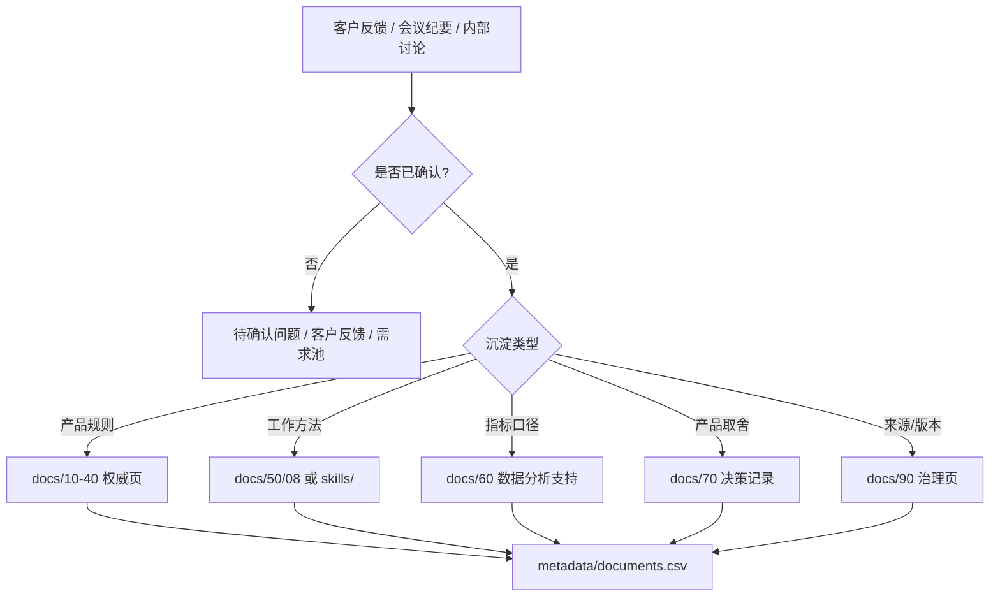

# 知识资产地图

本页用于把知识库从“文档集合”拆成可治理、可检索、可被 AI Agent 调用的知识资产。它对应团队记忆的四类资产：Chat Memory、Skill、Wiki、CodeGraph / System Map。

## 资产分层

| 资产类型 | 在本仓库中的形态 | 主要用途 | 维护要求 |
| --- | --- | --- | --- |
| Wiki | `docs/00` 到 `docs/90` 的权威知识页 | 产品规则、业务对象、流程、权限、指标、行业知识 | 每页登记到 `metadata/documents.csv`，有状态、路径、标签和更新时间 |
| Skill | `skills/*/SKILL.md` 与 `docs/50-运营支持知识/08-工作技能` | 把可重复工作变成可执行流程 | 写清适用场景、输入、必读知识页、输出格式和验收标准 |
| Chat Memory | 客户沟通、会议纪要、内部讨论、项目复盘沉淀后的摘要 | 保留“为什么会这样问、这样做、这样决定”的上下文 | 先沉淀为客户反馈、需求池、决策记录或待确认问题，不直接写入权威规则 |
| CodeGraph / System Map | `docs/20`、`docs/30`、`docs/40`、`docs/80`、`docs/99` | 分析对象关系、流程影响、权限边界和技术影响 | 重要对象、状态、权限和接口变化要同步到图谱或索引 |

## 使用边界

| 问题类型 | 优先资产 | 不建议 |
| --- | --- | --- |
| 产品规则是什么 | Wiki | 只凭客户案例或旧需求下结论 |
| 这个需求怎么写 | Skill + Wiki | 直接从聊天生成完整 PRD |
| 为什么当时这么设计 | 决策记录 + 来源治理 | 只看最终规则，不看取舍原因 |
| 客户问题怎么处理 | 产品成功 Skill + 运营 SOP | 把临时配置写成通用产品能力 |
| 改动会影响哪里 | System Map + 权限/数据页 | 只按关键词查单页文档 |
| 本周知识库要更新什么 | Chat Memory 摘要 + metadata | 把零散聊天原文全部塞进正文 |

## AI Agent 装备建议

| Agent 角色 | 推荐装载资产 | 典型任务 |
| --- | --- | --- |
| Product Manager | `AGENTS.md`、`docs/README.md`、`docs/70`、`docs/90`、`skills/linkincrease-product-manager` | 需求澄清、影响分析、决策记录、版本复盘 |
| Requirement Designer | `docs/10`、`docs/20`、`docs/30`、`docs/40`、`skills/linkincrease-requirement-design` | PRD、验收标准、权限/状态/日志设计 |
| Product Success | `docs/50`、`docs/55`、`docs/60`、`skills/linkincrease-product-success` | 客户诊断、上线方案、配置方案、问题排查 |
| Reviewer / QA | `docs/45`、`docs/40`、`docs/99` | 回归范围、异常边界、权限测试、缺口检查 |

## 知识入库流转

## 维护节奏

1. 每次新增文档后，更新对应目录 README、`metadata/documents.csv` 和必要的索引页。
2. 每周复盘客户问题、需求讨论和产品决策，把可复用内容转成 FAQ、SOP、Skill 或决策记录。
3. 每月检查一次高频关键词是否过度触发，例如 CAP、供应商治理、仪表盘、自动化、资源库、权限。
4. 旧文档不确定时先标记为 `reference` 或 `deprecated`，不要直接删除。
