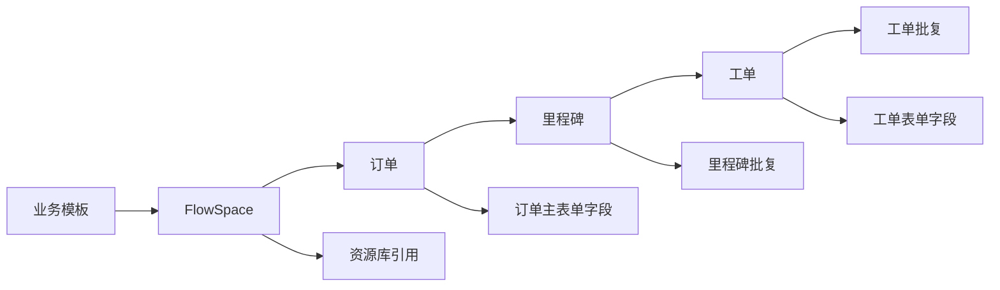

# 数据结构图

本页用于集中维护数据结构相关图表。

## FlowSpace 核心层级

```mermaid
flowchart LR
    A["业务模板"] --> B["FlowSpace"]
    B --> C["订单"]
    C --> D["里程碑"]
    D --> E["工单"]
    E --> F["工单批复"]
    D --> G["里程碑批复"]
    C --> H["订单主表单字段"]
    E --> I["工单表单字段"]
    B --> J["资源库引用"]
```

## 关联文档

- [FlowSpace 数据层级](../20-业务对象与数据模型/FlowSpace数据层级.md)
- [模板与实例关系](../20-业务对象与数据模型/模板与实例关系.md)

