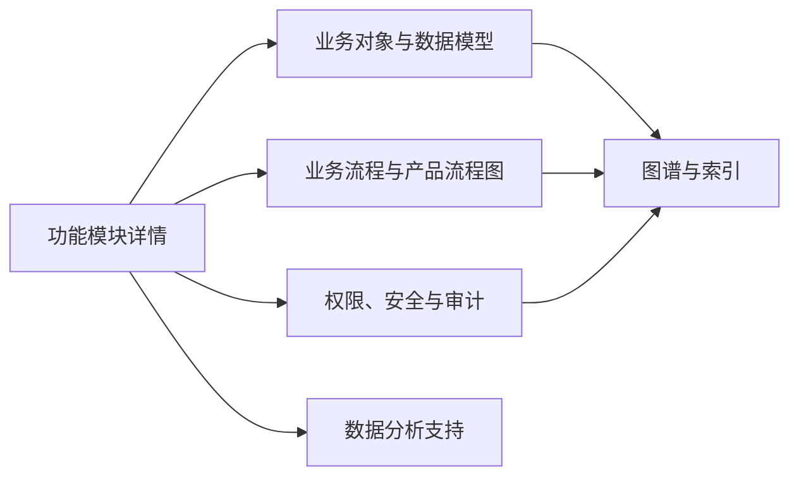

# 页面关系图

本页用于沉淀页面、模块、对象和流程之间的关系。

## 当前核心关系

```mermaid
flowchart LR
    A["功能模块详情"] --> B["业务对象与数据模型"]
    A --> C["业务流程与产品流程图"]
    A --> D["权限、安全与审计"]
    A --> E["数据分析支持"]
    B --> F["图谱与索引"]
    C --> F
    D --> F
```

## 维护规则

新增页面时，应判断它属于功能入口、权威规则、流程、权限、运营、分析、维护、架构还是图谱索引。

